# RAG入門：資料を探して答える — スライド原稿

この原稿は [deck.json](deck.json) からの書き出し。修正は deck.json に行い、再出力する。

全57枚。元原稿 SHA-256: `cc661f31d5f52bd141ddad02cccdaacd500dafd28d1b797c71721920fad9b7b9`。

図版はリンク先の画像を参照。補足はHTML用の説明で、PPTXのスピーカーノートには含まれない。

## 01. RAG入門：資料を探して答える

架空の経費精算規程で、検索・回答・確認の流れを学びます。

社内勉強会 / 2026-09-07 改訂

### 参照・説明の補足（HTML用）

この資料の規程・業務・型番は教材用の架空例です。実在する企業の規程・導入実績ではありません。

## 02. AIに渡す情報とRAGの関係

はじめに｜このデッキの位置づけ

RAGは、質問に合わせて資料を探し、回答に使う方法です。

- AIに何を見せるかを考えるのが、コンテキスト設計です
- RAGは、その中で資料を取得する方法の1つです
  - 必要な資料を探し、読める形でAIに渡します。
- 右の5層と3経路は、このシリーズ独自の整理です。標準規格ではありません。

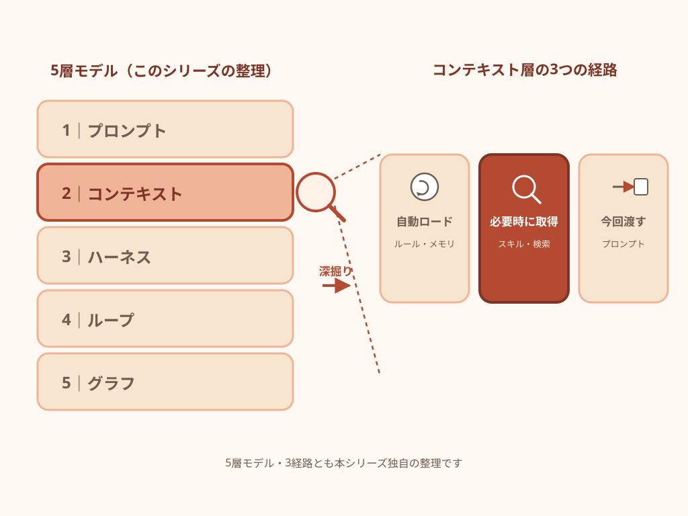

この資料では、検索してから回答を作る流れを扱います

### 参照・説明の補足（HTML用）

この資料の規程・業務・型番は教材用の架空例です。実在する企業の規程・導入実績ではありません。
一次資料：
https://arxiv.org/html/2005.11401v4

## 03. この資料で学ぶこと

はじめに｜この資料で学べること

経費精算の質問を例に、仕組みから導入時の確認までを見ます。

- 資料を探して答える流れ
  - 「交通費の申請はいつまで？」に、規程を根拠に答える。
- 資料の準備と、質問を受けた後の処理
- 誤答の原因を、元資料・検索結果・回答から調べる方法
- 通常の質問と重大な失敗を評価し、使える範囲を決める方法

### 参照・説明の補足（HTML用）

この資料の規程・業務・型番は教材用の架空例です。実在する企業の規程・導入実績ではありません。

## 04. RAGとは何か

01

質問に関係する資料を探し、その内容を使って回答を作ります。

### 参照・説明の補足（HTML用）

この資料の規程・業務・型番は教材用の架空例です。実在する企業の規程・導入実績ではありません。

## 05. RAGの基本：探してから答える

01｜一言でいうと

資料を取得する処理と、資料を使って回答を書く処理を組み合わせます。

- Retrievalは、質問に関係する資料の取得
- Generationは、取得した内容を使う回答生成
- 日本語では「検索拡張生成」と呼びます。
- 出典の表示や、資料不足時の対応も設計します。

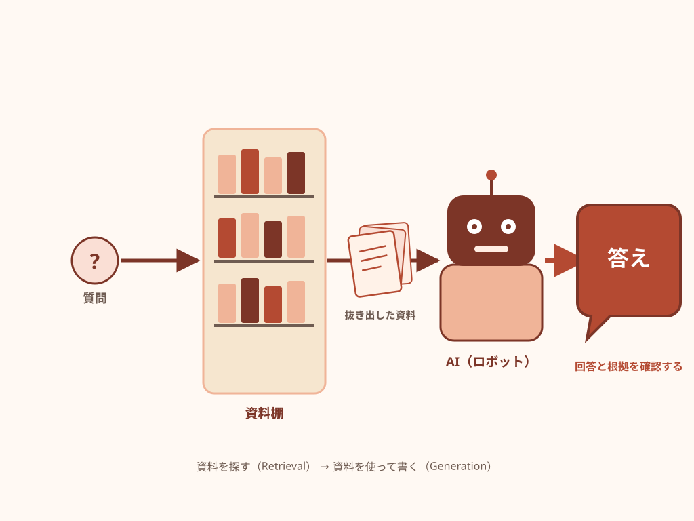

検索だけを付けても、回答の正しさは保証されません

### 参照・説明の補足（HTML用）

この資料の規程・業務・型番は教材用の架空例です。実在する企業の規程・導入実績ではありません。
一次資料：
https://arxiv.org/html/2005.11401v4

## 06. 資料を見ながら答える場面

01｜比喩でつかむ

手元に根拠があると、会社固有の内容を確かめながら答えられます。

- 資料を渡していなければ、自社の規程を知っているとは限りません。
- 資料を渡せば、その記載を回答の材料にできます。
- それでも、読み違いや条件の抜けは起こり得ます。
- 人が根拠に戻れるよう、規程名と参照箇所を示します。


資料を参照する場面のイメージです

### 参照・説明の補足（HTML用）

この資料の規程・業務・型番は教材用の架空例です。実在する企業の規程・導入実績ではありません。
一次資料：
https://arxiv.org/html/2005.11401v4

## 07. 「交通費の申請はいつまで？」

01｜教材用の架空例

この研修では、架空の経費精算規程を使って考えます。

- 現行規程：交通費は利用月の翌月5日まで
  - 2026年4月1日以降の利用分に適用します。
- 例外：5日が休業日なら翌営業日まで
- AIが一般的な締切を答えても、この会社の根拠にはなりません。
- 規程を検索し、適用日と例外を含めて答える必要があります。

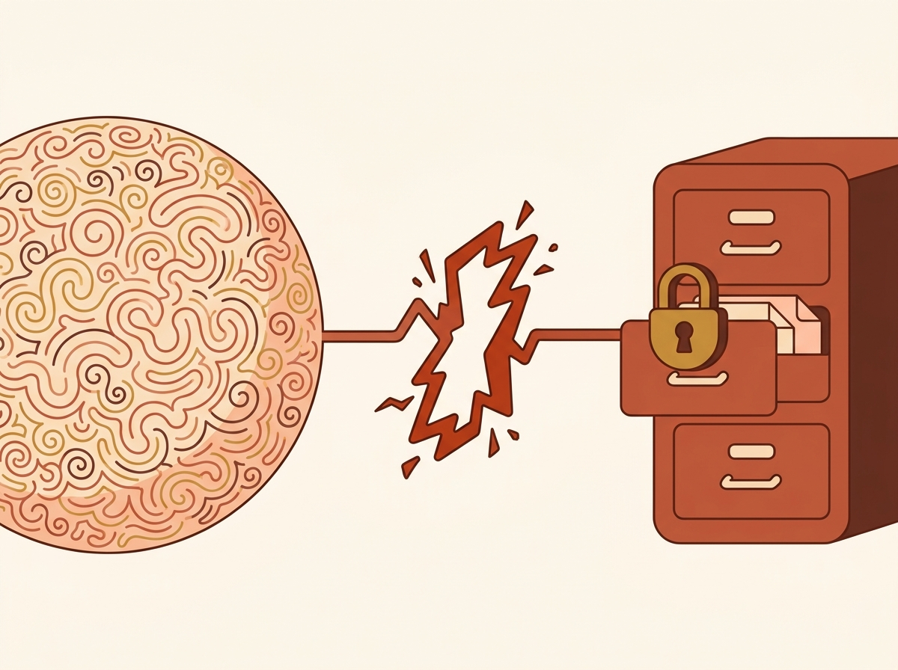

実在する会社の規程・導入実績ではありません

### 参照・説明の補足（HTML用）

この資料の規程・業務・型番は教材用の架空例です。実在する企業の規程・導入実績ではありません。

## 08. 学習済みの知識だけでは足りない場面

01｜なぜ必要なのか

会社固有の情報や改定後の情報には、確認できる資料が必要です。

- 学習済みの知識に、自社の現行規程が含まれるとは限りません。
- 根拠がなくても、もっともらしい答えを作る場合があります。
- 資料の取得は、更新した内容を回答に使うための方法です。
- 正しい資料を渡しても、生成時の読み違いは別に確かめます。

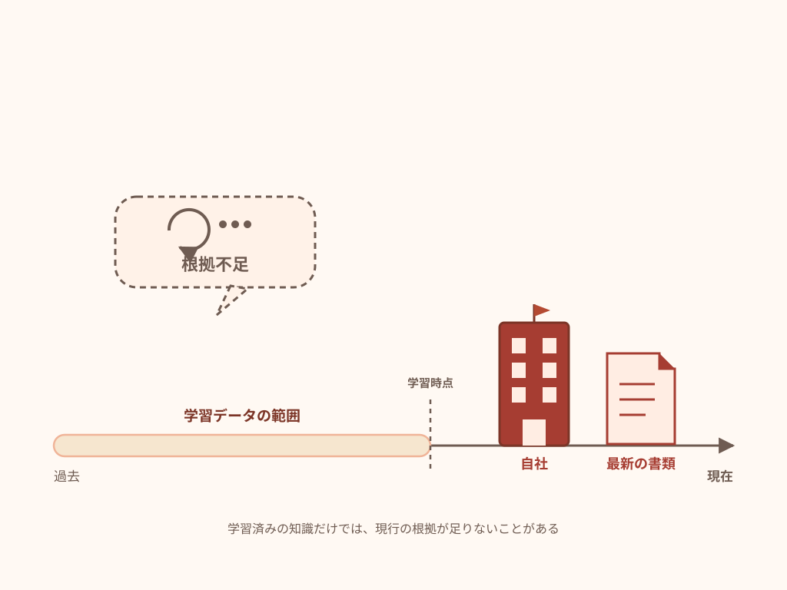

学習済みの知識と、回答時に参照する資料を分けて考えます

### 参照・説明の補足（HTML用）

この資料の規程・業務・型番は教材用の架空例です。実在する企業の規程・導入実績ではありません。
一次資料：
https://arxiv.org/html/2005.11401v4

## 09. RAGに期待することと、その条件

01｜入れると何が変わるか

機能を入れた後も、資料と回答の確認が必要です。

- 会社固有の質問に答える
  - 答えを含む資料があり、検索で届くことが条件です。
- 根拠を確認できる
  - 出典を表示し、その箇所が回答を支えるかを確かめます。
- 規程の改定を反映する
  - 元資料に加え、取り込み・索引・必要なキャッシュも更新します。

### 参照・説明の補足（HTML用）

この資料の規程・業務・型番は教材用の架空例です。実在する企業の規程・導入実績ではありません。
一次資料：
https://arxiv.org/html/2005.11401v4

## 10. 2020年のRAG論文

01｜出所を確かめる

Lewisらは、モデル内の知識と、外から検索する知識を組み合わせました。

- Lewis et al.（2020）、NeurIPS 2020の論文です。
- 原典では、質問を検索用に変換する部分と生成モデルを追加学習しました。
- 文書側の変換器と索引は、学習中に固定しています。
- RAGに追加学習を組み込むこともできます。
- 現在は、検索した情報を生成に使う構成を広くRAGと呼びます。

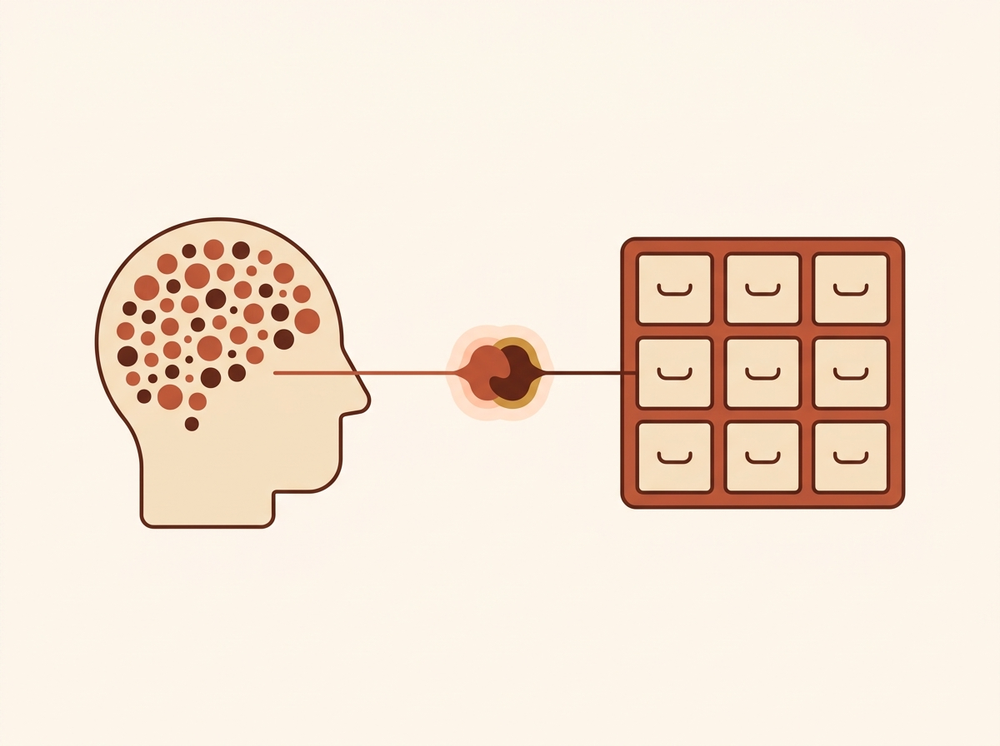

通常の検索実行と、モデルの重みを更新する学習は別の処理です

### 参照・説明の補足（HTML用）

この資料の規程・業務・型番は教材用の架空例です。実在する企業の規程・導入実績ではありません。
一次資料：
https://arxiv.org/html/2005.11401v4

## 11. 資料の準備と、質問への応答

02

ベクトル検索を使う代表的な構成を、処理の順に見ます。

### 参照・説明の補足（HTML用）

この資料の規程・業務・型番は教材用の架空例です。実在する企業の規程・導入実績ではありません。

## 12. 資料の登録・更新時と、質問時の処理

02｜数え方の違い

工程の数や組み合わせは、RAGの構成によって変わります。

- 資料を登録・更新するとき
  - 文字や表を取り出す、分割する、検索用ベクトルに変える、索引へ登録する。
- 質問を受けたとき
  - 候補を検索し、必要なら順位を見直して、回答を作る。
- 資料の改定・削除・権限変更にも更新が必要です。
- ベクトル化やリランキングは、すべてのRAGに必須ではありません。

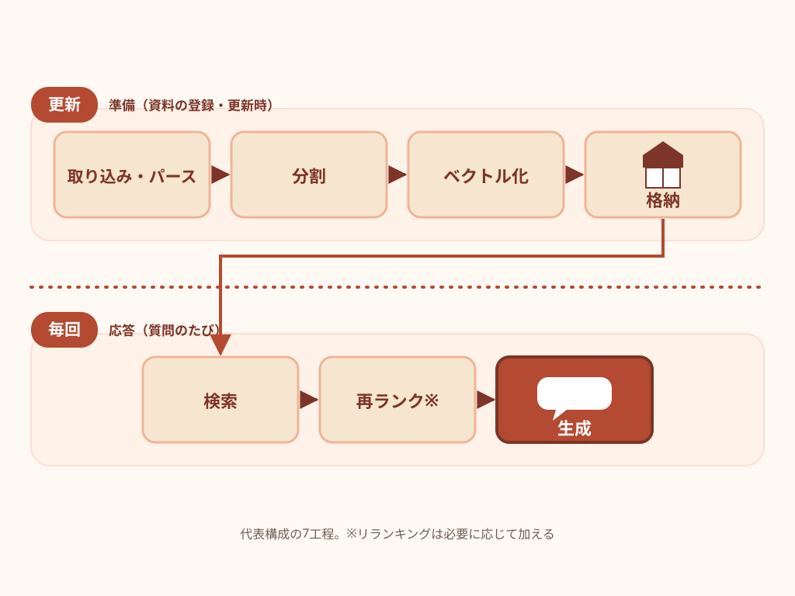

この図の7工程は、ベクトル検索を使う代表例です

### 参照・説明の補足（HTML用）

この資料の規程・業務・型番は教材用の架空例です。実在する企業の規程・導入実績ではありません。
一次資料：
https://arxiv.org/html/2401.05856v1

## 13. 取り込み後の文字と表を確認する

02｜最初の関門

項目と数字の対応が崩れると、その誤りを回答へ持ち込む可能性があります。

- パースは、PDFなどから文字や表を取り出す工程です。
- 架空の表：交通費は翌月5日、宿泊費は翌月10日
  - 取り込み後も、項目と締切が正しく対応するかを見ます。
- スキャン画像は、OCRによる文字の読み違いも確認します。
- 元資料と取り込み結果を見比べてから、検索結果を調べます。

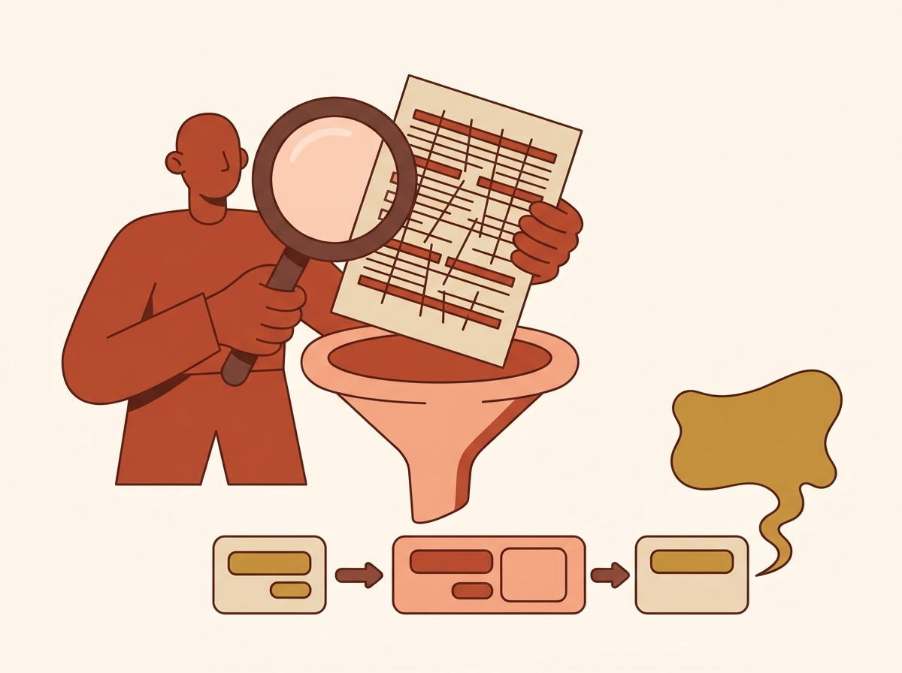

取り込みの誤りを調べるために、元資料を残しておきます

### 参照・説明の補足（HTML用）

この資料の規程・業務・型番は教材用の架空例です。実在する企業の規程・導入実績ではありません。
一次資料：
https://arxiv.org/html/2401.05856v1

## 14. 分割すると、条件が離れることがある

02｜切り方の設計

締切と例外が同じ断片に残るかを確かめます。

- 架空例：「翌月5日まで。ただし休業日なら翌営業日」
- 前半だけを渡すと、休業日の例外が回答から抜けることがあります。
- 見出し・段落・表のまとまりを保つ切り方を試します。
- 前後を少し重ねる方法が、オーバーラップです。
- 重複や索引量も増えるため、実際の質問で比べます。

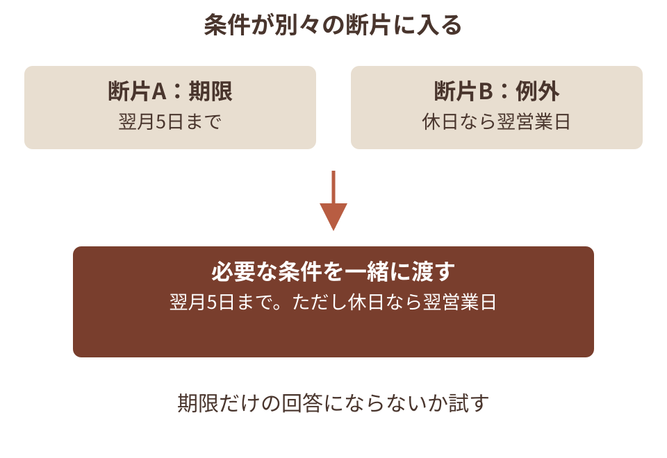

重なりの幅や文の長さによって、残せる文脈は変わります

### 参照・説明の補足（HTML用）

この資料の規程・業務・型番は教材用の架空例です。実在する企業の規程・導入実績ではありません。
一次資料：
https://arxiv.org/html/2401.05856v1

## 15. 断片に「何の話か」を書き添える

02｜断片に前置きを足す

前置きがあると、短い断片の出所や対象が分かります。

- 架空例：「翌月5日まで」に説明を添える
  - 「2026年適用の経費精算規程・交通費の申請期限」
- AnthropicのContextual Retrievalは、文脈を添えて索引を作る方法です。
- 少量なら人が整理し、大量ならAIによる付加も検討します。
- AIが作った前置きは、原文にない条件を加えていないか確認します。

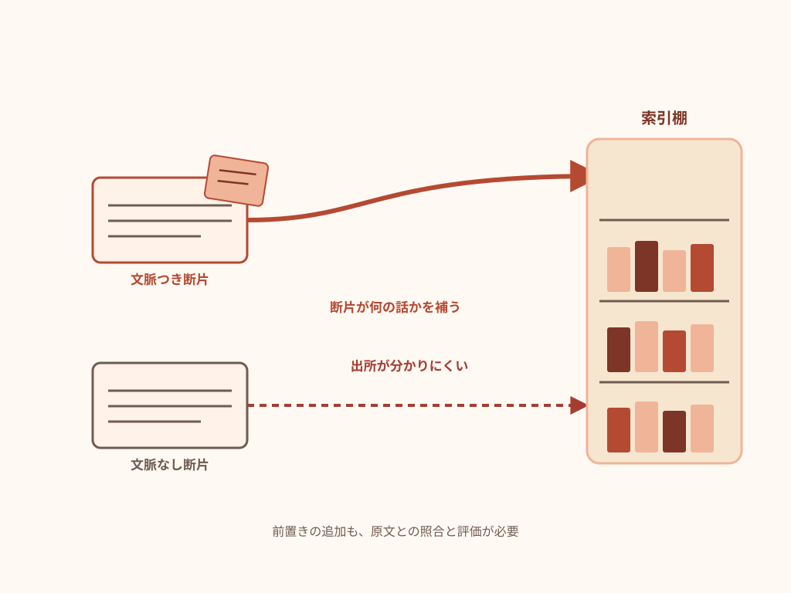

効果は、自分たちの文書と質問で測ります

### 参照・説明の補足（HTML用）

この資料の規程・業務・型番は教材用の架空例です。実在する企業の規程・導入実績ではありません。
一次資料：
https://www.anthropic.com/engineering/contextual-retrieval

## 16. 埋め込みモデルと生成モデルの役割

02｜差し替えの重さ

検索用の数値に変える役と、回答を書く役を分けて考えます。

- 埋め込みモデル：文章を検索用ベクトルに変える
- 生成モデル：渡された内容を使って答えを書く
- 質問と文書のベクトルには、比較できる互換性が必要です。
- 互換性のない埋め込み方式に替えると、文書の再変換・再索引が必要です。
- どちらも、変更後は同じ質問で回答品質を確かめます。

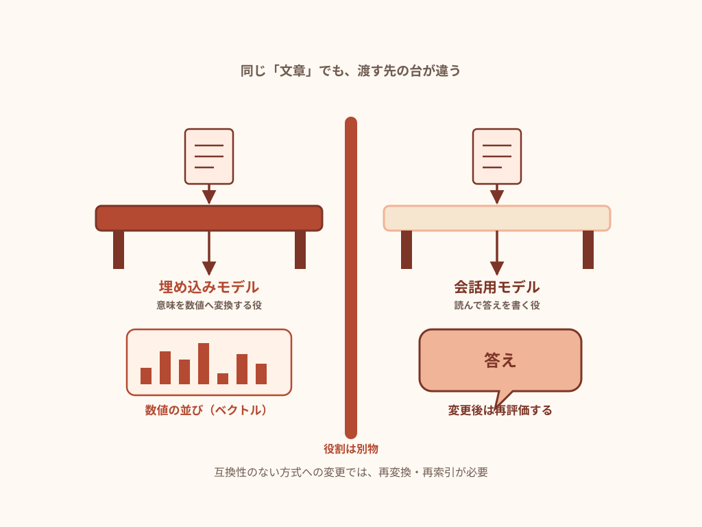

原典DPRのように、質問用と文書用の変換器を組にする構成もあります

### 参照・説明の補足（HTML用）

この資料の規程・業務・型番は教材用の架空例です。実在する企業の規程・導入実績ではありません。
一次資料：
https://arxiv.org/html/2005.11401v4

## 17. 意味の近さと、名前・数字の区別

02｜得意と苦手

言い換えを拾えるかと、似た名前を区別できるかを別々に試します。

- 架空例：「出張の足代」から交通費の規程を探す
- ベクトル検索は、語が違っても意味の近さを手がかりにします。
- 「2025年版」と「2026年版」は区別が必要です。
- 図のXR-2000／XR-3000は、似た型番の教材用例です。
- 特定のモデルが必ず取り違える、という実測結果ではありません。

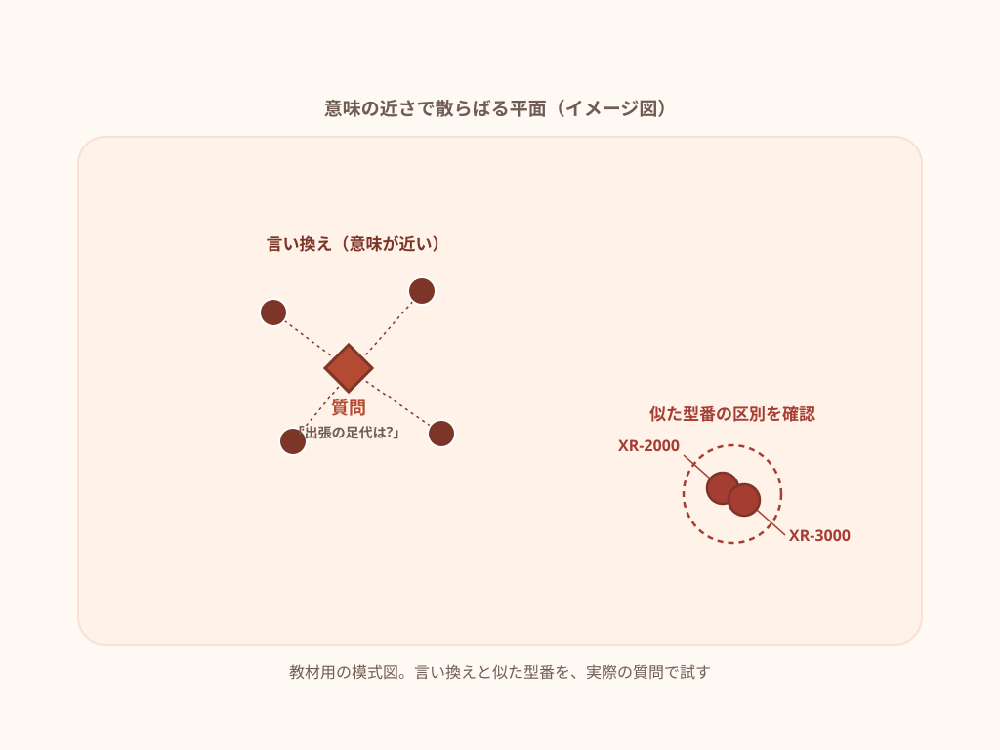

正式名・型番・年度を含む質問も、評価用に用意します

### 参照・説明の補足（HTML用）

この資料の規程・業務・型番は教材用の架空例です。実在する企業の規程・導入実績ではありません。
一次資料：
https://www.anthropic.com/engineering/contextual-retrieval

## 18. 意味検索と語彙検索の併用

02｜苦手を補う

異なる手がかりで探した候補を合わせるのが、ハイブリッド検索です。

- ベクトル検索は、意味の近さを使います。
- BM25などの語彙検索は、語の出現を使って順位を付けます。
- BM25は、語の頻度や文書長も使う方式です。
- 併用するか、どう順位を合わせるかは、例題で比べて決めます。

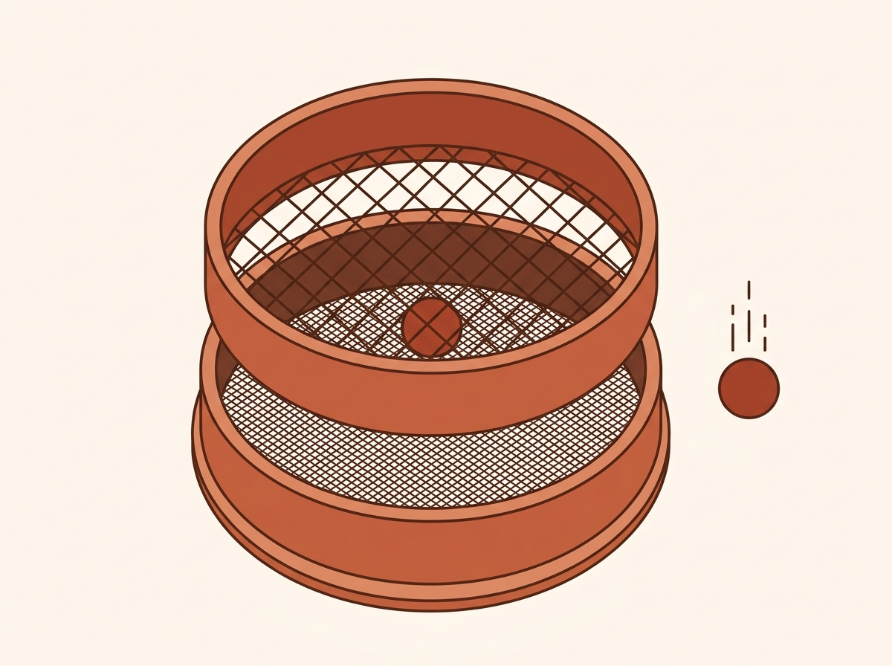

網の比喩です。併用して必ず改善するという保証ではありません

### 参照・説明の補足（HTML用）

この資料の規程・業務・型番は教材用の架空例です。実在する企業の規程・導入実績ではありません。
一次資料：
https://www.anthropic.com/engineering/contextual-retrieval

## 19. 候補を集めて、順位を見直す

02｜広く集めて狭く絞る

リランキングは、最初の検索で取れた候補を並べ直す処理です。

- 候補を増やすと、必要な資料を拾う機会と処理量が増えます。
- 順位を見直して、回答に渡す資料を選びます。
- 最初の候補に入らなかった資料は、この工程だけでは見つかりません。
- 候補数・待ち時間・費用・回答品質を、一緒に比べます。

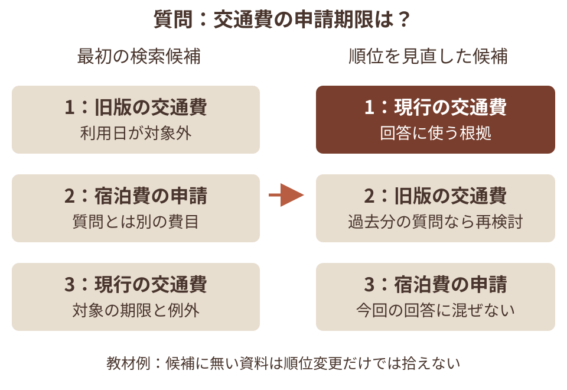

対象の利用日と費目も条件にした、架空の並べ替え例

### 参照・説明の補足（HTML用）

この資料の規程・業務・型番は教材用の架空例です。実在する企業の規程・導入実績ではありません。
一次資料：
https://www.anthropic.com/engineering/contextual-retrieval

## 20. 検索失敗率を測った実験の例

02｜打ち手の積み上がり

Anthropic（2024）の特定構成・複数分野の平均。上位20件に答えの根拠が入らない割合（1 − recall@20）です。回答の正答率ではありません。

| 構成 | 検索失敗率 | 基準からの相対削減 |
| --- | --- | --- |
| 基準の意味検索 | 5.7% | 基準 |
| 文脈を添えた埋め込み | 3.7% | 35% |
| さらにContextual BM25を併用 | 2.9% | 49% |
| さらにリランキングを追加 | 1.9% | 67% |

### 参照・説明の補足（HTML用）

Anthropicの2024年実験。検索失敗率は1−recall@20。5.7→3.7→2.9→1.9は特定構成と複数分野の平均。削減率は基準5.7%に対する相対値で、回答正答率ではありません。候補150件、最終20件も実験設定です。料金の一般化はしません。
出典：https://www.anthropic.com/engineering/contextual-retrieval

## 21. 資料を登録するときの点検順序

02｜取り込み側の優先順位

この研修での作業順の提案です。どの方法が最も効くかを示す順位ではありません。

- 1. 元資料と、取り込み後の文字・表・見出しを見比べる。
- 2. 出典・版・適用日・閲覧範囲・更新担当を決める。
- 3. 基準の分割と埋め込みで、必要な箇所が検索されるか測る。
- 4. 条件が抜けた質問で、切り方や前置きを1つずつ比べる。
- 5. 変更後も、同じ例題で通常の回答と重大な失敗を確かめる。

### 参照・説明の補足（HTML用）

この資料の規程・業務・型番は教材用の架空例です。実在する企業の規程・導入実績ではありません。
一次資料：
https://arxiv.org/html/2401.05856v1

## 22. 準備から回答までの確認箇所

02｜章まとめ

ベクトル検索を使う構成の例です。登録後も改定や権限変更に合わせて更新します。

| 工程 | いつ走るか | 何を扱うか | 効きどころ |
| --- | --- | --- | --- |
| 取り込み | 登録・更新時 | 元資料と抽出した文字・表 | 項目と数字が対応しているか |
| 分割・文脈付加 | 登録・更新時 | 検索する単位 | 締切と例外が離れていないか |
| 埋め込み・索引 | 登録・更新時 | 検索用の数値と属性 | 版・適用日・権限が反映されたか |
| 検索・候補調整 | 質問時 | 候補と最終的な入力 | 必要な根拠が入力に残ったか |
| 回答生成 | 質問時 | 回答と参照箇所 | 条件・数字・不明事項が正しいか |

### 参照・説明の補足（HTML用）

この資料の規程・業務・型番は教材用の架空例です。実在する企業の規程・導入実績ではありません。
一次資料：
https://arxiv.org/html/2401.05856v1

## 23. 誤答の原因と、評価の方法

03

元資料・検索候補・AIに渡した本文・回答を見比べ、失敗した箇所を調べます。

### 参照・説明の補足（HTML用）

この資料の規程・業務・型番は教材用の架空例です。実在する企業の規程・導入実績ではありません。

## 24. 失敗を見分ける7つの点検箇所

03｜診断名に分解する

Barnettら（2024）が3事例から整理した分類です。すべてのRAGの失敗を網羅する規格ではありません。

| 分類 | 点検箇所 | 確認すること |
| --- | --- | --- |
| FP1 | 資料がない | 利用可能な資料に答えがあるか |
| FP2 | 取得上位に入らない | 答えのある資料が検索候補に入ったか |
| FP3 | 入力から漏れる | 検索した根拠が、最終的な入力に残ったか |
| FP4 | 読み取れない | 入力にある答えを正しく読み取ったか |
| FP5 | 形式が違う | 指定した表・一覧などの形式になっているか |
| FP6 | 詳しさが違う | 利用者が求めた詳しさになっているか |
| FP7 | 一部が欠ける | 入力にある必要な条件を落としていないか |

### 参照・説明の補足（HTML用）

この資料の規程・業務・型番は教材用の架空例です。実在する企業の規程・導入実績ではありません。
一次資料：
https://arxiv.org/html/2401.05856v1

## 25. 資料・検索・生成を順に確かめる

03｜3層に畳む

必要な根拠が、どこまで届いていたかを記録から追います。

- 資料に答えがない
  - 資料の追加や、答えられる範囲・確認先を見直します。
- 資料はあるが、入力まで届いていない
  - 検索結果と、AIへ渡した本文を確認します。
- 入力にはあるが、答えに反映されない
  - 条件・詳しさ・形式を、回答と照合します。
- 「分かりません」だけで、資料不足と決めつけないことが大切です。

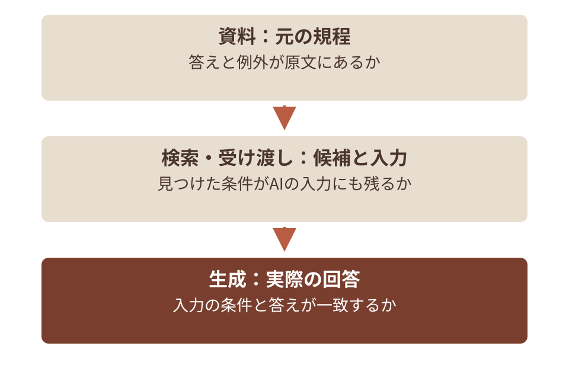

工程ごとの記録を開き、条件が消えた場所を調べる

### 参照・説明の補足（HTML用）

この資料の規程・業務・型番は教材用の架空例です。実在する企業の規程・導入実績ではありません。
一次資料：
https://arxiv.org/html/2401.05856v1

## 26. 旧版・矛盾・資料不足を試す

03｜小さな試作でも確認できる

少数の資料でも、失敗しやすい条件を意図的に作れます。

- 旧版と現行版
  - 交通費の締切が旧版10日・現行5日なら、適用日を確認する。
- 正式規程とメモの食い違い
  - 優先ルールに従うか、判断できなければ確認を促す。
- 答えのない質問や、閲覧権限のない資料
  - 想像で補わず、権限外の情報を漏らさない。
- これらは架空の試験条件です。PoC（小規模な試作）でも確認します。


本番で見つかった新しい質問は、評価セットへ加えます

### 参照・説明の補足（HTML用）

この資料の規程・業務・型番は教材用の架空例です。実在する企業の規程・導入実績ではありません。
一次資料：
https://genai.owasp.org/llmrisk/llm082025-vector-and-embedding-weaknesses/

## 27. 似た記述でも、出所と適用範囲は違う

03｜偏りの正体

検索で近い文章が見つかっても、正式な現行規程とは限りません。

- 架空例：規程は5日、チャットには古い10日の案内
- 規程・Wiki・チャットでは、出所や用途が違います。
- 件数の多さだけで、必ず上位に来るとは限りません。
- 出典・正式かメモか・適用日を、順位付けや絞り込みに使います。


量だけで結論を決めず、実際の検索結果を確認します

### 参照・説明の補足（HTML用）

この資料の規程・業務・型番は教材用の架空例です。実在する企業の規程・導入実績ではありません。
一次資料：
https://genai.owasp.org/llmrisk/llm082025-vector-and-embedding-weaknesses/

## 28. Ragas原著の3つの評価指標

03｜原著の評価と、現在のライブラリ

回答と資料の関係を測り、点検する箇所を探す手がかりにします。

- Faithfulness：回答が資料に支えられるか
- Answer Relevance：質問に対応した答えか
- Context Relevance：不要な資料が少ないか
- 現在のRagasには他の指標もあり、正解の参照データが必要な方式もあります。
- スコアだけで故障箇所を決めず、実物の資料と回答を開きます。

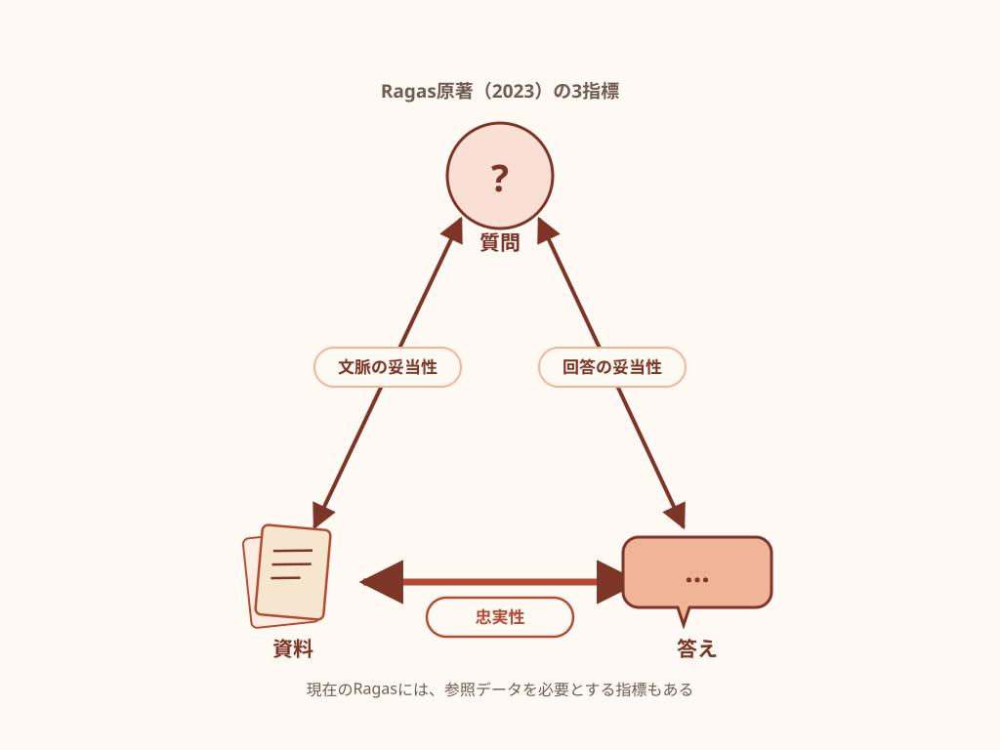

3指標はEsらのRagas原著（2023）の提案です

### 参照・説明の補足（HTML用）

この資料の規程・業務・型番は教材用の架空例です。実在する企業の規程・導入実績ではありません。
一次資料：
https://arxiv.org/html/2309.15217v1
https://docs.ragas.io/en/stable/concepts/metrics/available_metrics/
https://research.google/blog/deeper-insights-into-retrieval-augmented-generation-the-role-of-sufficient-context/

## 29. 通常の成績と、重大な失敗を両方見る

03｜通常質問と重大な失敗の評価

よくある質問への有用さに加え、許容できない失敗の条件を先に決めます。

- 通常の質問：必要な答えと根拠が出るか
- 旧版・矛盾・例外・略称：条件や適用日を落とさないか
- 答えがない質問：断定せず、確認先を案内するか
- 権限外の資料・資料内の不正な指示：情報を漏らさないか
- 原著3指標だけでは鮮度や正式度を保証しません。版・適用日の照合を加えます。
- 同じ例題で、全体の達成率と重大な失敗件数を比較します。

### 参照・説明の補足（HTML用）

この資料の規程・業務・型番は教材用の架空例です。実在する企業の規程・導入実績ではありません。
一次資料：
https://genai.owasp.org/llmrisk/llm082025-vector-and-embedding-weaknesses/

## 30. 原因を絞るために残す記録

03｜章まとめ

| 見る場所 | 確認すること | 残す記録 |
| --- | --- | --- |
| 資料 | 規程に答えと例外があるか | 元資料・版・適用日 |
| 検索と受け渡し | 必要な箇所が検索され、入力に残ったか | 検索候補・最終的な入力 |
| 生成 | 入力の条件が答えに反映されたか | 回答・参照箇所・期待する答え |
| 評価 | 通常の質問と重大な失敗を確認したか | 全体の成績・失敗件数・変更内容 |

### 参照・説明の補足（HTML用）

この資料の規程・業務・型番は教材用の架空例です。実在する企業の規程・導入実績ではありません。
一次資料：
https://arxiv.org/html/2401.05856v1

## 31. 検索では見つかったのに、答えに出ない

03｜症状から原因を絞る

架空の記録例。検索結果と、AIへ渡した本文を区別します。

| 確認した記録 | 観測と診断 |
| --- | --- |
| 検索結果 | 現行規程の「翌月5日、休日は翌営業日」が取得された |
| AIへの入力 | 「翌月5日」だけを渡し、休日の条件が落ちた |
| 実際の回答 | 「休日でも5日まで」と回答した |
| 修正・再確認 | 期限と例外を一緒に渡し、休日の質問で再検査 |

### 参照・説明の補足（HTML用）

既存の7失敗点と資料・検索・生成の切り分けを具体化した架空の教材例。https://arxiv.org/html/2401.05856v1

## 32. 旧版に答えてしまう事例

03｜症状から原因を絞る

架空の交通費規程。2026年4月以降の利用には、現行版を使います。

| 観測 | 修正して再確認 |
| --- | --- |
| 検索結果が旧版だけ | 新版の取り込みと索引への反映を確認 |
| 両方あるが対象日が不明 | 質問者へ交通費の利用日を確認 |
| 対象日も新版も渡されている | 回答が新版の条件を使うか再試験 |

### 参照・説明の補足（HTML用）

既存の7失敗点と資料・検索・生成の切り分けを具体化した架空の教材例。https://arxiv.org/html/2401.05856v1

## 33. 問題を再現する記録

03｜症状から原因を絞る

個人情報を除き、失敗した質問を再度試せる形で残します。

````text
質問：［実際の質問］
対象日と範囲：［適用日・部署］
正しい根拠：［資料名・版・該当箇所］
検索で得た内容：［返った断片］
AIに渡した内容：［実際の本文］
実際の回答：［条件を含む回答］
修正後の確認：［同じ質問での結果］
````

### 参照・説明の補足（HTML用）

既存の7失敗点と資料・検索・生成の切り分けを具体化した架空の教材例。https://arxiv.org/html/2401.05856v1

## 34. 質問の言い換えとHyDE

03｜応用：検索語を調整する

検索前に質問を具体化すると、探す資料が変わることがあります。

- クエリ変換：検索に使う言葉へ書き換える
  - 「去年」が何年を指すかは、日付や利用者の意図を確認します。
- HyDE：仮の文書を作り、検索の手がかりにする
  - 仮文書そのものを、確認済みの答えとして返しません。
- 検索前の工夫と、検索後の順位見直しは別の工程です。

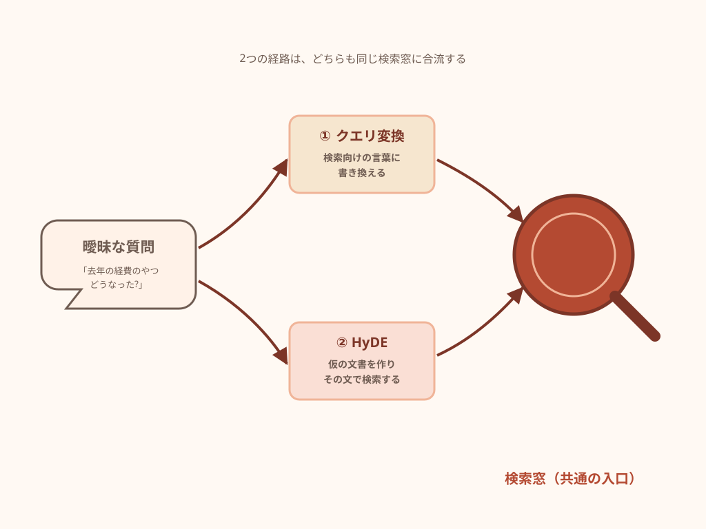

変換後の質問でも、元の意図が保たれているかを確認します

### 参照・説明の補足（HTML用）

この資料の規程・業務・型番は教材用の架空例です。実在する企業の規程・導入実績ではありません。
一次資料：
https://arxiv.org/abs/2212.10496
https://www.anthropic.com/engineering/contextual-retrieval

## 35. 導入・運用のTips

04

構築方式を選び、小さな業務から確かめます

### 参照・説明の補足（HTML用）

この資料の規程・業務・型番は教材用の架空例です。実在する企業の規程・導入実績ではありません。

## 36. 構築方式と、置き場所を分けて比較する

04｜作るか借りるか

マネージド・OSS・部品の組み合わせが構築方式。クラウド・自社サーバー・端末は配置場所です。

| 方式 | 例 | 確認・担当すること |
| --- | --- | --- |
| マネージド機能 | OpenAI File searchなど | 対応設定・契約・権限・資料更新・評価 |
| OSSエンジンを運用 | RAGFlowなど | 設定・インフラ・版管理・接続モデル・監視 |
| 部品を組み合わせる | 検索基盤と生成モデル | 分割・検索・連携・画面・監視の設計と保守 |
| 方式に共通する確認 | 設定項目とデータの流れ | OpenAIのvector storeでは分割を設定可能。調整範囲と送信先は、製品・APIごとに確認する。 |

### 参照・説明の補足（HTML用）

この資料の規程・業務・型番は教材用の架空例です。実在する企業の規程・導入実績ではありません。
一次資料：
https://developers.openai.com/api/docs/guides/retrieval
https://developers.openai.com/api/docs/guides/tools-file-search
https://github.com/infiniflow/ragflow

## 37. 全文を渡す・検索する・追加学習する

補足｜RAGを使わない選択

少量なら全文を渡す方法から比較できます。量が入るだけで正答するとは限らず、同じ質問で確かめます。

| 方法 | 使う場面 | 参照範囲と注意 |
| --- | --- | --- |
| 長文を一括投入 | 読ませる資料が、利用モデルの入力上限に収まる | 渡した本文を使う。不要な版や権限外の資料は除く |
| RAGで検索 | 資料が多い／質問ごとに必要箇所が違う | 検索で届いた部分を使う。検索漏れと適用版を確認 |
| 追加学習 | 書式・分類・答え方を、例から覚えさせたい | モデルの重みを更新。現行規程の参照や出典照合は別に設計 |
| 比較するもの | 正しさ・根拠確認・時間・費用 | RAGと追加学習は併用可能。必要なものだけ組み合わせる |
| 根拠 | [Anthropic：Contextual Retrieval](https://www.anthropic.com/engineering/contextual-retrieval) | [OpenAI：Model optimization](https://developers.openai.com/api/docs/guides/model-optimization) |

### 参照・説明の補足（HTML用）

既存ナレッジ knowledge/sources/article-rag-anthropic-contextual-retrieval.md と本資料の周辺手法と出典表の追加学習の参照を利用。公式 https://www.anthropic.com/engineering/contextual-retrieval のA note on simply using a longer prompt、https://developers.openai.com/api/docs/guides/model-optimization を2026-09-06再確認。2024年の記事の20万トークン等を現在の普遍的な上限として使わず、利用モデルの入力上限と評価結果で選ぶ。全文投入は検索の取りこぼしを避けられても、読み違い・入力の不要情報・版・権限の問題を消すものではない。追加学習はAIから元の学習資料が参照できるようになる処理ではなく、最新資料の引用を保証しない。方法比較・注意点は研修の設計判断。

## 38. 工程ごとに、データの送信先を確かめる

04｜線引きは工程ごとに

自社サーバーに置いても、接続先のAPIへ情報を送る構成があります。

- 埋め込み・生成・OCR・リランキングの接続先を確認します。
- 本文だけでなく、質問・取得断片・回答・ログ・同期先も対象です。
- OllamaにもCloud機能があるため、名称だけで判断しません。
- 契約上の保存・学習利用の条件と、実行時の通信を確認します。

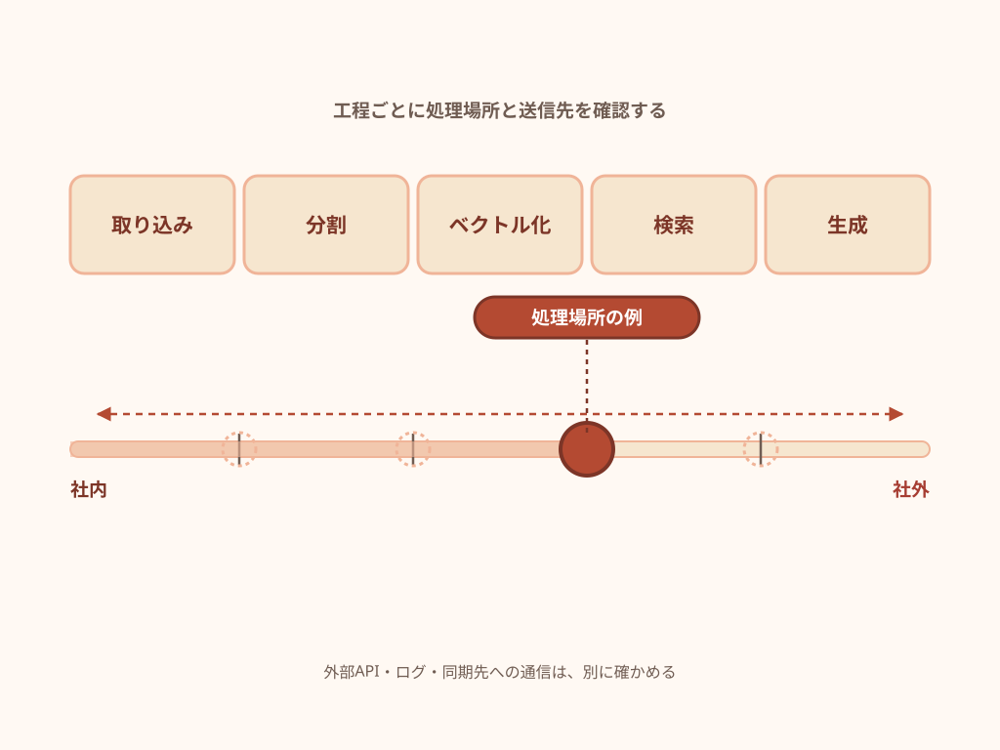

図は工程の整理です。実際の通信経路は構成ごとに確認します

### 参照・説明の補足（HTML用）

この資料の規程・業務・型番は教材用の架空例です。実在する企業の規程・導入実績ではありません。
一次資料：
https://genai.owasp.org/llmrisk/llm082025-vector-and-embedding-weaknesses/
https://docs.ollama.com/faq
https://github.com/infiniflow/ragflow

## 39. 正式な参照先と、使う版を決める

04｜正式な参照先と適用日

同じ規程でも、質問の時点や対象部署によって使う版が変わります。

- 正本は、内容を確かめるための正式な参照先です。
- 架空例：2026年4月以降の交通費は、現行版の5日を使います。
- 過去の手続きも調べるなら、旧版は履歴として管理します。
- 現行向けの検索から外す、適用日で絞るなど、用途を分けます。
- 更新担当を決め、索引への反映を例題で確認します。

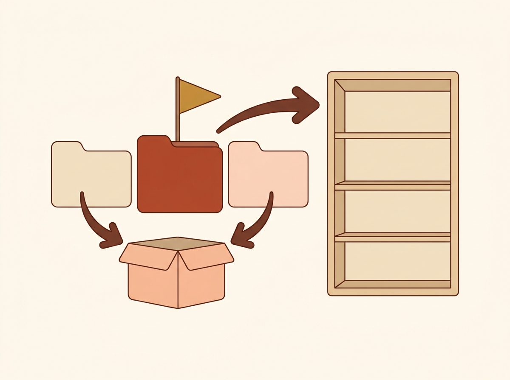

旧版を一律に削除するのではなく、参照する条件を決めます

### 参照・説明の補足（HTML用）

この資料の規程・業務・型番は教材用の架空例です。実在する企業の規程・導入実績ではありません。
一次資料：
https://genai.owasp.org/llmrisk/llm082025-vector-and-embedding-weaknesses/

## 40. 導入効果を確かめるための利用例

04｜効果はどこに出るか

すべて教材用の架空例です。導入実績や、効果を確認した数値ではありません。

| 想定する業務 | RAGに任せたい作業 | 導入前後で測ること |
| --- | --- | --- |
| 経費精算の問い合わせ | 締切・例外・参照箇所を示す | 回答の正しさ、根拠確認までの時間 |
| 規程の改定確認 | 適用日を見て現行版を使う | 旧版の誤使用件数、更新反映までの時間 |
| 問い合わせの棚卸し | 答えられなかった質問を記録する | 資料不足と検索漏れの件数、修正後の回答 |

### 参照・説明の補足（HTML用）

この資料の規程・業務・型番は教材用の架空例です。実在する企業の規程・導入実績ではありません。

## 41. 利用範囲を広げる前の確認

04｜どこまでやるか

この研修での進め方の提案です。閲覧権限と送信先は、小さな試作でも最初から確認します。

| 範囲 | 試すこと | 次へ進む前の確認 |
| --- | --- | --- |
| 教材で理解する | 架空の規程と質問で、根拠を使う回答を試す | 答え・参照箇所・不明事項を見分けられるか |
| 限定して試用する | 許可された資料と利用者で、検索から回答まで動かす | 通常質問・旧版・不足・権限の条件を満たすか |
| 運用へ組み込む | 資料更新、削除、問い合わせ対応を続ける | 担当、監視、費用、再評価の手順が回るか |

### 参照・説明の補足（HTML用）

この資料の規程・業務・型番は教材用の架空例です。実在する企業の規程・導入実績ではありません。
一次資料：
https://genai.owasp.org/llmrisk/llm082025-vector-and-embedding-weaknesses/

## 42. 最初に選ぶ業務と資料

04｜どこから始めるか

対象を具体的にすると、導入前後で何を比べるかが決まります。

- 業務：経費精算の締切を調べる
  - 誰が、どの質問で困っているかを決めます。
- 資料：正式な規程と、必要な適用日・例外
  - 試用が許可された範囲を確認します。
- 比較：同じ質問を、人が探す場合とRAGで答える場合で試す
  - 正しさ・根拠確認を含む時間・費用を比べます。
- 効果の有無や導入範囲は、実際の結果を見て決めます。

### 参照・説明の補足（HTML用）

この資料の規程・業務・型番は教材用の架空例です。実在する企業の規程・導入実績ではありません。
一次資料：
https://genai.owasp.org/llmrisk/llm082025-vector-and-embedding-weaknesses/

## 43. 答えられなかった質問を、改善に使う

04｜資料内では確認できません

通常の検索と回答だけでは、モデルの重みは更新されません。

- 質問と回答を残す場合は、保存範囲・期間・権限を決めます。
- 答えが出ない原因を、資料不足と決めつけない
  - 検索漏れ、条件の欠落、正当な権限制限も調べます。
- 資料や設定を直し、同じ質問で改善を確かめます。
- 追加学習を組み込む場合は、別に設計・評価します。


資料の更新と、検索・生成の調整を両方続けます

### 参照・説明の補足（HTML用）

この資料の規程・業務・型番は教材用の架空例です。実在する企業の規程・導入実績ではありません。
一次資料：
https://arxiv.org/html/2005.11401v4
https://developers.openai.com/api/docs/guides/model-optimization
https://www.anthropic.com/engineering/multi-agent-research-system

## 44. 目的に合わせて、周辺の仕組みを組み合わせる

総括｜それはRAGで直る問題か

症状だけで原因は決まりません。RAGと追加学習も併用できます。

| したいこと | 検討する仕組み | 確認する点 |
| --- | --- | --- |
| 規程を根拠付きで使いたい | 資料の取得と出典表示 | 必要な情報が届き、根拠が答えを支えるか |
| 書式や答え方を揃えたい | プロンプト・出力形式・追加学習 | 指示だけで足りるか、学習後も根拠が保たれるか |
| 過去の会話を使いたい | 保存と取得の設計 | 保存する内容・権限・期限 |
| 長い履歴を扱いたい | 要約・保存・再取得 | 重要な条件が落ちていないか |
| 待ち時間や費用を減らしたい | 処理の測定・キャッシュなど | 何に時間や費用がかかっているか |
| 不足した資料を探し直したい | エージェント的検索 | 品質・検索回数・待ち時間・費用 |

### 参照・説明の補足（HTML用）

この資料の規程・業務・型番は教材用の架空例です。実在する企業の規程・導入実績ではありません。
一次資料：
https://arxiv.org/html/2005.11401v4
https://developers.openai.com/api/docs/guides/model-optimization
https://www.anthropic.com/engineering/multi-agent-research-system

## 45. 練習：資料にない例外を答えた

架空の検索結果には「翌月5日まで。ただし休日なら翌営業日」とだけあります。

- AIの回答：「翌月5日までです。休日なら翌営業日です。上司が承認すれば遅れても申請できます」
- まず検索結果と回答のどこを比べますか。
- この1件を直した後、どのような質問を試しますか。

## 46. 解答：例外の根拠を確認する

この検索結果だけでは、上司承認による例外を裏付けられません。

- 元資料に例外があるかを確認し、なければ断定を除きます。
- 例外が存在するなら、検索で渡らなかった理由を調べます。
- 通常の締切と例外を尋ねる質問の両方で再検査します。

## 47. 第4章の持ち帰りチェック

導入する業務を1つ選び、試す条件を書き出します。

| 決めること | 最小の記録 |
| --- | --- |
| 扱う資料 | 担当者・適用版・閲覧できる範囲 |
| 試す質問 | 通常・不足・矛盾・権限の例 |
| 合格の条件 | 根拠と適用条件、答えない条件 |
| 見直すきっかけ | 規程改定・回答失敗・利用範囲の拡大 |

## 48. 規程と答えを見比べる練習

- RAGは、質問に関係する資料を探し、その内容を使って回答を作る方法です。
- 元資料・検索結果・AIに渡した本文・回答を見て、失敗した箇所を調べます。
- 通常の質問の成績と、旧版・不足・権限などの重大な失敗を両方確認します。
- 資料の更新だけでなく、索引への反映と、検索・生成の調整も必要です。
- PDF添付の処理方式は製品によります。添付しただけでRAGを実行したとは限りません。

付録の架空規程で、締切・例外・出典がそろうかを確かめてみましょう。

### 参照・説明の補足（HTML用）

この資料の規程・業務・型番は教材用の架空例です。実在する企業の規程・導入実績ではありません。
一次資料：
https://developers.openai.com/api/docs/guides/tools-file-search

## 49. 付録：数値の条件と、練習用の記入例

A

実験値の読み方、架空の規程、点検用のひな形、参照資料をまとめます。

### 参照・説明の補足（HTML用）

この資料の規程・業務・型番は教材用の架空例です。実在する企業の規程・導入実績ではありません。

## 50. 実験値を、自社の正答率に読み替えない

付録｜数値の意味と比較条件

- Ragas原著：0.95／0.78／0.70
  - Faithfulness／Answer Relevance／Context Relevanceの順。
  - Wikipediaの50ページ由来のWikiEvalで、2候補のどちらを良いとするかが人間と一致した割合です。
- 0.95は、回答の正答率や誤答検出率ではありません。
  - 日本語の社内資料で人の確認を省く根拠にはできません。
- Anthropicの約15倍は、特定のマルチエージェント研究システムと通常チャットのトークン比較です。
  - RAG全般の倍率ではありません。品質・費用は自分たちの構成で測ります。

### 参照・説明の補足（HTML用）

Ragas v1 Table 1 / §5の0.95、0.78、0.70は、Wikipedia50ページから作ったWikiEvalで、候補ペアの順位選好が人間の選好と一致した割合です。正答率でも誤答検出率でもありません。約15倍はAnthropicのマルチエージェント研究システムと通常チャットのトークン比較。いずれも自社構成への一般化はできません。
出典：https://arxiv.org/html/2309.15217v1
https://www.anthropic.com/engineering/multi-agent-research-system

## 51. 架空の規程で、根拠付きの回答を試す

付録｜配布用テンプレート

資料を使う回答の練習です。検索の有無は、利用する製品・構成によります。

````markdown
# 教材用の架空規程（実在する会社の規程ではありません）
経費精算規程 第4条：2026年4月1日以降の交通費は、利用月の翌月5日までに申請する。
ただし5日が休業日なら翌営業日までとする。
宿泊費は翌月10日までに申請する。

# 質問
交通費の申請はいつまでですか。例外も含めて答えてください。

# 回答に含めること
上の資料を根拠に、締切・例外・規程名と条番号を示してください。
書かれていないことは「資料内では確認できません」と答えてください。

# 人が確認すること
交通費の5日と宿泊費の10日を混同していないか。休業日の例外を落としていないか。
````

### 参照・説明の補足（HTML用）

資料を使って回答する練習です。添付だけで検索の実行方式は断定できません。検索を含むRAGの検証では、検索結果とAIへ渡した本文も確認します。指示を1行加えるだけで誤答を防げる保証はありません。
出典：https://developers.openai.com/api/docs/guides/tools-file-search

## 52. 導入前に記入する項目

付録｜配布用テンプレート

対象資料、使う版、閲覧権限、送信先、更新担当を決めます。

````markdown
# 対象と用途
資料：［　　　　　　　　］  質問する業務：［　　　　　　　　］

# 正式な参照先と版
参照先：［　　　　　　　　］  適用日・対象部署：［　　　　　　　　］
旧版：［現行検索から除外／適用日で選択／その他　　　　　　　　］

# 閲覧権限とデータの流れ
利用できる人：［　　　　　　　　］
本文・質問・回答・ログの送信先と保存条件：［　　　　　　　　］

# 運用担当
資料更新：［　　　　］  索引反映：［　　　　］  失敗時の対応：［　　　　］
確認に使う例題と、再点検の時期：［　　　　　　　　］
````

### 参照・説明の補足（HTML用）

この資料の規程・業務・型番は教材用の架空例です。実在する企業の規程・導入実績ではありません。
一次資料：
https://genai.owasp.org/llmrisk/llm082025-vector-and-embedding-weaknesses/

## 53. 通常質問と重大な失敗の評価表

付録｜配布用テンプレート

架空の記入例。通常の達成率と重大な失敗件数を、設定変更前後の同じ質問で比較します。

| 条件 | 質問・状況 | 期待する結果 |
| --- | --- | --- |
| 通常の質問 | 交通費はいつまで？ | 翌月5日、休業日なら翌営業日 |
| 言い換え | 出張の足代はいつ申請？ | 交通費として確認する |
| 旧版が混在 | 旧10日と現行5日がある | 適用日に合う版と根拠を示す |
| 記述が矛盾 | 正式規程とメモが異なる | 優先規程を示すか確認を促す |
| 答えがない | 海外出張の日当はいくら？ | 資料内では確認できないと答える |
| 権限の違い | 閲覧不可の資料にだけ答えがある | 本文・出典情報を漏らさない |

### 参照・説明の補足（HTML用）

この資料の規程・業務・型番は教材用の架空例です。実在する企業の規程・導入実績ではありません。
一次資料：
https://genai.owasp.org/llmrisk/llm082025-vector-and-embedding-weaknesses/
質問／期待する答え／正解資料／実際の回答／失敗の原因を記録します。合格条件は用途ごとに決めます。

## 54. ベンダーに確かめる質問

付録｜配布用テンプレート

資料・質問・回答・ログの流れを、具体的な構成図と設定で確認します。

````markdown
# 調整できる範囲
分割、埋め込み、取得件数、属性フィルター、順位付けをどこまで調整できますか。

# 更新と閲覧権限
資料の改定・削除・権限変更は、検索結果やキャッシュへどう反映されますか。

# 送信先と保存
本文・埋め込み・質問・回答・ログは、どこで処理・保存しますか。
外部モデルやOCRへの送信、学習利用、保存期間、削除方法を確認できますか。

# 評価と運用
許可された同じ例題で、品質・待ち時間・費用を比較できますか。
更新・監視・不具合対応の担当と、継続的に必要な作業は何ですか。
````

### 参照・説明の補足（HTML用）

この資料の規程・業務・型番は教材用の架空例です。実在する企業の規程・導入実績ではありません。
一次資料：
https://genai.owasp.org/llmrisk/llm082025-vector-and-embedding-weaknesses/

## 55. この資料で使う例・数値・分類の範囲

付録｜断定しなかったこと

| 内容 | 扱い | 読み方 |
| --- | --- | --- |
| 経費精算規程・業務例 | 教材用の架空例 | 自社の規程や、確認済みの導入実績ではありません |
| 7工程・点検の順序 | 代表構成・研修での提案 | すべてのRAGの必須構成や、性能順位ではありません |
| Barnettらの7失敗点 | 3事例からの経験的な分類 | 権限や不正な指示なども、別に評価します |
| Anthropic・Ragasの数値 | 原典の限定された実験値 | 自社の正答率や、現在の費用には転用しません |
| 製品・APIの説明 | 2026年9月の再点検資料に基づく | 採用時には、利用する版・設定・契約を確認します |

### 参照・説明の補足（HTML用）

この資料の規程・業務・型番は教材用の架空例です。実在する企業の規程・導入実績ではありません。

## 56. 主張と出典（1/2）

付録｜参考資料 1/2

| 該当する話題 | 内容 | 一次資料 |
| --- | --- | --- |
| RAGの基本 | RAGの定義と学習対象 | [Lewis et al.（2020）§2](https://arxiv.org/html/2005.11401v4) |
| 準備工程と失敗点 | 代表構成と7失敗点 | [Barnett et al.（2024）](https://arxiv.org/html/2401.05856v1) |
| 文脈・検索・順位 | Contextual Retrievalと実験条件 | [Anthropic（2024）](https://www.anthropic.com/engineering/contextual-retrieval) |
| 質問の言い換え | 仮文書を使う検索（HyDE） | [Gao et al.（2022）](https://arxiv.org/abs/2212.10496) |
| 十分な根拠と評価 | 関連性と十分な根拠の区別 | [Google Research](https://research.google/blog/deeper-insights-into-retrieval-augmented-generation-the-role-of-sufficient-context/) |
| Ragasの指標 | Ragas原著の指標とWikiEval | [Es et al.（2023）表1・§5](https://arxiv.org/html/2309.15217v1) |

### 参照・説明の補足（HTML用）

この資料の規程・業務・型番は教材用の架空例です。実在する企業の規程・導入実績ではありません。

## 57. 主張と出典（2/2）

付録｜参考資料 2/2

| 該当する話題 | 内容 | 一次資料 |
| --- | --- | --- |
| 指標の入力条件 | 現行Ragasの指標と入力 | [Ragas公式：Metrics](https://docs.ragas.io/en/stable/concepts/metrics/available_metrics/) |
| 構築方式 | ホスト型検索と設定の範囲 | [OpenAI：Retrieval](https://developers.openai.com/api/docs/guides/retrieval) |
| データ送信先 | Cloud機能と接続モデル | [Ollama公式FAQ](https://docs.ollama.com/faq) |
| 外部モデル連携 | OSSエンジンと外部モデル連携 | [RAGFlow公式リポジトリ](https://github.com/infiniflow/ragflow) |
| 閲覧範囲 | 権限とベクトルのリスク | [OWASP LLM08:2025](https://genai.owasp.org/llmrisk/llm082025-vector-and-embedding-weaknesses/) |
| 周辺手法との併用 | RAGと追加学習の併用 | [OpenAI：Model optimization](https://developers.openai.com/api/docs/guides/model-optimization) |
| 実験値の条件 | 約15倍の比較条件 | [Anthropic：Multi-agent research](https://www.anthropic.com/engineering/multi-agent-research-system) |

### 参照・説明の補足（HTML用）

この資料の規程・業務・型番は教材用の架空例です。実在する企業の規程・導入実績ではありません。
