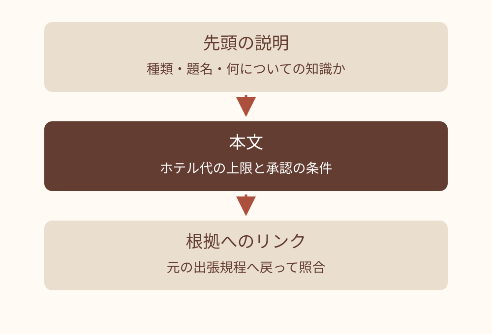
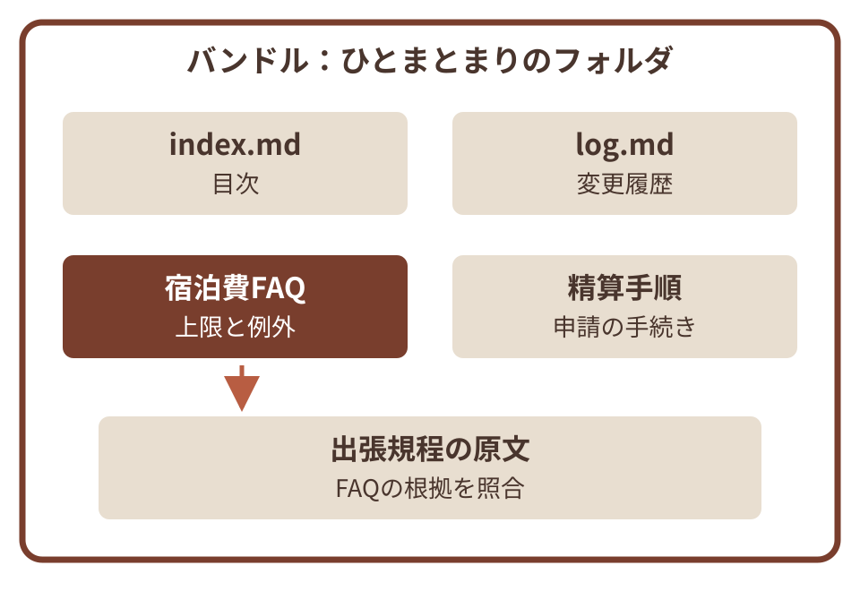
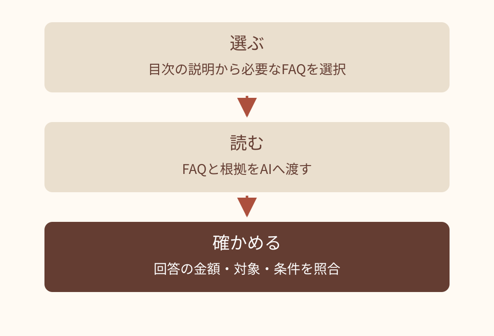
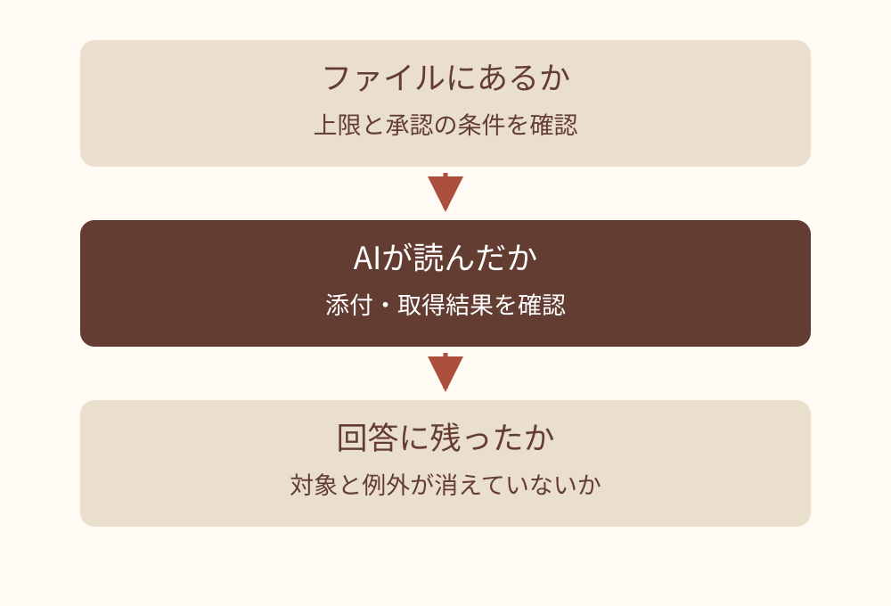

# OKF超入門 — スライド原稿

この原稿は [deck.json](deck.json) からの書き出し。修正は deck.json に行い、再出力する。

全55枚。元原稿 SHA-256: `e4d82591ed875c48a7c3a5a9874cbef73763cb825e18090d1682aa8e87fd5963`。

図版はリンク先の画像を参照。補足はHTML用の説明で、PPTXのスピーカーノートには含まれない。

## 01. OKF超入門

社内FAQを例に、
知識の書き方とAIへの渡し方を学ぶ

社内トレーニング / 2026-09

## 02. 「出張のホテル代、いくらまで？」

はじめに｜身近な質問から

社内の決まりをAIに聞くには、その決まりをAIが読めるようにする必要があります。

- 新人の質問
  - 「来週の出張で、1泊13,000円のホテルを予約してよいですか？」
- AIに見せた資料は、まだゼロ
  - この状態では、自社の上限や承認手順は分かりません。


研修用の架空例です。実際の社内規程ではありません。

## 03. 今日は、1つのFAQを作って使います

はじめに｜今日できるようになること

プログラミングの知識は不要です。ファイルとフォルダを使って説明します。

- OKFが何かを説明する
  - 社内の知識を、人とAIが参照しやすい形で書くルールです。
- 1つのFAQをOKFの形にする
  - ファイルの先頭に説明を付け、本文と根拠を書きます。
- AIに渡して、答えを確かめる
  - 答えの金額・条件・出典が元資料と合うかを見ます。

## 04. OKFとは何か

01

書き方の仕様を、宿泊費のFAQで理解する

## 05. OKFは、知識ファイルの書き方を決めた仕様

01｜OKFとは何か

Open Knowledge Format（オープンナレッジフォーマット）を、OKFと略します。

- 基本は、文章のファイルとフォルダ
  - ファイルの先頭に「種類・題名・説明」などを書き、本文に知識をまとめます。
- 人もAIも、同じファイルを参照する
  - Google Cloudが公開したオープン仕様です。この資料ではv0.2を扱います。
- AIに読ませる操作も必要
  - ファイルを作った後に、添付や接続の設定を行います。


専用サービスへの加入は不要です。ファイルを読める環境を使います。

## 06. 資料が食い違ったら、書き方を直す前に確認する

01｜OKFとは何か

研修用の架空例です。実際の社内規程ではありません。

### 手元にある資料

- 古いFAQ：「1泊10,000円まで」
- 9月改定の規程：「12,000円まで」
- チャット：「部長に聞いてみて」

### 総務担当に確認すること

- 今使う規程は、9月改定版か
- 12,000円は税込か、1泊あたりか
- 上限を超えるときは、誰がいつ承認するか

## 07. 確認した内容を、1つのFAQにまとめる

01｜OKFとは何か

金額だけでなく、対象・単位・例外・出典を一緒に残します。

- 本文に書くこと
  - 国内出張／1人1泊／12,000円（税込）／超過は予約前に部長承認
- 出典に戻れるようにする
  - 「出張規程・研修用」へのリンクを付けます。
- AIに渡した後も、答えを確認する
  - 整理すると根拠を探しやすくなります。正答を保証するものではありません。


研修用の架空例です。実際の社内規程ではありません。

## 08. 1ファイルに、1つの知識をまとめる

01｜OKFとは何か

知識ファイルは、説明欄と本文を持つ文章のファイルです。

- 宿泊費の上限と例外を、一緒に残す。
- 先頭の説明で、読む前に話題を知る。
- 本文の根拠へ戻れるようにする。



架空の宿泊費FAQを、読む順に分けた図。

## 09. バンドルは、知識ファイルのまとまり

01｜OKFとは何か

関連する知識を、フォルダの一式として扱います。

- 宿泊費のFAQと精算手順を分けて置く。
- 目次を付けると、必要な話題を選びやすい。
- この研修では、目次と変更履歴も使う。



枠内がバンドル一式。矢印はFAQから原文への参照。

## 10. Wikiや共有ドライブの資料も、引き続き使えます

01｜OKFとは何か

OKFは、資料の内容を共通の書式でまとめる方法です。既存ツールにも検索や更新履歴はあります。

| 観点 | 元の資料を使うとき | OKFでそろえること |
| --- | --- | --- |
| 内容 | 出張規程やFAQが根拠になる | 質問ごとに要点をまとめ、元資料へリンク |
| 説明 | ページの見出しや概要を見る | 先頭に種類・題名・説明をそろえる |
| 確認 | 規程の適用日や承認履歴を見る | 出典・確認者・見直す日時も記録できる |
| 保管 | 社内の既存ツールで管理する | 文章ファイルとして保存・受け渡しできる |

## 11. AIが参照する資料を選びやすくする

01｜OKFとは何か

目次と短い説明があると、質問に関係するファイルを絞りやすくなります。

- まず、候補を選ぶ
  - 「宿泊費の上限」と書いてあれば、hotel.mdを選ぶ手がかりになります。
- 次に、必要な本文を読む
  - 精算の質問なら、別の手順ファイルも開きます。
- 効果は、使う環境で確かめる
  - 読む量を減らせる場合があります。速さ・費用・正確さはツールや資料次第です。


目次から読むように依頼し、必要なファイルにアクセスできる状態にします。

## 12. 書式と、実際に読む仕組みを分ける

01｜OKFとは何か

OKFを保存しただけでは、AIの参照設定は変わりません。

### 書き方で整える

- 話題のまとまりを作る。
- 説明・本文・根拠を残す。
- 別の人も読み直せる形にする。

### 利用環境で用意する

- ファイルの添付や取得手段。
- 見せてよい範囲のアクセス権。
- 出てきた回答を確認する手順。

## 13. FAQの書き方と使い方

02

ファイルの実物から、回答の確認まで

## 14. OKFのファイルを、先に見てみましょう

02｜FAQの書き方と使い方

架空のFAQ：hotel.md（.md は文章ファイルの拡張子）。# は見出し、\[名前\](参照先) はリンクです。

````markdown
---
type: FAQ
title: 国内出張の宿泊費
description: 宿泊費の上限と、超える場合の承認手順
---
# ホテル代はいくらまで？
1人1泊12,000円（税込）が上限です。
超える見込みなら、予約前に部長の承認を受けます。

出典: [出張規程・研修用](../sources/travel-policy.md)
````

## 15. 必要な条件を残して、話題ごとに分ける

02｜FAQの書き方と使い方

研修用の架空例です。金額と条件を切り離さず、別々の質問に答える内容を分けます。

### 一緒に残す情報

- ホテル代の上限：12,000円。
- その条件：国内・1人1泊・税込。
- 超える場合：予約前に部長承認。

### 別のファイルにする情報

- 質問：「精算はいつ、何を出す？」
- 帰着後5営業日以内に申請。
- 領収書を添付する。

## 16. 先頭の3項目は「種類・題名・説明」

02｜FAQの書き方と使い方

--- 内はYAMLフロントマター（説明欄）、その下はMarkdown本文です。一般の知識ファイルでは type が必須です。

````text
---
type: FAQ                 # 種類
title: 国内出張の宿泊費    # 題名
description: 宿泊費の上限と、超える場合の承認手順
---

# ホテル代はいくらまで？
1人1泊12,000円（税込）が上限です。
超える見込みなら、予約前に部長の承認を受けます。
````

### 参照・説明の補足（HTML用）

説明欄は項目名・半角コロン・半角スペース・値で書く。titleとdescriptionは任意だがこの研修では付ける。例は架空。

## 17. 目次から、FAQと元資料にたどれるようにする

02｜FAQの書き方と使い方

../ は「1つ上のフォルダ」。最下行は、hotel.md から元資料を参照するリンクです。

````markdown
travel-knowledge/
├── index.md                 ← 全体の目次
├── log.md                   ← 何を変えたかの記録
├── faq/
│   ├── index.md             ← FAQの目次
│   ├── hotel.md             ← 宿泊費の上限
│   └── expense.md           ← 精算手順
└── sources/
    ├── index.md             ← 元資料の目次
    └── travel-policy.md     ← 架空の出張規程
[出張規程・研修用](../sources/travel-policy.md)
````

### 参照・説明の補足（HTML用）

../ は1つ上のフォルダ。index.md と log.md は予約ファイルであり、仕様上は任意。今回の練習では参照しやすくするため置く。リンクは相対パスを使う。仕様はバンドル基準のパスも許容。

## 18. 「仕様で必要」と「この研修で勧める」を分ける

02｜FAQの書き方と使い方

ファイルを使いやすくするため、仕様上は任意の項目も付けます。

- 一般の知識ファイルに必要なこと
  - 先頭に、YAML形式の説明欄と空でない type を書きます。
- この研修では、題名・説明・目次も付ける
  - title と description、index.md は、資料を選ぶ手がかりになります。
- リンク切れは、使う前に直す
  - 仕様はリンク切れを許容しますが、答えの根拠が欠けたまま使ってよいとは限りません。

## 19. 目次から、読む順番を決める

02｜FAQの書き方と使い方

すべてのファイルを一度に渡す前に、必要な話題を選びます。

- 目次の説明を見て宿泊費FAQを選ぶ。
- 質問に必要なら、規程も一緒に渡す。
- 省いた条件がないか回答と原文を照合する。



目次を読む動作は、依頼文や利用環境側で指定する。

## 20. 分ける単位は、質問と更新の単位

02｜FAQの書き方と使い方

ファイル数を増やすこと自体は目的ではありません。

| 話題 | まとめる／分ける判断と理由 |
| --- | --- |
| 宿泊費の上限＋超える場合の承認 | 一緒に残す。例外だけ離すと、上限のみの回答になる。 |
| 精算書の提出手順 | 別ファイルにする。宿泊費の上限とは別の理由で変わる。 |
| 出張規程の原文 | 原文を別に保つ。FAQで省いた条件を照合する。 |

## 21. descriptionは、選ぶための一文

02｜FAQの書き方と使い方

本文を開く前に、そのファイルで答えられる質問が分かるようにします。

| 記入例 | 選びやすさ |
| --- | --- |
| 出張について | 宿泊費か交通費か、説明だけでは不明。 |
| 国内出張の宿泊費の上限と、超過時の承認手順 | 上限の質問で選べる。精算期限の質問とは分けられる。 |
| 全社の最新規程を完全に網羅 | 実際に確認した範囲を超える説明は付けない。 |

## 22. 本文に加えて残しておきたい情報

02｜FAQの書き方と使い方

以下は任意の項目です。書き足すだけで、正しさや自動更新が保証されるわけではありません。

| 知りたいこと | 項目名 | 宿泊費FAQに書く例 |
| --- | --- | --- |
| 元の資料は？ | sources | 出張規程への参照先を記録 |
| 誰が書いた？ | generated | 作成したAIや人の名前と日時 |
| 誰が確かめた？ | verified | 元規程と照合した人や処理の名前と日時 |
| いつ見直す？ | stale_after | 2026年12月1日 0時（日本時間）以降は要見直し |
| 作成途中か、現行か？ | status | draft：下書き／stable：利用対象／deprecated：旧版 |

## 23. 確認の記録を、先頭の説明欄に足します

02｜FAQの書き方と使い方

先頭の --- の内側に足す部分の抜粋です。架空例の確認者・日時を、そのまま実務で使わないでください。

````markdown
sources:
  - resource: ../sources/travel-policy.md
    title: 出張規程・研修用
generated:
  by: ai-assistant/1.0
  at: "2026-09-04T10:00:00+09:00"
verified:
  by: human:training-reviewer
  at: "2026-09-04T11:00:00+09:00"
stale_after: "2026-12-01T00:00:00+09:00"
status: stable
````

### 参照・説明の補足（HTML用）

前の type / title / description に加え、同じ --- の内側へ書く抜粋。+09:00 は日本時間。日時はタイムゾーン付き。stale_after 以降は要見直し、それ以前なら必ず有効という意味ではない。

## 24. 「確認済み」の名前だけで判断しない

02｜FAQの書き方と使い方

元資料との照合を行い、何を確認したかも記録します。

- リンク確認の処理で分かること
  - ファイルが存在するかを調べられます。金額の正しさまでは分かりません。
- 総務担当が確かめること
  - 上限・税込・承認者・適用する規程が合っているかを確認します。
- 本文を直したら、もう一度確認する
  - 古い確認記録を、新しい内容の確認済み表示として残さないようにします。


verified は確認記録です。名前の本人性や内容の正しさを証明する電子署名ではありません。

## 25. AIに渡すときは、資料と依頼をセットにする

02｜FAQの書き方と使い方

最初は hotel.md と元資料を添付するか、内容を貼り付けて試せます。

````markdown
# 参照する資料
添付した hotel.md と travel-policy.md だけを使ってください。

# 質問
国内出張で、1泊13,000円（税込）のホテルを予約したいです。
予約前に何をすればよいですか？

# 答え方
- 結論と条件を、元資料に沿って答えてください。
- 参照したファイル名と、根拠となる記述を示してください。
- 資料にないことや、食い違う記述は、推測せず知らせてください。
````

## 26. 期待するのは、条件と根拠が分かる回答です

02｜FAQの書き方と使い方

研修用の期待回答です。AIが実際に出した回答の記録ではありません。

### 13,000円のホテルの場合

- 上限12,000円（税込）を超えます。
- 予約前に部長の承認を受けてください。
- 根拠：hotel.md と travel-policy.md の宿泊費の記述。

### 資料にない質問の場合

- 質問：「海外出張の上限は？」
- 期待回答：「この資料では確認できません」
- 国内の上限を海外にも当てはめていないか確かめます。

## 27. 説明欄の確認と、本文の照合を分ける

02｜FAQの書き方と使い方

書式が読めても、金額や例外が正しいとは限りません。

### 書式を点検

- type があり、説明欄として読める。
- リンク先がたどれる。
- 日時にタイムゾーンがある。

### 内容を照合

- 原文の対象は国内出張か。
- 税込・1人1泊の条件が一致するか。
- 超過時の承認タイミングが同じか。

## 28. 事例と、つまずいたときの直し方

03

同じ宿泊費FAQで、症状から原因を切り分ける

## 29. 上限が変わったら、FAQと確認記録を更新する

03｜事例とトラブルシューティング

架空の更新練習：10月1日から上限が14,000円になる、と正式に決まったとします。

### 直す内容

- 9月30日までは12,000円、10月1日から14,000円と書く。
- 新しい規程の参照先を付ける。
- 確認前は draft に戻し、古い verified を外す。

### もう一度確かめること

- 総務担当が新規程と照合し、確認を記録。
- 目次の説明と log.md を更新。
- 「9月の出張」「10月の出張」で答えを比べる。

## 30. 答えが違うときは、3か所を追う

03｜事例とトラブルシューティング

どこで条件が落ちたかを見てから、直す場所を選びます。

- ファイルが違うなら、根拠と本文を直す。
- 未取得なら、読み込むファイルを指定する。
- 回答だけ違うなら、条件付きで回答させる。



書き直した後も、同じ質問で再確認する。

## 31. 古い回答が出たら、使った版を確かめる

03｜事例とトラブルシューティング

架空例：FAQを更新したのに、以前の12,000円が返りました。

### 確認すること

- 回答が参照したファイルと更新時点。
- 旧ファイルや以前の会話が残っていないか。
- 新しい本文を実際に取得したか。

### 直して再確認

- 現行ファイルを明示して読み直す。
- 旧版には後継への案内を付ける。
- 金額に加え、適用日と例外も質問する。

## 32. うまく答えないとき、まず見る3か所

03｜事例とトラブルシューティング

書式だけを整えても、資料・渡し方・確認に問題があれば答えは安定しません。

- 本文に必要な条件があるか
  - 「12,000円」だけでなく、「国内・1人1泊・税込」が書かれているか。
- AIが根拠のファイルを読めるか
  - 目次だけを渡し、リンク先の本文を渡し忘れていないか。
- 元資料と確認記録が今も合っているか
  - 規程の改定後に、古い確認記録が残っていないか。

## 33. このAIの回答を、そのまま使えますか？

03｜事例とトラブルシューティング

9月版の国内出張規程を使う架空例です。　手元の資料は、国内出張の規程だけです。

### AIの回答例（誤りを含みます）

- ホテル代は1泊12,000円までです。
- 海外出張も同じ金額です。
- 超えた分は、あとで部長に承認してもらえば大丈夫です。

### 確認してほしい点

- 資料に書いていない内容はどれですか？
- 元の規程と違う条件はどれですか？
- どのファイルに戻れば確かめられますか？

## 34. 対象範囲と、承認のタイミングが違います

03｜事例とトラブルシューティング

hotel.md と travel-policy.md の記述に戻って確認します。

- 「海外出張も同じ」は、資料に根拠がない
  - 海外出張の規程を確認する必要があります。
- 「あとで承認」は、元の条件と違う
  - 正しくは「上限を超える見込みなら、予約前に部長の承認」です。
- 金額の条件も補う
  - 「国内出張・1人1泊・12,000円（税込）」と答えます。

## 35. このメモを分けるなら、どこで分けますか？

03｜事例とトラブルシューティング

9月版の国内出張規程を使う架空例です。　答えは次のページにあります。

### 元のメモ

- 国内出張の宿泊費は1人1泊12,000円（税込）。
- 超える場合は予約前に部長承認。
- 精算は帰着後5営業日以内。
- 領収書を添付して申請する。

### 考えること

- どんな質問に答えるメモですか？
- 一緒に残す必要がある条件はどれですか？
- それぞれのファイル名を付けてみましょう。

## 36. 上限のFAQと、精算の手順に分けます

03｜事例とトラブルシューティング

金額だけ、期限だけを切り出すと、必要な条件が抜けてしまいます。

### hotel.md｜宿泊費の上限

- 質問：「ホテル代はいくらまで？」
- 国内出張・1人1泊12,000円（税込）。
- 超過は予約前に部長承認。

### expense.md｜精算手順

- 質問：「いつ、何を提出する？」
- 帰着後5営業日以内に申請。
- 領収書を添付する。

## 37. 海外出張の質問には、推測で広げない

03｜事例とトラブルシューティング

9月版の国内出張FAQだけを渡し、海外の上限を質問する架空例です。

### 不適切な答え

- 海外も12,000円です。
- 根拠の対象範囲を広げている。

### 期待する答え

- この資料は国内出張の規程です。
- 海外出張の上限は確認できません。
- 海外向けの規程を確認してください。

## 38. 小さく続けるためのTips

04

担当・見直し・試し方を、最初の1件で決める

## 39. 最初の1件は、この4ステップで進めます

04｜続けるためのTips

配布サンプルは examples/travel-knowledge/ にあります。まずはこの架空例で練習できます。

- 1. 元資料を決める
  - 最新版と担当者を確認し、AIに渡せる資料を選びます。
- 2. AIに下書きを頼む
  - 付録の依頼文を使い、分からない点も報告させます。
- 3. 人が元資料と照合する
  - 数字・条件・出典を確かめ、確認記録を付けます。
- 4. 質問して回答を確かめる
  - 期待する答えと比べ、足りない説明を直します。

## 40. チームでは、担当と見直し方を決めます

04｜続けるためのTips

この研修からの運用提案です。OKFが組織の役割や承認手順を決めるわけではありません。

| 決めること | 小さく始めるときの例 |
| --- | --- |
| 作成担当 | 質問を受けた人が下書きし、draft として保存 |
| 内容の確認担当 | 元規程を管理する総務担当が、数字・条件・出典を確認 |
| 更新のきっかけ | 規程改定時に更新。見直し日時を過ぎたものも点検 |
| AIに渡す範囲 | 閲覧権限と利用中のAIの取り扱いルールに合う資料を選ぶ |

## 41. 自分の仕事なら、どの質問から始めますか？

04｜続けるためのTips

以下も研修用の候補例です。効果は、実際の質問で確かめます。

| 仕事 | 最初の質問 | 一緒に残す条件・根拠 |
| --- | --- | --- |
| 営業 | 値引きは誰の承認が必要？ | 金額の境界、承認者、承認ルール |
| サポート | 返品は何日以内なら受け付ける？ | 日数、対象外の商品、返品規程 |
| 開発 | 障害が起きたら誰に連絡する？ | 時間帯、連絡先、当番表の参照先 |
| 人事・総務 | 備品を買うとき、どの申請を使う？ | 申請の順番、承認者、購入手順 |

## 42. 試行の効果は、同じ質問で比べる

04｜続けるためのTips

9月版の規程で行う測定の設計例です。効果を実測した結果ではありません。

| 質問 | 確認する点 |
| --- | --- |
| ホテル代はいくらまで？ | 金額・税込・1人1泊がそろう。 |
| 上限を超えそうなときは？ | 予約前に部長承認を受ける。 |
| 海外でも同じ？ | 資料の対象外だと示す。 |
| どの規程に書いてある？ | 出張規程の根拠箇所に戻れる。 |

## 43. 見直すきっかけを、先に決める

04｜続けるためのTips

期限の到来だけを待つと、規程の変更を見落とします。

- 原本が変わったら、関係するFAQを開く。
- 担当が変わったら、確認先を更新する。
- 誤った回答が出たら、原因と修正を残す。
- 使わなくなったFAQは、後継を案内する。

## 44. 最初の題材は、確認できる質問を選ぶ

04｜続けるためのTips

正しい回答を、担当者が原本と照合できることが条件です。

### 始めやすい質問

- 何度も尋ねられる宿泊費の上限。
- 原本と確認担当が決まっている。
- 機密を含まない演習用の情報。

### 先に整理が必要な質問

- 部門ごとに答えが違い未合意。
- 原本も担当者も分からない。
- 外部AIへ渡せるか未確認。

## 45. 1つのFAQで、作る・渡す・確かめる

- OKFは、人とAIが参照する知識ファイルの書き方です。
- 質問に答えられる単位でまとめ、種類・題名・説明を書きます。
- 出典・確認者・見直す日時を残し、元資料に戻れるようにします。
- AIにファイルを渡し、答えの数字・条件・根拠を確認します。

まずは、よく聞かれる質問を1つ選んでみましょう。

## 46. 付録：実習と調べ直しのために

A

用語／コピー用の記入例と依頼文／確認リスト／周辺の仕組み／出典

## 47. 本文に出てきた用語

付録｜用語

英語名を覚える必要はありません。仕様書を読むときの対応表です。

| 用語 | 意味 |
| --- | --- |
| Markdown（.md） | 文章の書き方。# は見出し、\[名前\](参照先) はリンクを表す |
| YAMLフロントマター | 先頭を --- で挟んだ説明欄。項目名の後に半角コロン・半角スペース・値を書く |
| type / title / description | 種類／題名／短い説明。一般の知識ファイルでは type が必須 |
| バンドル | 関連する知識ファイルをまとめたフォルダ一式 |
| index.md / log.md | 目次／変更履歴。予約された名前で、置くこと自体は任意 |

## 48. コピーして使える、FAQ作成の依頼文

付録｜依頼文

AIに渡せる元資料と配布サンプルを添付し、以下を依頼します。生成結果は人が照合します。

````markdown
添付の元資料を、配布サンプルを参考にOKF v0.2のFAQにします。
- 1つの質問ごとに分け、対象・条件・例外を落とさない。
- 先頭に type: FAQ、title、description、status: draft を書く。
- sources の各項目に元資料の resource（参照先）を書く。
- generated.by に実際の作成者、generated.at に日時を書く。
  日時はタイムゾーン付き。値を確認できない場合は報告する。
- verified は作らない。資料にない規則や承認者を補わない。
- index.md と log.md の案も作り、相対リンクでつなぐ。

返すもの：ファイル案の一覧、全文、確認が必要な点。
この段階では、既存の規程やFAQを上書きしない。
````

## 49. 宿泊費FAQの、下書き用の記入例

付録｜FAQの記入例

研修用の架空例です。verified は確認前に書きません。全文は配布サンプルを参照してください。

````markdown
---
type: FAQ
title: 国内出張の宿泊費
description: 宿泊費の上限と、超える場合の承認手順
status: draft
sources:
  - resource: ../sources/travel-policy.md
    title: 出張規程・研修用
---
# ホテル代はいくらまで？
1人1泊12,000円（税込）が上限です。
超える見込みなら、予約前に部長の承認を受けます。
````

## 50. 目次（index.md）の記入例

付録｜目次の記入例

これは最上位フォルダの目次です。okf_version は、ここにだけ任意で書けます。

````markdown
---
okf_version: "0.2"
---
# 研修用の出張ナレッジ
## FAQ
- [宿泊費の上限](./faq/hotel.md) - 上限と超過時の承認手順
- [精算手順](./faq/expense.md) - 申請期限と必要な書類
## 元資料
- [出張規程・研修用](./sources/travel-policy.md) - 架空の規程
## 利用上の注意
このフォルダは研修用です。実際の出張判断には使いません。
````

## 51. 人が確認するときのチェックリスト

付録｜確認リスト

正解が分かる質問と、資料に答えがない質問を、両方試します。

````markdown
□ 金額・日付・名称は、元資料と一致しているか
□ 対象・単位・条件・例外が抜けていないか
□ 出典に戻れるか。リンク先をAIも参照できるか
□ 資料にない主張や、古い規則が混ざっていないか
□ 確認者・確認日時は実際の確認を記録しているか
□ 見直す日時を過ぎていないか。改定の予定はないか
□ AIに渡せる資料か。共有先は適切か

対象ファイル：
確認した元資料・版：
確認者・日時：
未確認の点：
````

## 52. OKFと、周りの仕組みの役割

付録｜接続と保管

ファイルを添付して試す場合、MCPなどの接続規格を覚える必要はありません。

| 名前 | 役割 | 利用時の注意 |
| --- | --- | --- |
| OKF | 知識ファイルの書き方をそろえる | ファイルを読む操作や接続は別に用意する |
| MCP | AIと外部のツールやデータを接続する規格 | OKFファイルを読むための選択肢の1つ |
| AGENTS.mdなど | 対応するAIツールに作業上の指示を伝える | 対応状況・参照される範囲はツールごとに確認する |
| Wiki・メモツール | 元資料の管理や、人による編集に使う | 書き出し後の説明欄・リンク・閲覧権限を確認する |

## 53. 計算方法と実行結果を確かめる仕組みもある

付録｜計算結果の確認（発展）

仕様上の名前は Attested Computation。初めてのFAQ作成では使わなくて構いません。

- OKF側に、定めた計算方法を記録する
  - 例：部門ごとの売上合計を、会社が決めた集計方法で求める。
- 別のプログラムで、実行と結果を照合する
  - 実際に実行した計算と、表示する数値の根拠を確かめます。
- OKF自身が計算や検査を行うわけではない
  - 実行・検査の仕組みを別途用意します。元データの正しさも別に確認が必要です。

## 54. 仕様の確認に使った資料

付録｜出典 1/2

2026年9月6日に現行の仕様正本を再確認。説明した項目と参照先を対応付けています。

| 資料 | このデッキで確認したこと |
| --- | --- |
| [OKF v0.2 公式仕様 §3・4・8・9](https://github.com/GoogleCloudPlatform/open-knowledge-format/blob/ad30107c31c06aec8a7d5636e0d1058118604e6f/SPEC.md) | 一般の知識ファイルの構成、type、目次、変更履歴 |
| [OKF v0.2 公式仕様 §5・7](https://github.com/GoogleCloudPlatform/open-knowledge-format/blob/ad30107c31c06aec8a7d5636e0d1058118604e6f/SPEC.md) | sources.resource、作成・確認記録、status、タイムゾーン付き日時 |
| [OKF v0.2 公式仕様 §10](https://github.com/GoogleCloudPlatform/open-knowledge-format/blob/ad30107c31c06aec8a7d5636e0d1058118604e6f/SPEC.md) | 計算の実行記録を照合する仕組みと、別途必要な実装 |
| [Google Cloud 公式ブログ](https://cloud.google.com/blog/ja/products/data-analytics/how-the-open-knowledge-format-can-improve-data-sharing/) | OKFの公開背景、文章ファイルを使う設計 |

### 参照・説明の補足（HTML用）

現行正本: https://github.com/GoogleCloudPlatform/open-knowledge-format/blob/main/SPEC.md 。2026-09-05に参照したknowledge-catalogの固定版と、今回の固定版のSPEC本文は同一。移転案内と内容照合は docs/recheck-rag-okf-tools-2026-09-05/independent-okf.md 参照。

## 55. 架空例と運用提案の扱い

付録｜出典 2/2

仕様が定めること、研修で考えた例、運用の提案を区別しています。

| 対象 | この資料での扱い |
| --- | --- |
| 出張規程・金額・登場する担当者 | すべて研修用の架空例。実在する社内規程や確認実績ではありません。 |
| AIへの質問と回答 | 理解を確かめるための期待回答。実際のAI出力や効果測定ではありません。 |
| 担当分担・下書きからの確認手順 | 本資料の運用提案。OKFの必須要件ではありません。 |
| [MCPの役割：公式ドキュメント](https://modelcontextprotocol.io/docs/2026-07-28/getting-started/intro) | 接続規格の説明のみ参照。OKF利用に必須とはしていません。 |
