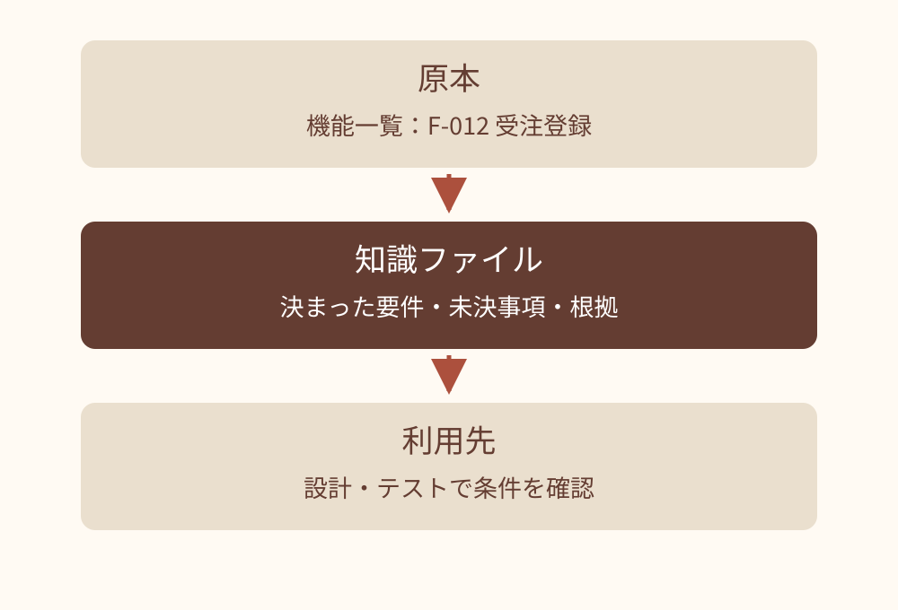
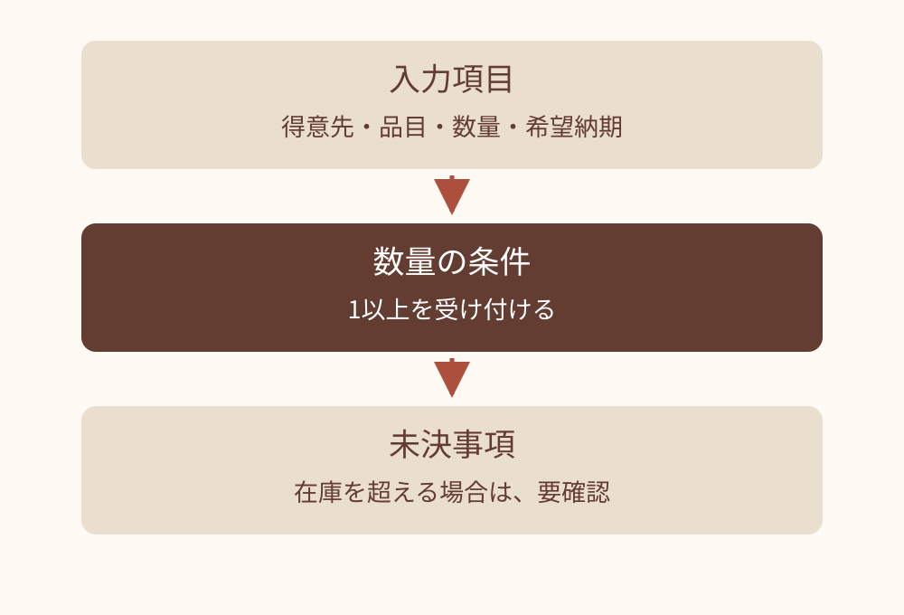
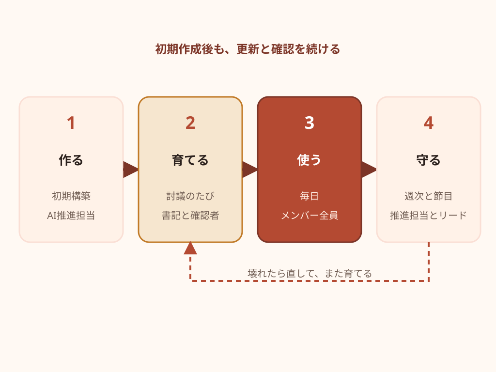
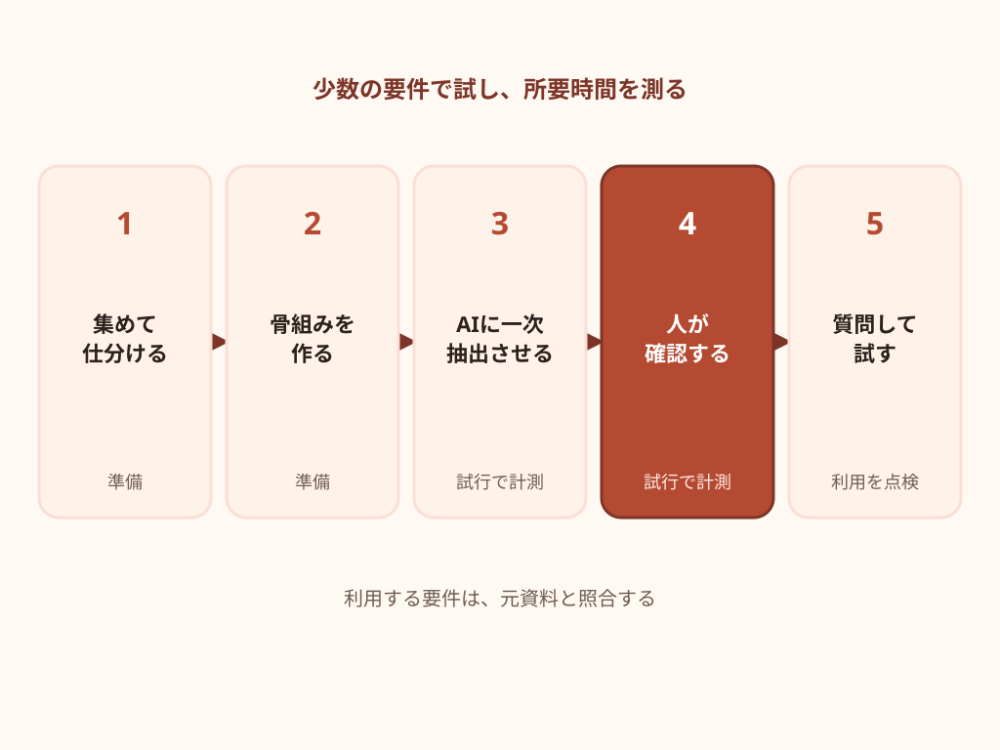
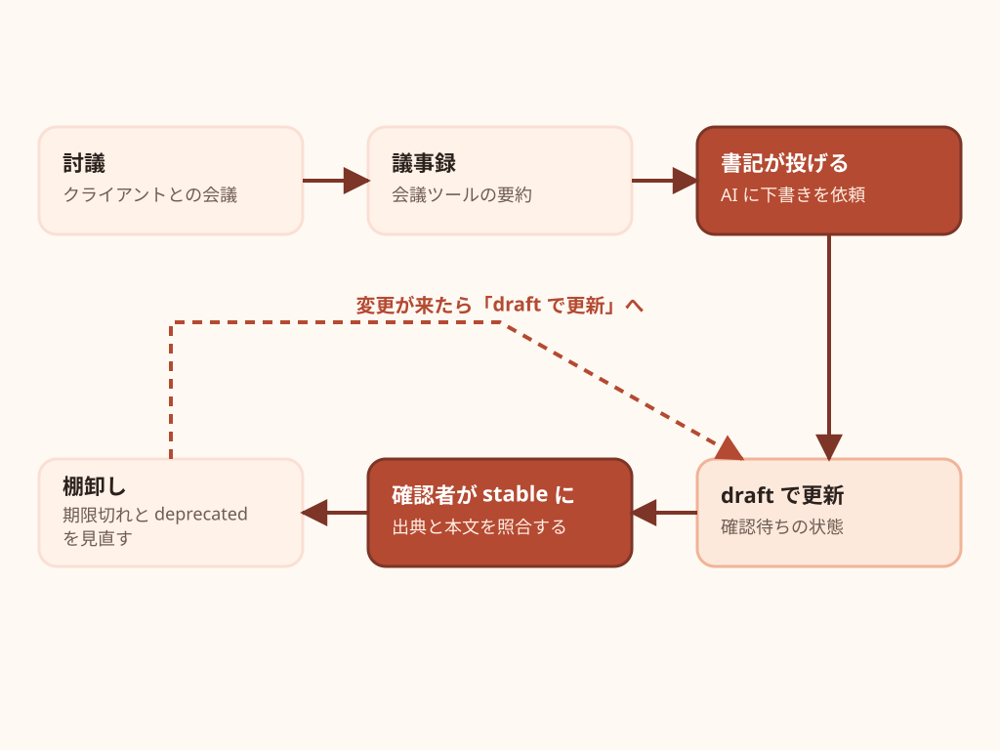
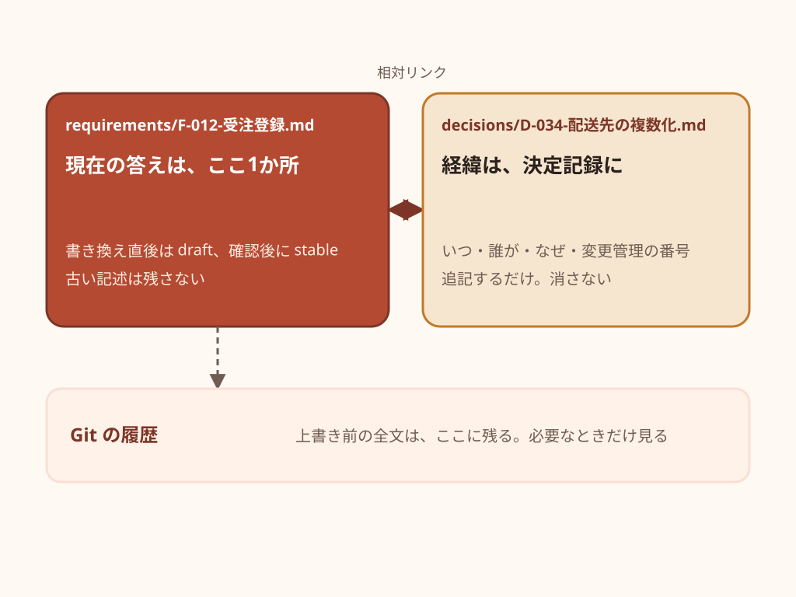
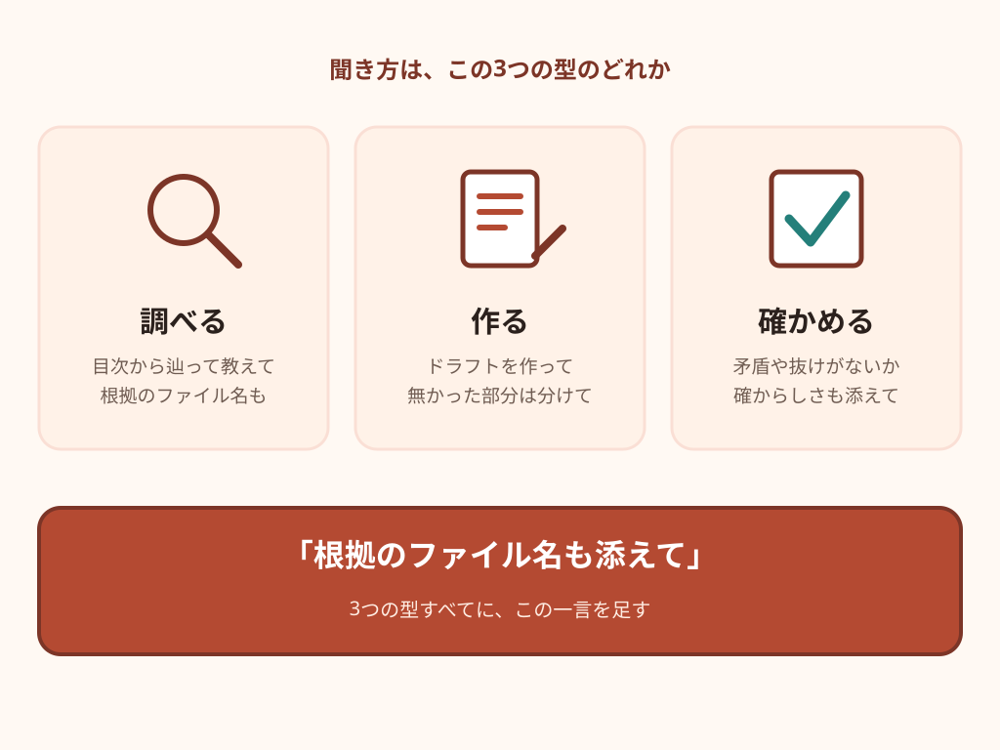
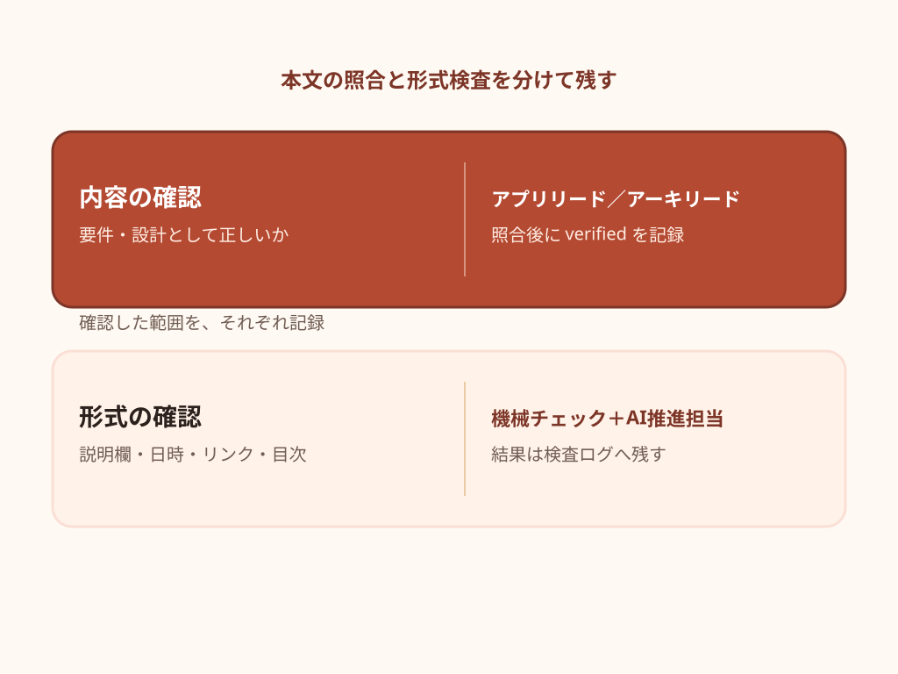

# OKF 実践編：要件を知識ファイルに残す — スライド原稿

この原稿は [deck.json](deck.json) からの書き出し。修正は deck.json に行い、再出力する。

全63枚。元原稿 SHA-256: `29c61c32aa585bf25293bd876b0b0be366697c75ee939a50bf17d3bd6e5bf144`。

図版はリンク先の画像を参照。補足はHTML用の説明で、PPTXのスピーカーノートには含まれない。

## 01. OKF 実践編
要件を知識ファイルに残す

架空の販売管理案件で、資料からの作成と日々の更新を学ぶ

社内勉強会 / 2026-09

### 参照・説明の補足（HTML用）

比較用修正版。元デッキは保持する。SI案件を初めて扱う読者にも、F-012受注登録の具体例を軸に説明する。

## 02. この資料で扱う仕事と前提

はじめに｜この資料の位置づけ

OKF は、説明欄とリンクを持つ Markdown の知識ファイル形式です。今回は、受注登録の要件を残して使う仕事を扱います。

- 作る人と使う人
  - AI 推進担当が下書きの作り方を整える。メンバーが使い、領域リードが根拠を確認する。
- 架空の案件の環境
  - Claude Code を利用できる社内チームを想定。ファイル操作・変換ツール・権限の準備は別に必要。
  - 正式文書はクライアントと合意した版。OKF は、その内容を調べるための社内の整理版。
- この案件の運用案
  - 金額・契約条件・個人情報は入力対象から除く。保存先と AI への送信先を先に確認する。
  - 役割・件数・日程は、この資料の提案。OKF 仕様が要求する運用ではない。

### 参照・説明の補足（HTML用）

OKFそのものはファイル形式であり、記載した依頼文が特定製品で確実に動くことは保証しない。製品での実行・権限・効果測定は別の確認。

## 03. 定義から、実務の運用へ

はじめに｜この資料で学べること

受注登録 F-012 の要件が、資料から生まれ、変更され、設計やテストで使われる流れを追います。

- 第1章：OKFと、知識を残す仕事を理解する。
- 第2章：要件ファイルを作成し、変更を取り込む。
- 第3章：事例・トラブル・演習で使い方を確かめる。
- 第4章：担当と確認の仕組みを決めて続ける。

### 参照・説明の補足（HTML用）

定義、作成と更新、事例とトラブル、運用Tipsの順に学ぶ。

## 04. 通し例：X 社の受注登録を作り直す

はじめに｜通し例の設定

会社・人員・日付・要件は、すべて架空の演習設定です。

| 項目 | 設定 |
| --- | --- |
| 案件 | 販売管理システムの刷新。受注・出荷・請求を扱う。 |
| 用語 | SI：システムを構築する仕事。RFP：発注側が要望をまとめた提案依頼書。 |
| 通し例 | F-012 受注登録。得意先・品目・数量・希望納期を入力する。後に配送先を複数にする案が出る。 |
| 進め方 | 2026年9月に準備し、10月から要件定義。設計・開発・テストを経て2027年9月の稼働を想定。 |
| 担当 | 社内11名。PMと領域リード、開発・テスト担当。AI推進は兼務2名と外部支援1名。 |
| 材料と置き場所 | RFP、提案書、機能一覧。許可済みの材料を読み、設計書と同じリポジトリの knowledge/ に整理。 |

### 参照・説明の補足（HTML用）

架空の案件を1つ決めて、最後まで通します。体制は SI 側だけで11名。クライアントは会議と正式文書でやり取りする相手で、OKF には触れません。

## 05. OKFとは何か、実践で何をするか

01

受注登録の要件を、後から確かめられる知識にする

## 06. OKFは、知識を文章で残す書式

01｜OKFと実践の定義

OKFは、人とAIが読める知識ファイルの公開仕様です。

- 先頭に種類や説明、本文に知識を書く。
- 関連ファイルをフォルダにまとめる。
- この実践編では、要件と決定の記録に使う。



例は架空の販売管理案件。OKF v0.2を参照。

## 07. 会議の記録だけでは、現在の答えを探しにくい

01｜OKFと実践の定義

配送先の条件が変わると、古い決定と新しい決定が並びます。

### 原本に残る情報

- いつ、誰が、何を話したか。
- 検討案と合意事項が混在する。
- 以前の条件も経緯として残る。

### 知識ファイルにまとめる情報

- 現在の受注登録の条件。
- まだ決まっていない点。
- どの原本の決定に基づくか。

## 08. 要件は、満たすべき条件の記録

01｜OKFと実践の定義

要件ファイルには、システムに求める振る舞いを残します。

- F-012では得意先・品目・数量を扱う。
- 数量は1以上という条件を明記する。
- 在庫超過時の扱いは、未決として残す。



実装方法を決める前に、必要な振る舞いを確認する。

## 09. 要件と決定記録は、答える質問が違う

01｜OKFと実践の定義

同じ配送先の変更でも、現在の条件と変更理由を分けて残します。

### 要件ファイル

- 今、どう動く必要があるか。
- 現行の入力項目と制約。
- 設計やテストが参照する。

### 決定記録

- なぜ、その条件に変えたか。
- 検討案・理由・影響。
- 経緯を調べるときに参照する。

## 10. 知識を整える仕事と、承認を分ける

01｜OKFと実践の定義

ファイルの書式から、契約や要件の合意は生まれません。

### OKFで残す

- 根拠と現在の要件。
- 未決と確認した範囲。
- 変更の理由と関連先。

### 案件側で決める

- 誰が要件を合意するか。
- どの環境でAIを使えるか。
- 設計・開発へ進む条件。

## 11. 初期作成の後も、変更と確認が続く

01｜OKFと実践の定義

F-012 を作った後、会議での変更を反映し、設計やテストで使い、根拠を見直します。

- 作る（初期構築）
  - AI 推進担当が、手元の材料から初期ナレッジを作る
- 育てる（討議のたび）
  - 書記が下書きを更新し、確認者が根拠と照合する
- 使う（毎日）
  - メンバー全員が、朝の差分確認と工程ごとの問いかけで使う
- 守る（週次と節目）
  - 推進担当とリードが、ルール・機械チェック・棚卸しで壊れを防ぐ



この案件の運用案。記録の更新と確認は人が担当します。

### 参照・説明の補足（HTML用）

初期作成の後も追加や再構成が必要になる。OKFを置くだけで知識が自動的に育つわけではない。

## 12. 作成と更新を、実物で身に付ける

02

材料→下書き→照合→変更取り込みの順に進める

## 13. 実践編で使う言葉

02｜実物で使う項目

欄の名前を覚える前に、何を確かめる欄かを押さえます。

| 呼び方 | 記入するもの | 注意点 |
| --- | --- | --- |
| フロントマター | 先頭の --- に挟まれた YAML の説明欄 | 通常の知識ファイルで常に必須なのは type |
| sources | 根拠の資料。各項目の resource に参照先 | 資料名だけでは、参照先が分からない |
| generated / verified | 作成・更新の記録 / 出典との照合の記録 | verified は正しさや本人認証の保証ではない |
| status / stale_after | 状態 / 再確認の目安となる日時 | stable も期限前も、正しさの保証ではない |
| バンドル | 知識ファイル一式のフォルダ | この運用では index.md と log.md を使う |

### 参照・説明の補足（HTML用）

超入門のたとえ話は、指示文には使いにくいので、ここで正式な呼び方に置き換えます。以後、この資料では右の呼び方で通します。status の3値は draft・stable・deprecated です。 仕様の根拠: https://github.com/GoogleCloudPlatform/open-knowledge-format/blob/ad30107c31c06aec8a7d5636e0d1058118604e6f/SPEC.md 。本資料の役割分担は運用案。

## 14. 初期構築の5ステップ

02｜作成と更新の詳細

最初は少数の要件で試します。所要日数は、材料の量と確認の手間を測って見積もります。

- 1. 集めて仕分ける
  - AI に渡せる材料と、対象外の情報を確認する。
- 2. 骨組みを作る
  - フォルダ、目次、AI への作業指示を用意する。
- 3. AI に一次抽出させる
  - F-012 など少数の要件を draft にする。
- 4. 人が根拠と照合する
  - 数値、条件、例外、未決事項を元資料で確かめる。
- 5. 質問して使い方を試す
  - 通常・例外・答えのない質問で、根拠と回答を見る。



少数で測った時間から、次に確認できる範囲を決めます。

### 参照・説明の補足（HTML用）

以前の3日〜1週間という所要日数には実測根拠がないため削除。人数だけでは工数を決められない。

## 15. 材料の棚卸し：読ませるもの、書かないもの

02｜作成と更新の詳細

この演習では金額・契約条件・個人情報を除外します。出所と送信先を確認し、入力前に許可された範囲へ絞ります。

| 材料 | 形式と量 | OKF に入れる | OKF に入れない |
| --- | --- | --- | --- |
| 提案書 | PowerPoint 30〜50 枚 | 想定アーキテクチャ・想定機能・前提条件・スコープ外 | 見積・金額・体制単価・社内の営業メモ |
| 機能一覧 | Excel 200 行（1行1機能） | 機能ID・機能名・概要・優先度。1機能1ファイルにする | 工数・金額の列 |
| RFP と背景資料 | Word 数十ページ・受領 PDF | 業務の背景・目的・現行システムの課題・非機能要件 | 契約条件・個人名・担当者の連絡先 |
| 提案時の想定図 | PowerPoint の構成図（画像） | 図は画像として渡し、要点は人が箇条書きにする | （図に金額が書かれていれば消す） |

### 参照・説明の補足（HTML用）

材料は Office 形式が中心です。入れない情報は、金額・単価・契約条件・個人情報。この線引きをステップ1で決めておくと、AI への依頼文にそのまま書けます。図は文字が取れないので、画像として渡すか、人が要点を箇条書きにします。

## 16. Office の変換結果を原本で確かめる

02｜作成と更新の詳細

文字を取り出しても、表の対応や図の条件が落ちることがあります。変換後に原本と照合します。

- 許可済みの材料を変換する
  - 利用できる変換ツールと AI の送信先を先に確認する。
- 表と図は、対応関係まで確認する
  - 機能IDと説明の行が合うか。構成図の接続先や注記が残るか。
- 崩れた部分を補い、出所を残す
  - F-012 が機能一覧のどの行か、後から辿れるようにする。
- inputs/ の扱いは保存先の権限で決める
  - .gitignore は未追跡ファイルの追加抑止。AI の読み取りや送信は防がない。


変換は準備工程。読めたことと、原本どおりであることは別です。

### 参照・説明の補足（HTML用）

変換処理の実行環境や、Office・PDFの読み取り方式は利用製品に依存。入力前に資料を選別する。このデッキの依頼文を実製品で実行した保証はない。

## 17. フォルダ構成の2案

02｜作成と更新の詳細

この架空案件では B を使います。8種類への分類は、このチームの運用案です。

|  | A：5種類の小規模構成 | B：SI 工程に合わせて8種（推奨） |
| --- | --- | --- |
| フォルダ | glossary / decisions / howto / sources ＋ requirements | glossary / requirements / architecture / decisions / risks / howto / meetings / sources |
| 向いている案件 | 小規模・短期。要件定義中心の準委任 | 要件定義から本稼働まで通す案件。体制が10名前後 |
| 良い点 | 迷わない。type も5つで済む | 担当する工程から、関連する資料を探しやすい。回答品質は実際の質問で確かめる。 |
| 注意点 | 設計・リスク・会議の要約が decisions に混ざりやすい | 最初に8種を覚える必要がある。増やしたくなる誘惑がある |
| この資料の推奨 | 小規模・短期なら A でよい | B。ただし type はこの8種で固定し、増やすときは推進担当に相談する |

### 参照・説明の補足（HTML用）

type の値は仕様で固定されていない。8種はこの案件の運用案。分類による回答速度や精度の改善は測定していない。

## 18. この案件のフォルダ構成（B）

02｜作成と更新の詳細

設計書（docs/）と OKF（knowledge/）は同じリポジトリに置き、CLAUDE.md で入口を教えます。inputs/ は原本置き場

````text
docs-repo/
├── CLAUDE.md              # AI への指示書。「知識は knowledge/index.md から辿る」と書く
├── inputs/                # 原本と変換後テキスト（OKF の外）
│   ├── text/              # 機能一覧などの変換後テキスト
│   └── meetings/          # 許可済みの議事録（原本）
├── docs/                  # 設計書・テスト仕様（Markdown）。納品物の元になる
└── knowledge/             # OKF バンドル（社内限定）
    ├── index.md           #   入口の目次。okf_version と、各フォルダの一言説明
    ├── log.md             #   変更履歴。いつ・誰が・何を
    ├── glossary/          #   用語集：1用語1ファイル（受注・出荷・請求の言葉）
    ├── requirements/      #   要件：1機能1ファイル（F-012-受注登録.md …）
    ├── architecture/      #   アーキテクチャ：構成・非機能・外部接続
    ├── decisions/         #   決定記録：いつ・誰が・なぜ（D-001-…md）
    ├── risks/             #   懸念と未決：持ち越し事項（R-001-…md）
    ├── howto/             #   手順：環境構築・リリース・障害対応
    ├── meetings/          #   会議の要約：決定・変更・未決の3節だけ
    └── sources/           #   出典台帳：提案書・RFP・受領資料を1つ1ファイルで
````

### 参照・説明の補足（HTML用）

推奨構成です。ポイントは3つ。設計書と OKF を同じリポジトリに置くこと、原本は inputs/ に分けること、CLAUDE.md で入口を教えること。type はフォルダ名と同じ英単語の単数形で揃えます。

## 19. 依頼文①：初期ナレッジを一次抽出させる

02｜作成と更新の詳細

F-012 など少数の機能で試す依頼文です。許可済みの変換結果を選び、実ファイル名に置き換えます。

````markdown
# やること
inputs/text/functions.csv の F-012 と、関連する RFP を読み、
knowledge/requirements/F-012-受注登録.md の下書きを作って。

# この案件で使う欄
- type: requirement、title、description を書く。
- sources の各項目に resource（元資料の参照先）を付け、行や節を示す。
- generated に実際の作成者と UTC オフセット付き日時を記録する。
- status は draft。未実施の verified は書かない。

# 内容の約束
- 条件と例外を残す。資料にないことは補わず「未決」に分ける。
- 金額・契約条件・個人情報を見つけたら、書かずに報告する。
- requirements/index.md と knowledge/log.md も更新する。

# 報告
変更ファイル、参照した資料の行・節、未決事項を挙げて。
````

### 参照・説明の補足（HTML用）

実行前に変換ツール・ファイル参照・権限の確認が必要。まず1件で試し、入力から出力までを照合する。要求したから漏れなく実行できる保証はない。

## 20. 下書きの点検と、利用前の照合

02｜作成と更新の詳細

下書きの傾向はサンプルで点検できます。業務の判断に使う要件は、使う範囲を元資料と照合します。

- 目次と形式は全件を見る
  - 話題の重複、説明の抜け、リンク切れを探す。
- 本文のサンプルで作り方を直す
  - F-012 など優先度の高い要件と、未決のある要件から読む。
- 利用する要件は元資料と照合する
  - 入力項目・必須条件・例外が一致するかを確認する。
- 確認していない範囲は draft のまま
  - サンプルが正しくても、残り全件の正しさは保証されない。


確認した範囲を残し、未確認の要件まで stable にしません。

### 参照・説明の補足（HTML用）

サンプル点検は大量の下書きの傾向を確認するための案。全件の正しさを保証しない。業務の判断に使用する本文は原典と照合する。

## 21. F-012 受注登録の下書き

02｜作成と更新の詳細

架空の記入例。sources の参照先と、見直す日時を記録します。verified はまだありません。

````yaml
---
type: requirement
title: F-012 受注登録
description: 受注登録の入力項目と数量の条件。
sources:
  - id: functions
    resource: ../../inputs/text/functions.csv
    title: 機能一覧の F-012 行
generated: { by: "human:training-author", at: "2026-09-01T09:00:00+09:00" }
status: draft
stale_after: "2026-12-26T00:00:00+09:00"
---
# 要件
- 得意先・品目・数量・希望納期を入力する。数量は1以上。[^functions]
# 未決
- 在庫を超えたときの扱いは、資料から分からない。
# 関連
- [得意先](../glossary/得意先.md)
[^functions]: 機能一覧の F-012 行。
````

### 参照・説明の補足（HTML用）

仕様§5.1 sources[].resourceは必須。stale_afterはUTCオフセット付き絶対日時でnow>=指定日時がstale。例の相対パスはknowledge/requirements/から見た位置。架空データであり、このパスに実案件の原本が存在することは示さない。 仕様の根拠: https://github.com/GoogleCloudPlatform/open-knowledge-format/blob/ad30107c31c06aec8a7d5636e0d1058118604e6f/SPEC.md 。本資料の役割分担は運用案。

## 22. CLAUDE.md に記す、読み方と更新の約束

02｜作成と更新の詳細

この案件の指示例です。読んだ資料の報告を求め、期待した読み方が実行されたかを確かめます。

````markdown
# 知識の読み方
- knowledge/index.md の目次と説明から、必要なファイルを開く。
- draft は未確認として示す。stable も正しさの保証とは扱わない。
- stale_after は UTC オフセット付きの現在時刻と比較する。
- now >= stale_after なら「見直し時点に到達」と示す。
- deprecated は現行の根拠にせず、後継への案内を確認する。
- 回答には、読んだファイルと根拠の行・節を添える。

# 知識の更新
- 既存の同じ話題を探してから編集。sources.resource に根拠を残す。
- 内容を変えたら generated を更新し、status を draft に戻す。
- 以前の verified を、新しい変更の確認済み記録として使わない。
- 確認者が本文を出典と照合した後、その主体と日時を記録する。
- 関連する index.md と knowledge/log.md を更新する。
- 金額・契約条件・個人情報、資料にない推測は書かずに報告する。
````

### 参照・説明の補足（HTML用）

CLAUDE.md は利用製品の指示読み取り機能を使う運用例。指示しただけで必ず読みに行く保証はない。自動検知や通知の実装は別途必要。verifiedは機械の形式検査だけでは記録しない。 仕様の根拠: https://github.com/GoogleCloudPlatform/open-knowledge-format/blob/ad30107c31c06aec8a7d5636e0d1058118604e6f/SPEC.md 。本資料の役割分担は運用案。 CLAUDE.md の読み込みと指示の性質: https://code.claude.com/docs/en/memory （2026-09-06参照）。

## 23. 小さな試行を終える条件

02｜作成と更新の詳細

この条件は、今回確認した範囲の記録です。残り全件や、今後の製品動作を保証しません。

- 対象のファイルへ、目次から辿れる
- type・sources.resource・draft と、実際の作成記録がある
- 入力対象外の情報がないか、目視と利用できる検査で確認した
- 形式検査が通り、使う本文を元資料と照合した
- 別のメンバーが質問し、回答と根拠を確かめた
  - 通常：数量はいくつから登録できるか。
  - 例外：在庫を超えたらどうするか。資料に答えはあるか。
  - 対象外：海外の取引にも同じルールを使えるか。

### 参照・説明の補足（HTML用）

仕様への適合、本文の照合、利用アプリの動作は別の確認。少数の質問が成功しても、全件の信頼性や製品の互換性を保証しない。

## 24. 討議から棚卸しまで、知識が回る道

02｜作成と更新の詳細

会議の内容を draft に反映し、根拠と照合した範囲を記録します。更新と確認の担当を決めて運用します。

- 討議 → 議事録
  - 会議ツールの要約機能で議事録を作る。書記が内容を整える
- 書記が投げる → AI が draft で更新
  - 書記が当日中に依頼文②を投げる。AI が該当ファイルを書き換え、status を draft にする
- 確認者が stable に
  - 領域のリードが内容を見て、verified に確認者 ID と日時を記録し、status を stable にする
- 棚卸し
  - 週次と節目で、期限切れと deprecated を見直す（第4章）
- 変更が来たら、また draft から
  - 上書きして決定記録を残す。この後のページで



変更するたび、以前の確認記録の対象範囲を見直します。

### 参照・説明の補足（HTML用）

人は材料の選別、議事録の整形、変更の判断、出典との照合、棚卸しを担当する。2か所だけで回るという保証はない。

## 25. status と、チームの確認条件

02｜作成と更新の詳細

status は記録上の状態です。stable でも、正しさ・社内承認・アクセス権の保証にはなりません。

| status | 仕様上の意味 | この案件の運用案 |
| --- | --- | --- |
| draft | 未レビュー・不完全な可能性がある | 下書きや変更直後。回答に使うなら未確認と示す。 |
| stable | 利用可能な状態。省略時もこの値 | 合意した原本と本文を照合し、確認した範囲を記録する。 |
| deprecated | 現在の内容ではないが、履歴やリンクのため保持 | 廃止や置き換えを明記し、後継があればリンクする。 |

### 参照・説明の補足（HTML用）

OKF仕様§5.4–5.5。確認者だけがstableにするのは本資料の運用ルールであり、OKFのアクセス制御ではない。verifiedは出典や実体との照合記録。 仕様の根拠: https://github.com/GoogleCloudPlatform/open-knowledge-format/blob/ad30107c31c06aec8a7d5636e0d1058118604e6f/SPEC.md 。本資料の役割分担は運用案。

## 26. 議事録を取り込む日の作業

02｜作成と更新の詳細

この案件では、会議の当日中に書記が更新の下書きを依頼します。取り込めない場合は、未反映の範囲を残します。

- 1. 許可済みの議事録を inputs/meetings/ に置く
  - 発言者の個人名は役割に置換し、内容を確認する。
- 2. 依頼文②で下書きを更新する
  - 決定・変更・未決を分け、status は draft にする。
- 3. 領域リードが出典と本文を照合する
  - 実際に確認した後、確認者 ID と日時を verified に記録する。
- 4. 更新した範囲を共有する
  - 未確認なら draft のまま。翌朝、担当する作業への影響を読む。


human:app-lead は記入例。対応する実在の確認者 ID を管理します。

### 参照・説明の補足（HTML用）

動画の個人運用を実証の根拠として使わない。AIに人の確認記録を書かせる場合も、本人の確認実施に基づく転記に限る。

## 27. 依頼文②：議事録から確定・変更・未決を取り込む

02｜作成と更新の詳細

書記が会議の当日に投げる文です。［　］は会議のファイル名だけ

````markdown
# やること
inputs/meetings/［議事録.md］を読み、knowledge/ の更新案を作って。
# 手順
1. 決定・変更・未決を分け、関連する既存ファイルを探す。
2. 合意した変更を該当する要件に反映する。現行の条件を明確にする。
3. 変更理由を knowledge/decisions/ に記録し、要件から相対リンクを張る。
4. 未決は knowledge/risks/ または該当要件の「未決」に残す。
5. 会議の要約を knowledge/meetings/ に保存する。
6. 触ったフォルダの index.md と knowledge/log.md を更新する。
# 約束
- sources.resource に議事録の参照先を残す。
- 内容を変えたら generated を更新し、status を draft にする。
- 旧 verified で今回の変更を確認済みにしない。未実施の確認は書かない。
- 議事録にない内容、金額・契約条件・個人情報は書かずに報告する。
# 報告
変更したファイル、決定記録、未決、確認者に見てほしい箇所。
````

### 参照・説明の補足（HTML用）

依頼文②です。手順に、決まった・変わった・持ち越しの3分類、書き換え、決定記録の追加、会議要約の保存、目次と履歴の更新を書きます。書き換えたら draft に戻す、が肝です。最後の報告を確認者に回します。

## 28. 現在の答えは上書き、経緯は決定記録に残す

02｜作成と更新の詳細

F-012 の配送先を複数にする変更が合意されたら、現行の要件を更新し、変更理由を決定記録に残します。

- 要件ファイルは、常に「現在の答え」だけを持つ
  - 現行の条件と適用時点を明記し、古い条件との混同を避ける。
- 経緯は decisions/ に1件ずつ追記する
  - いつ・誰が・なぜ・変更管理の番号。追記するだけで消さない
- 上書き前にコミットした版は、Git履歴から確認できる
  - 変更前に記録する。保存だけではGit履歴に残らない。
- deprecated は「現在の内容ではない」記録に使う
  - 例：廃止した機能、置き換えられた用語。後継へのリンクを付ける
- 決定記録そのものが覆ったら、古い決定を deprecated にして後継へリンクする。消さない
- この案件では現在と経緯を分ける。決定記録は ADR の考え方を参考にした運用案。



現行の要件と、変更理由の決定記録をリンクで結びます。

### 参照・説明の補足（HTML用）

現行の要件と変更理由を分ける運用案。ADRでは覆った決定も経緯として残す。deprecatedは一律の参照禁止やアクセス制御を表す値ではない。

## 29. D-034 配送先の複数化を記録する

02｜作成と更新の詳細

架空の合意後の記録例。本文を照合する前の下書きなので draft。確認後に verified を記録します。

````yaml
---
type: decision
title: D-034 受注に複数の配送先を持たせる
sources:
  - resource: ../../inputs/meetings/2027-07-08.md
    title: 結合テスト中間報告会の議事録
change_request: CR-007
status: draft
generated: { by: "human:training-author", at: "2027-07-08T18:30:00+09:00" }
---
# 背景
1受注に複数の納品先がある取引を、手作業で分けていた。
# 決定
明細ごとに配送先を選べるようにする。
# 影響
- [F-012 受注登録](../requirements/F-012-受注登録.md) に配送先を追加。
- F-031 出荷指示と、関連する設計・テストの変更を確認する。
# 却下した案と理由
受注を配送先ごとに登録する案は、入力の重複が増える。
````

### 参照・説明の補足（HTML用）

架空の未来日付を含む記入例。実際の確認を行っていないためverifiedは記載しない。CR番号は本資料の独自欄でありOKF必須項目ではない。この例は業務上の合意後に作った未照合の記録下書き。合意自体と、本文の確認状態を区別する。 仕様の根拠: https://github.com/GoogleCloudPlatform/open-knowledge-format/blob/ad30107c31c06aec8a7d5636e0d1058118604e6f/SPEC.md 。本資料の役割分担は運用案。

## 30. 変更要求（CR）の流れと、OKF 側の動き

02｜作成と更新の詳細

正式な変更管理は、変更管理台帳と正式文書で進みます。OKF はその各段階で「今の状態」を写し取るだけです

| 変更管理の段階 | 正式文書側（クライアントと） | OKF 側の動き（社内） |
| --- | --- | --- |
| 受付 | 変更要求票に起票。番号（CR-007）を付ける | 書記が risks/ に1ファイル作る。status: draft（本文に「検討中」と書く） |
| 影響分析 | 影響範囲と規模を整理（見積は別途） | アーキリードが AI に影響分析を頼む（第3章）。結果を risks/ のファイルに追記する |
| 承認 | クライアントと合意し、台帳の状態を承認にする | 書記が decisions/ に決定記録を追加し、要件ファイルを上書きして draft にする。受付時の risks/ は deprecated にして決定記録へリンク |
| 反映 | 設計書・テスト仕様を改版し、Office 形式に書き出して提出する | 確認者（リード）が stable にする。docs/ の設計書へリンクを張り直す |
| 見送り | 台帳の状態を見送りにする | 書記が risks/ のファイルを deprecated にし、理由を1行残す |

### 参照・説明の補足（HTML用）

変更管理との接続です。正式な流れは台帳と正式文書で進み、OKF は各段階で状態を写し取ります。金額と見積は台帳側にしかありません。承認された時点で決定記録を書き、要件を上書きします。

## 31. 毎朝、AI に「昨日から何が変わった？」と聞く

02｜作成と更新の詳細

更新履歴から F-012 の変更を探し、自分の設計やテストへの影響を確認します。読む時間は内容に応じて確保します。

- 依頼文③（毎朝）
  - 「knowledge/log.md と git log --since=yesterday を見て、昨日から変わった知識を『決まった／変わった／未決のまま』に分けて教えて。私の担当（［受注・出荷］）に関係するものは先に。根拠のファイル名も添えて」
- 答えの見方
  - stable になった範囲の根拠・確認記録・適用時点を確かめる。
  - 変わった＝決定記録つき。自分の作業への影響を確かめる
  - 未決のまま＝risks。担当なら動かす
- リードは週に一度、「先週から」に広げて見る


更新履歴を入口に、担当する要件の本文と根拠を開きます。

### 参照・説明の補足（HTML用）

毎朝3分という所要は保証しない。log.mdとgit logは変更を探す入口。本文と出典を開いて現在の条件を確認する。

## 32. 工程別の事例とトラブル対応

03

F-012を使い、設計・テスト・変更の判断まで確かめる

## 33. 6つの場面で、何を聞き、どこが根拠になるか

03｜事例とトラブルシューティング

根拠になるフォルダが分かっていると、AI の答えを疑うべきときが分かります

| 場面 | よくある問い | 根拠になるフォルダ |
| --- | --- | --- |
| 要件定義 | 要件同士の矛盾は？ RFP にあって要件に無いものは？ | requirements / sources / risks |
| 設計 | この要件が影響する設計書は？ 設計書のドラフトを作って | requirements / architecture / decisions / docs（設計書） |
| 開発 | この機能の要件と決定は？ 仕様が無いところは？ | requirements / decisions / glossary |
| テスト | この要件からテストケースを作って。テストされていない要件は？ | requirements / decisions / docs（テスト仕様） |
| 新規参画 | この案件の背景と、今どこまで決まっている？ | index / architecture / meetings / risks |
| マネジメント | 詰まっている領域は？ 期限切れと未決は？ | status と stale_after の欄 / risks |

### 参照・説明の補足（HTML用）

使い方の地図です。6つの場面それぞれに、よくある問いと根拠になるフォルダを並べました。根拠のフォルダが分かると、答えを疑うべきときが分かります。

## 34. 調べる・作る・確かめる依頼文

03｜事例とトラブルシューティング

依頼に根拠の提示を加えます。返ってきたファイルを実際に開き、主張を支えているかを確かめます。

- 型1：調べる
  - 「index.md から辿って、［受注登録の必須項目］を教えて。根拠のファイル名も添えて」
- 型2：作る
  - 「［受注登録の設計書ドラフト］を作って。参照した知識と、知識に無かった部分を分けて報告して」
- 型3：確かめる
  - 「［F-001〜F-050］に矛盾や抜けがないか確認して。根拠と確からしさを添えて」
- 共通のコツ
  - 「知識に無い部分は分けて」で、AI の推測を見分けやすくなる
  - draft の情報を使ったら「未確認」と言わせる（CLAUDE.md に書いてある）
  - 答えに違和感があれば根拠のファイルを開く。違っていたら推進担当に伝え、draft に戻す



ファイル名だけでなく、根拠の行や節も確かめます。

### 参照・説明の補足（HTML用）

根拠を付ける指示だけでは、推測や誤引用を防げない。回答と出典を照合する。

## 35. 要件定義：矛盾と抜けを、要件全体で確かめる

03｜事例とトラブルシューティング

依頼文④。AI に矛盾や抜けの候補を挙げてもらい、リードが根拠と対象範囲を確かめます。全件の検出保証はありません。

````markdown
# やること
knowledge/requirements/ と、knowledge/sources/rfp.md の参照先を読み、
矛盾や抜けの候補を挙げて。対象の件数と、実際に読んだ範囲も報告して。
# 見るところ
1. 同じ条件で矛盾する記述。
   例：F-012 の在庫超過時に「登録可」と「登録不可」が併記されている。
2. RFP にあるのに、要件に見つからない項目。
3. 要件にあるが、RFP や提案書に根拠を見つけられない項目。
4. 「要確認」が残っている箇所。
# 約束
- 根拠のファイル名と行・節を添える。推測で埋めない。
- draft や期限に達した資料は、その状態を示す。
- 未読の資料や、判断できなかった項目を別に挙げる。
# 出力
表の列：種類、該当ファイル、見つけた記述、確認すること。
````

### 参照・説明の補足（HTML用）

異なる工程の条件は一見異なっても矛盾とは限らない。比較する条件と適用範囲をそろえた矛盾例に変更。AIによる全件検出は保証しない。

## 36. 設計：影響分析と、設計書のドラフト

03｜事例とトラブルシューティング

依頼文⑤。変更要求が来たときの影響分析と、設計書のドラフト作りの2本。どちらも「知識に無い部分」を分けて報告させます

````markdown
# 影響分析（変更要求が来たとき）
［F-012 を「1受注に複数の配送先を持てる」に変える案］の影響範囲を洗い出して
# 材料
knowledge/requirements/・knowledge/architecture/・docs/design/
# 守ってほしいこと
「直接影響（要件や設計書を直す）」「間接影響（確認が要る）」「影響なしと判断した理由」に分け、
根拠のファイル名を添える。推測は「（推測）」と印を付ける
# 最後に報告してほしいこと
参照したファイルの一覧／判断に迷った点

# 設計書のドラフト
docs/design/［order-entry.md］（受注登録の設計書）のドラフトを書いて。型は docs/design/_template.md
# 材料
［knowledge/requirements/F-012-受注登録.md］ と、knowledge/architecture/・knowledge/decisions/ の関連ファイル
# 守ってほしいこと
根拠に無い部分は「（設計判断が必要）」と印を付け、最後に一覧にする
# 最後に報告してほしいこと
参照したファイルの一覧／設計判断が必要な箇所
````

### 参照・説明の補足（HTML用）

設計の依頼文は2本。影響分析と、設計書のドラフト。影響分析は直接・間接・影響なしの3分類。ドラフトは根拠に無い部分に印を付けさせます。設計判断は人がします。

## 37. 開発：コードを書く前に、要件と決定を読ませる

03｜事例とトラブルシューティング

CLAUDE.md に読む順番を記し、依頼には F-012 のように機能 ID を添えます。参照した資料の報告も確認します。

- CLAUDE.md に、実装の前提を書く
  - 「実装の前に、該当する knowledge/requirements/ と knowledge/decisions/ を読む」
  - 「仕様が無い・矛盾するときは実装せず、質問として返す」
- 依頼のときは、機能 ID を添える
  - 「F-012 受注登録の入力チェックを実装して。要件と決定記録に無い振る舞いは、実装せず質問して」
- コードのコメントやコミットに、機能 ID と決定 ID を書く
  - 「F-012 / D-034」と書いておくと、あとから AI がコードと知識を突き合わせられる
- 実装中に分かった「要件の穴」は、risks/ に1ファイル足す
  - AI に「これを risks/ に未決として書いて」と頼む。決めるのはリード

### 参照・説明の補足（HTML用）

作業指示の読み込みと、指示どおりの実行は同じではない。実際の参照ファイルと実装・テスト結果を確認する。 CLAUDE.md の読み込みと指示の性質: https://code.claude.com/docs/en/memory （2026-09-06参照）。

## 38. テスト案を、F-012の要件と照合する

03｜事例とトラブルシューティング

要件は数量1以上。在庫を超える場合は未決という架空例です。

| 入力 | AIが出した期待結果 | 根拠と照合した判断 |
| --- | --- | --- |
| 数量1 | 入力を受け付ける | 数量の下限条件を満たす。ほかの必須入力も確認 |
| 数量0 | 入力を受け付ける | 誤り。数量1以上を満たさないため拒否する |
| 数量が在庫超過 | 自動で分納する | 根拠なし。未決として業務担当へ確認 |

### 参照・説明の補足（HTML用）

架空のF-012数量条件に基づくケース。表はAIの実測出力ではなく、誤りを見つけるための教材例。テストケースの入力、期待値、根拠を一組で確認する。

## 39. 新規参画者が最初に確認すること

03｜事例とトラブルシューティング

背景、現状、自分の担当を先に整理し、リードとの確認で分からない点を埋めます。

- 1. 背景と目的
  - 「index.md から辿って、この案件の背景・目的・体制を10分で読める分量に。根拠のファイル名も添えて」
- 2. 今の状態
  - 「今どの工程で、どの範囲に確認記録があり、何が未決（risks）か」
- 3. 自分の担当領域
  - 「私は出荷（F-030〜F-045）担当。関係する要件・決定・用語を優先度順に」
- 答えを読んでから、リードに不明点と、理解が合っているかを確かめる


効果を見るなら、説明にかかった時間と理解の抜けを記録します。

### 参照・説明の補足（HTML用）

数時間から30分程度という未実測の効果断定を削除。質問への回答だけで追いつけるとはしない。同じ確認項目で説明時間と理解を比較する運用案。

## 40. 状態と見直し時点を集計する

03｜事例とトラブルシューティング

依頼文⑦。件数は状態を探る入口です。stale は見直しの目印であり、内容が誤りという判定ではありません。

````markdown
# 状態を数える
knowledge/requirements/ の status 別の件数（draft／stable／deprecated）を、
受注・出荷・請求の領域別に表にして。
UTC オフセット付きの現在時刻を示し、now >= stale_after のファイルを一覧にして。
日時が不正・未記載なら期限切れと混ぜず別欄に。risks/ の draft も一覧にして。
# 詰まりを挙げる
上の数字と knowledge/meetings/ の直近3回の「未決」節から、
要件定義完了に向けて詰まっている領域を挙げて（多くて5つ）
# 壁打ち
いま私（PM）が見落としていそうなリスクを、knowledge/ の記述だけを根拠に挙げて
# 守ってほしいこと
根拠の無いものは挙げない。推測は「（推測）」と印を付けて分ける
# 最後に報告してほしいこと
それぞれの根拠のファイル／詰まっている理由（議事録の記述から）／次に決めるべき問い
````

### 参照・説明の補足（HTML用）

マネジメントの依頼文です。まず数える。draft の件数、期限切れ、未決。次に詰まりを挙げさせ、根拠と次に決める問いを添えさせる。最後に壁打ち。根拠が無いものは挙げさせません。 仕様の根拠: https://github.com/GoogleCloudPlatform/open-knowledge-format/blob/ad30107c31c06aec8a7d5636e0d1058118604e6f/SPEC.md 。本資料の役割分担は運用案。

## 41. 整理の効果は、同じ質問で比べる

03｜事例とトラブルシューティング

フォルダや description だけで回答品質は保証できません。整理前後で、同じ資料・質問・利用設定を使って確かめます。

- F-012 の通常・例外・対象外の質問を用意する
  - 数量の下限、在庫超過時、海外取引への適用を聞く。
- 検索と回答を分けて見る
  - 必要な現行ファイルを見つけたか。条件と例外を正しく答えたか。
- 一度に変える整理方法を絞る
  - 目次の説明、ファイルの分割、工程別の入口をそれぞれ試す。
- 効果と失敗を記録する
  - 時間や利用量を測る場合は、質問数と測定条件も残す。
  - 対象を絞りすぎて、関連する決定記録を落とさないかも確認する。

### 参照・説明の補足（HTML用）

フォルダとdescriptionで絞れば精度は落ちない、専門特化より効くという未検証の比較を削除。整理前後で同じ質問を使用する評価案。

## 42. 成果物は別に置き、要件とリンクする

03｜事例とトラブルシューティング

この資料の推奨では、同じリポジトリにあるものを OKF に写しません。OKF が持つのは「索引・決定・用語・前提」です

- OKF（knowledge/）が持つもの
  - 要件・決定記録・用語・アーキテクチャの前提・未決・会議の要約・出典
- OKF の外（docs/・src/）に置くもの
  - 設計書・テスト仕様・コード。要件ファイルから相対リンクで指す
- リンクは両方向に張る
  - requirements/ からは ../../docs/design/order-entry.md。設計書側にも要件へのリンクを置く。
- 設計書を直したら、要件ファイルの「設計」リンクと index.md も同じ PR（プルリクエスト）で直す

### 参照・説明の補足（HTML用）

成果物との関係です。同じリポジトリにあるものを OKF に写さない。OKF が持つのは索引・決定・用語・前提。設計書やコードは外に置いてリンクで結びます。発展編として、設計書のマージをきっかけに AI に索引を更新させる自動化（GitHub Actions など）も考えられますが、本資料の提案で実績はまだありません。まず手動で回してからです。

## 43. 症状が出たときの確認先

03｜事例とトラブルシューティング

原因は候補です。根拠のファイルと実際の回答を見て切り分けます。

| 症状 | 考えられる原因 | 確認・修正 |
| --- | --- | --- |
| 古い答えを返す | 旧版や適用時点を取り違えた | 回答が参照した版を開き、現行の条件と照合。 |
| 話題が重複している | 既存ファイルを探さず追加した | 同じ話題を比較し、現行の参照先を決める。 |
| 根拠のない要件がある | 資料にない内容を補った | sources の参照先を読み、未確認なら draft。 |
| draft が溜まる | 対象が多い、確認者が不在 | 優先する範囲と代理の確認者を決める。 |
| 回答が遅い・外れる | 目次、読み込み範囲、モデル等の問題 | 同じ質問で、検索と回答を別々に確認。 |
| 機密が混ざった | 選別や変換後の確認で見落とした | 利用を止めて担当に連絡。履歴と送信先の扱いも確認。 |

### 参照・説明の補足（HTML用）

壊れ方と直し方の早見表です。古い答えが返る、重複、根拠のない要件、draft の滞留、遅い・外す、機密混入。それぞれ原因と直し方を決めておくと、運用が始まってから慌てません。

## 44. 演習：配送先の案を、確定として使える？

03｜事例とトラブルシューティング

議事録には「配送先を複数にする案。業務側が持ち帰り確認」とあります。

### AIが書いた下書き

- 明細ごとに配送先を選択できる。
- 状態を stable に変更した。
- 設計書へ反映するよう指示した。

### 確認してほしいこと

- 何が原本より先に進んでいるか。
- 今の要件には何を残すか。
- 誰の、どの確認を待つか。

## 45. 解答：未決を残し、合意を待つ

03｜事例とトラブルシューティング

議事録の「案」を、現在の要件へ無条件に上書きしません。

### 直す箇所

- 現行要件は、決定前の条件を保つ。
- 案と影響範囲を risks/ の未決記録へ残す。
- 下書きに戻し、確認担当を明示する。

### 再確認の方法

- 業務側の合意記録を確認する。
- 確定した条件と本文を照合する。
- 設計・テストへの影響を再点検する。

## 46. 壊さずに続けるためのTips

04

担当・チェック・見直しを、運用に組み込む

## 47. 誰が、何をするか

04｜続けるためのTips

11名の体制で、OKF に関わる役割は5つ。全員が「書く」に参加でき、「確認する」は分けます

| 役割 | 書く（draft） | 内容を確認する（stable） | 形式を確認する | 棚卸し・ルール |
| --- | --- | --- | --- | --- |
| AI 推進担当（2〜3名、兼務） | 初期構築。依頼文の整備 | （担当しない） | 機械チェックの運用。立ち上げ期は伴走する | 週次棚卸し。ルール改定の提案 |
| アプリリード／アーキリード | 自領域の要件・決定 | 自領域の verified を書く | （担当しない） | 節目の棚卸し。stable の条件を決める |
| 書記（PMO 兼務） | 議事録の当日取り込み | （担当しない） | （担当しない） | meetings/ と risks/ の整理 |
| メンバー（アプリ・アーキ・テスター） | 実装・テストで見つけた穴を risks/ に書く | （担当しない） | （担当しない） | 毎朝の差分確認 |
| PM | （担当しない） | リード承認後の決定記録に目を通す。判断が割れたら決める | （担当しない） | 週次で状態を数える（第3章）。ルールを承認する |

### 参照・説明の補足（HTML用）

役割分担です。書くのは全員、内容の確認は領域リード、形式の確認は機械と推進担当、棚卸しは推進担当とリード。PM は決定記録の最終確認と状態の把握です。

## 48. 本文の照合と形式検査の役割

04｜続けるためのTips

本文が原本と合うかは領域リードが確認します。形式検査では、YAML や日時、リンクなどを確認します。

- 本文の照合：領域リード
  - 合意した要件と本文を読み、確認した範囲を残す。
  - その実施記録を verified の主体と日時に書く。
- 形式検査：検証スクリプトと推進担当
  - 必須欄、日時、sources、リンク、目次を調べる。
  - 結果は検査ログへ。形式 PASS だけで verified は付けない。
- 担当を代わるときも確認範囲を残す
  - 人の ID と役割の対応は、チームで管理する。
  - 操作に不慣れな間は推進担当が伴走し、状況に応じて支援を減らす。



verified は出典や実体との照合記録。本人認証の仕組みではありません。

### 参照・説明の補足（HTML用）

元版のprocess:で機械検査結果が自動的に残るという記述を訂正。ローカルvalidate_okf.pyは形式検査のみ。形式検査だけでは本文照合を意味しない。 仕様の根拠: https://github.com/GoogleCloudPlatform/open-knowledge-format/blob/ad30107c31c06aec8a7d5636e0d1058118604e6f/SPEC.md 。本資料の役割分担は運用案。

## 49. この案件で選ぶ更新方法

04｜続けるためのTips

### 少人数で直接更新する場合

- チームが認めた場合に限り main を直接更新する。
- 内容を変えたら draft。未確認の変更範囲を示す。
- 形式検査の後、確認者が本文を出典と照合する。
- 同時編集は担当を調整し、差分を確認する。

### この案件の案：ブランチと PR

- ブランチで変更し、PR で差分をレビューする。
- CI の形式検査と、人の本文照合を分ける。
- 照合した主体・日時・範囲を確認して取り込む。
- PR の承認操作だけを、verified の根拠にしない。

### 参照・説明の補足（HTML用）

いずれも運用案。GitやCIは別途設定が必要。確認者の承認クリックが出典との照合を意味するとは限らない。

## 50. 機械で調べること、人が確かめること

04｜続けるためのTips

本リポジトリの validate_okf.py の現行コードに基づく説明です。形式 PASS は本文の正しさや機密の不在を保証しません。

| 範囲 | 現行スクリプトで調べること | 別に必要な確認 |
| --- | --- | --- |
| YAML・型 | 構文、重複キー、空でない type、status の値 | type の使い分けが適切か |
| 日時・記録 | generated / verified の by と日時、stale_after の UTC オフセット | 作成や照合を実際に行ったか |
| sources | 各項目の resource、日時と usage_window の書式 | 参照先を開けるか、本文の根拠か |
| 目次・リンク | 相対リンク先の存在、目次の記載、okf_version 宣言 | 目次の説明とリンクの意味 |
| 追加するなら | 期限抽出と機密候補の検出は、この資料の提案 | now >= stale_after を抽出。内容を照合して見直す |

### 参照・説明の補足（HTML用）

現行validate_okf.pyを直接確認。generated欠落はプロジェクト上の警告。YAML重複キー、日時、status、sources.resource、usage_window、verified等を検査する。期限到達の抽出と機密検出は実装されていない。表の現行検査は完全なOKF適合性や本文の正しさを保証しない。 仕様の根拠: https://github.com/GoogleCloudPlatform/open-knowledge-format/blob/ad30107c31c06aec8a7d5636e0d1058118604e6f/SPEC.md 。本資料の役割分担は運用案。

## 51. 定期的な見直しと、工程の節目

04｜続けるためのTips

週次で確認待ちと期限到達を探し、工程の節目で使う知識を見直します。時間は対象の量に応じて確保します。

- 週次（推進担当）
  - draft のまま1週間以上なら、確認者に催促する
  - 期限到達は根拠と照合し、修正・期限更新・廃止を判断する
  - 動いていない未決は、次の会議の議題に入れる
  - type や tags が増えていたら、まとめる
- 節目（リード、全件）
  - 要件定義完了・設計完了・テスト開始・リリース前
  - 未確認は draft。照合した上で状態と次の見直し時点を決める
  - 決定記録と要件の整合を AI に確認させる
- リリース後は、引継ぎと保存の要件に合わせて残す知識を決める。


期限を延ばす前に、参照した根拠と確認結果を残します。

### 参照・説明の補足（HTML用）

30分で必ず終わるという保証を削除。期限到達はnow>=stale_afterで判定し、単なる期限延長を確認としない。保存対象は引継ぎ・監査の要件に応じて決める。

## 52. 更新時に確認する8項目

04｜続けるためのTips

この案件の運用案です。形式の合格と、本文の確認を混同しないための確認表です。

- 1. 変更後は draft に戻したか
  - 以前の verified で新しい変更まで確認済みにしない。
- 2. 現行の条件と変更理由を分けたか
  - 要件の本文と、決定記録の両方を更新する。
- 3. 入力対象外の情報が混ざっていないか
  - 機械で候補を探し、内容を人が確認する。
- 4. 同じ話題が重複していないか
  - 新規作成前に既存ファイルを探す。
- 5. 目次と履歴も更新したか
- 6. 使う本文を出典と照合したか
- 7. 作業指示と知識を分けて置いたか
- 8. 合意した正式文書と食い違っていないか

### 参照・説明の補足（HTML用）

やってはいけないこと8つです。どれも善意で起きます。draft を stable と言い張る、古い記述を残す、機密を書く、type を増やす、目次を更新しない、読まずに stable にする、指示書に知識を書く、正式文書との食い違いを放置する。それぞれ防ぎ方を決めておきます。

## 53. 差分の確認は、3つの質問で進める

04｜続けるためのTips

変更の量だけでは、見落とした影響を判断できません。

| 確認の質問 | F-012の例 |
| --- | --- |
| 何が変わった？ | 明細ごとの配送先選択を追加した。 |
| なぜ変わった？ | 複数の納品先を扱う合意に基づく。 |
| どこも直す？ | 出荷指示・設計・テストを点検する。 |

## 54. 小さな試行を、同じ課題で評価する

04｜続けるためのTips

測定の提案です。実測した工数削減や精度ではありません。

### 試す課題

- F-012の入力条件を説明する。
- 配送先変更の理由を探す。
- 未決の扱いを指摘する。

### 合否を確認

- 原本と一致している。
- 要件から根拠へ戻れる。
- 未決を確定と扱わない。

## 55. 受注登録の1件から試す

- 作る：許可済みの資料から F-012 を draft にし、参照先を付ける。
- 育てる：合意した変更を要件と決定記録に反映する。未合意案は別に残す。
- 使う：通常・例外・答えのない質問で、回答と参照先を確かめる。
- 守る：形式検査と本文の照合を分け、見直す時点を日時で残す。
- まず行うこと：少数の要件で試し、時間と誤りを記録する

コピー用の例は付録へ。ファイル名・根拠・日時を実際の値に置き換えます。

### 参照・説明の補足（HTML用）

日数や効果は実測せず断定しない。最初の小さな試行を記録し、未確認の範囲を残す。

## 56. 付録：依頼文集とひな形

A

本編に出てきた依頼文とひな形を、コピーして使える形で並べます。最後に出典

### 参照・説明の補足（HTML用）

付録です。依頼文①〜⑦、要件ファイルと決定記録のひな形、チェックリスト、出典を収めています。

## 57. 依頼文の一覧：作成・更新・要件

付録｜依頼文の一覧

本編の見出しを手がかりに、使う依頼文を選びます。

| 番号 | 名前 | 誰が | いつ | 本編 |
| --- | --- | --- | --- | --- |
| ① | 初期ナレッジの一次抽出 | AI 推進担当 | 9月の初期構築（ステップ3） | 第2章：初期構築 |
| ② | 議事録の取り込み | 書記（PMO） | 会議の当日中 | 第2章：議事録取り込み |
| ③ | 毎朝の差分確認 | 全員 | 毎朝の業務開始時 | 第2章：朝の差分 |
| ④ | 要件の矛盾と抜けの確認 | アプリリード | 要件定義の中盤・終盤 | 第3章：要件定義 |

### 参照・説明の補足（HTML用）

依頼文の一覧です。番号、名前、誰が、いつ、本編の該当ページ。本編のコード部分をそのままコピーして使ってください。

## 58. 依頼文の一覧：設計・テスト・集計

付録｜依頼文の一覧

本編の見出しを手がかりに、使う依頼文を選びます。

| 番号 | 名前 | 誰が | いつ | 本編 |
| --- | --- | --- | --- | --- |
| ⑤ | 影響分析と設計書ドラフト | アーキリード・アプリリード | 変更要求のとき・設計着手時 | 第3章：設計 |
| ⑥ | テストケース作成と漏れ確認 | テスター | テスト設計時・テスト完了前 | 付録：依頼文⑥ |
| ⑦ | 状態の集計と壁打ち | PM・リード | 週に一度 | 第3章：状態集計 |

### 参照・説明の補足（HTML用）

依頼文の一覧です。番号、名前、誰が、いつ、本編の該当ページ。本編のコード部分をそのままコピーして使ってください。

## 59. 依頼文⑥：テスト案と漏れの確認

付録｜コピーして使う依頼文

F-012の根拠と照合するための依頼文。本編のテスト表と合わせて使います。

````markdown
# テストケースを作る
［knowledge/requirements/F-012-受注登録.md］ と関連する knowledge/decisions/ から、
テストケースを表で作って。列は「ケースID」「観点（正常／異常／境界）」「前提」「操作」
「期待結果」「根拠のファイル」。
要件に根拠の無いケースは表を分けて「（要件に無い。追加要件か確認）」と書いて

# テスト漏れを確かめる
docs/test/［F-012-cases.md］（実施済みのケース）と
［knowledge/requirements/F-012-受注登録.md］ を突き合わせて、
要件にあるのにテストされていない項目と、テストにあるのに要件に無い項目を列挙して。
決定記録（D-034 など）で変わった要件が、テストに反映されているかも見て

# 最後に報告してほしいこと
要件に根拠のないケース／判断に迷った項目／参照したファイルの一覧
````

### 参照・説明の補足（HTML用）

テストの依頼文は2本。要件からケースを作ることと、テスト漏れの確認。要件に根拠の無いケースは分けて出させます。決定記録で変わった要件がテストに反映されているかも見ます。

## 60. 要件ファイルのひな形（requirements/）

付録｜ひな形①

架空の記入例。参照先・作成者・日時を実際の値に置き換え、本文を照合するまでは draft にします。

````yaml
---
type: requirement
title: F-000 機能名
description: この要件で分かることを1文で書く。
sources:
  - resource: ../../inputs/text/functions.csv
    title: 機能一覧の該当行
status: draft
generated: { by: "human:training-author", at: "2026-09-01T09:00:00+09:00" }
stale_after: "2026-12-26T00:00:00+09:00"
---
# 要件
誰が、どの条件で、何をするか。例外も残す。
# 未決
資料から分からないことを書く。
# 関連
根拠の行・節と、関連する要件への相対リンクを書く。

<!-- verified は実際の照合後に、確認した主体と日時を記録する。 -->
````

### 参照・説明の補足（HTML用）

このまま実案件へコピーして完了とはしない。全ての架空値を実際の作成内容へ置き換える。sources.resourceは知識ファイルから見た相対パス。stale_afterはUTCオフセット付き絶対日時でnow>=が抽出条件。 仕様の根拠: https://github.com/GoogleCloudPlatform/open-knowledge-format/blob/ad30107c31c06aec8a7d5636e0d1058118604e6f/SPEC.md 。本資料の役割分担は運用案。

## 61. 決定記録のひな形（decisions/）

付録｜ひな形②

架空の記入例。決定が覆ったら deprecated とし、後継へのリンクを残します。

````yaml
---
type: decision
title: D-000 決定の名前
sources:
  - resource: ../../inputs/meetings/2026-10-15.md
    title: 合意した議事録の決定事項
status: draft
generated: { by: "human:training-author", at: "2026-10-15T18:00:00+09:00" }
change_request: CR-000
---
# 背景
決定が必要になった状況と制約を書く。
# 決定
合意した内容と、適用する時点を書く。
# 影響
変更する要件・設計・テストへ相対リンクを付ける。
# 却下した案
案と採用しなかった理由を書く。
````

### 参照・説明の補足（HTML用）

sources.resourceを持つ架空例。change_requestは本資料の独自欄。ADR原典は背景・決定・状態・影響を記録する慣行を示す。「却下した案」は本資料の追加。 仕様の根拠: https://github.com/GoogleCloudPlatform/open-knowledge-format/blob/ad30107c31c06aec8a7d5636e0d1058118604e6f/SPEC.md 。本資料の役割分担は運用案。

## 62. 試行と見直しのチェックリスト

付録｜チェックリスト

人が使う確認用です。確認した対象と、残った未確認事項も記録します。

````text
# 最初の試行
□ 対象の要件へ、knowledge/index.md から辿れる
□ type、sources.resource、作成記録と draft がある
□ 入力対象外の情報がないか、検査と目視で確認した
□ YAML・日時・出典欄・リンクなどの形式検査が通る
□ 使う本文を、元資料の行・節と照合した
□ 通常・例外・対象外の質問で、回答と根拠を確認した

# 定期的な見直し
□ 確認待ちの draft を一覧にし、担当と次の確認を決めた
□ now >= stale_after の対象を、UTC オフセット付き日時で抽出した
□ 期限到達の対象は根拠と照合し、修正・期限更新・廃止を判断した
□ 変更後の内容を、以前の verified だけで確認済みにしていない
□ log.md に、確認した対象と未確認事項を記録した

実施日：［　　　　　　］　確認した対象：［　　　　　　］
````

### 参照・説明の補足（HTML用）

チェックリストです。初期構築の完了と、週次の棚卸し。人が使う確認用で、AI には送りません。

## 63. 仕様と、この資料の運用案

付録｜出典

仕様は固定した版に照合。日数・効果・利用製品の動作は保証していません。

| 項目 | 根拠・位置づけ | 参照先 |
| --- | --- | --- |
| OKF v0.2 | sources / verified / status / stale_after 等。照合版は ad30107c31c0。 | [現行の SPEC.md](https://github.com/GoogleCloudPlatform/open-knowledge-format/blob/main/SPEC.md) |
| 照合した仕様の版 | 再確認時には main との差分を見る。 | [固定コミットの SPEC.md](https://github.com/GoogleCloudPlatform/open-knowledge-format/blob/ad30107c31c06aec8a7d5636e0d1058118604e6f/SPEC.md) |
| 決定記録（ADR） | 決定と理由、状態、影響を残す慣行。却下案の節は本資料の追加。 | [Nygard: Architecture Decisions](https://cognitect.com/blog/2011/11/15/documenting-architecture-decisions) |
| CLAUDE.md | プロジェクトの指示を読む機能。指示の遵守を強制する設定ではない。 | [Claude Code 公式文書](https://code.claude.com/docs/en/memory) |
| 形式検査 | このリポジトリの実装。本文照合・期限抽出・機密検出とは区別。 | tools/validate_okf.py |
| この案件の運用 | フォルダ分類、役割、PR、棚卸し、依頼文は提案。製品での実行確認は別途必要。 | 本資料の架空設定・運用案 |

### 参照・説明の補足（HTML用）

一次仕様を2026-09-05の再点検台帳と照合し、2026-09-06に固定版URLを再確認。https://github.com/GoogleCloudPlatform/open-knowledge-format/blob/ad30107c31c06aec8a7d5636e0d1058118604e6f/SPEC.md 。旧knowledge-catalogは保守停止のスナップショット。自動字幕の動画は効果や製品挙動の根拠から外した。
