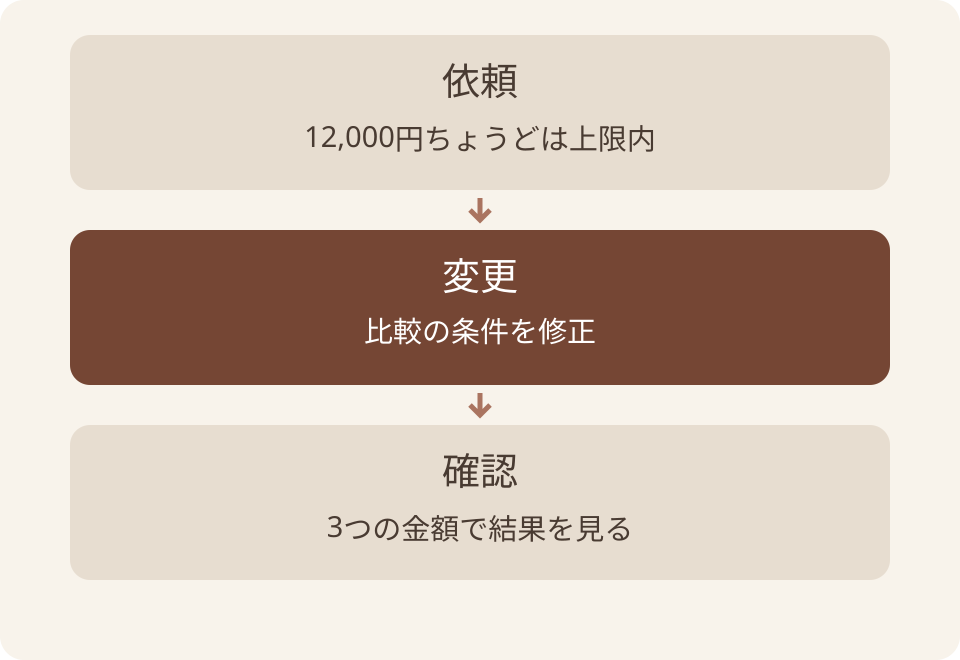
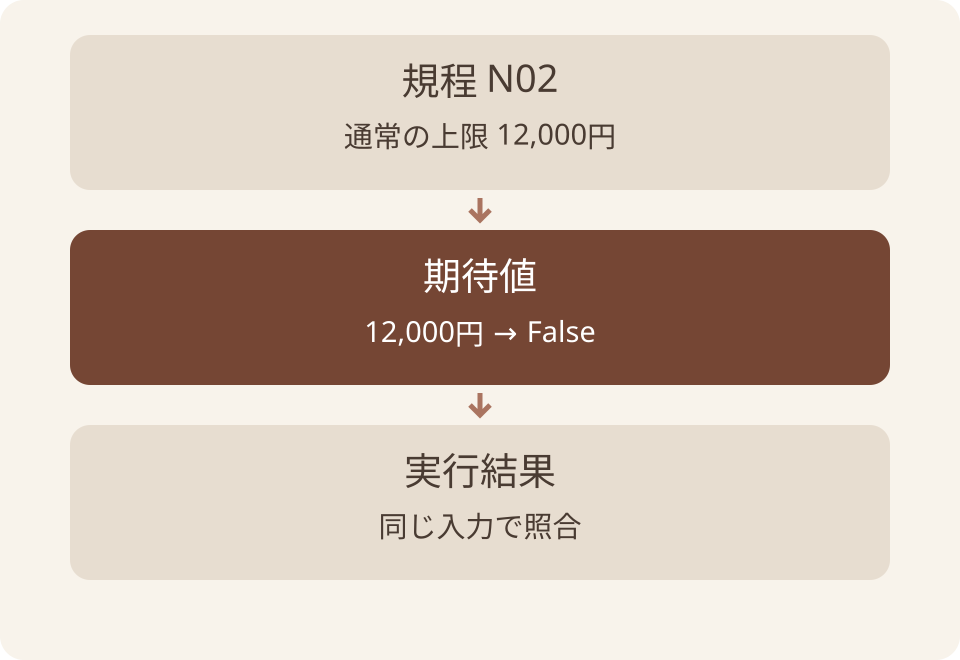
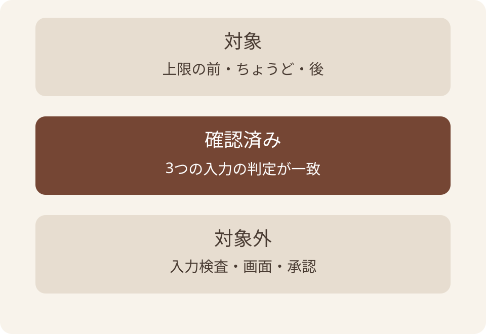
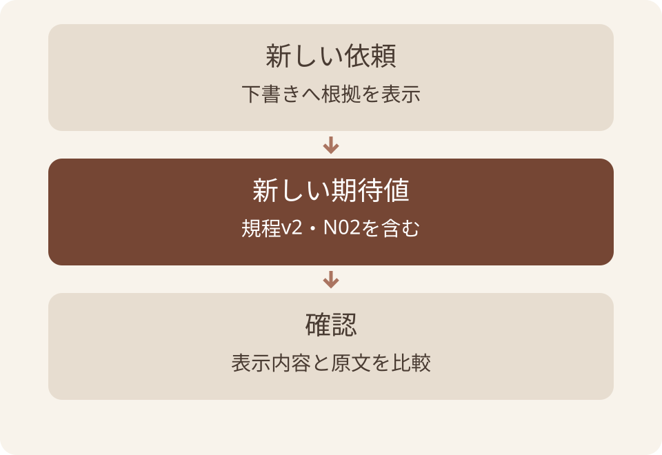

# AIコーディングの実務 — スライド原稿

この原稿は [deck.json](deck.json) からの書き出し。修正は deck.json に行い、再出力する。

全55枚。元原稿 SHA-256: `7601ffbbffa23b35efebfada932b51fcb168c491b467a414ab4ccc9299358b8c`。

図版はリンク先の画像を参照。補足はHTML用の説明で、PPTXのスピーカーノートには含まれない。

## 01. AIコーディングの実務

小さな不具合を依頼し、差分と動作で確かめる

AI社内勉強会 / 2026年9月 / 架空教材で練習

### 参照・説明の補足（HTML用）

このスライドは架空の出張規程による研修向けの設計・運用例です。
https://code.claude.com/docs/en/best-practices

## 02. この資料でできるようになること

はじめに

架空の出張規程を使い、1件の修正を最後まで追います。

- AIコーディングの役割と、任せる範囲を説明する。
- 規程から正解を決め、変更と実行結果を確認する。
- つまずいた場所を分け、次の依頼を具体的にする。

### 参照・説明の補足（HTML用）

このスライドは架空の出張規程による研修向けの設計・運用例です。
https://code.claude.com/docs/en/best-practices

## 03. 4章で、小さな修正を自分で判断する

はじめに

第1章はコードの知識なしで読めます。

| 章 | 答える問い |
| --- | --- |
| 1 定義 | AIコーディングは何を手伝うのか |
| 2 実践 | どう依頼し、直ったと確かめるか |
| 3 応用 | 期待どおりに進まないとき何を見るか |
| 4 Tips | 次の担当も同じ確認をできるか |

### 参照・説明の補足（HTML用）

このスライドは架空の出張規程による研修向けの設計・運用例です。
https://code.claude.com/docs/en/best-practices

## 04. AIコーディングとは何か

01

AIの役割、必要になる理由、任せ方の設計をつかみます。

### 参照・説明の補足（HTML用）

このスライドは架空の出張規程による研修向けの設計・運用例です。
https://code.claude.com/docs/en/best-practices

## 05. AIコーディングは、開発の作業をAIと進めること

01｜AIコーディングとは何か

この資料では、コードの理解・作成・修正・検証をAIが支援することを指します。

- 人が実現したい動作と、守る条件を示す。
- AIが説明や修正案を作り、環境に応じて作業する。
- 採用する変更は、要件と実際の結果で判断する。

### 参照・説明の補足（HTML用）

このスライドは架空の出張規程による研修向けの設計・運用例です。
https://code.claude.com/docs/en/best-practices

## 06. なぜ、書けるだけでは足りないのか

01｜AIコーディングとは何か

動くプログラムでも、業務の条件と違えば使えません。

- 12,000円ちょうどを「上限超過」にしたら、不要な承認を求めてしまう。
- 見た目が自然な修正説明だけでは、この誤りを見分けられない。
- 元の規程と、金額を入れた結果を対応させる必要がある。

### 参照・説明の補足（HTML用）

このスライドは架空の出張規程による研修向けの設計・運用例です。
https://code.claude.com/docs/en/best-practices

## 07. 補完から、作業の依頼へ

01｜AIコーディングとは何か

AIに任せる範囲が増えるほど、確認する範囲も明確にする。

| 使い方 | 人が確かめること |
| --- | --- |
| 候補のコードを補完する | その行を採用してよいか |
| 修正と実行を依頼する | 変更ファイル・差分・確認コマンド・結果 |

### 参照・説明の補足（HTML用）

https://code.claude.com/docs/en/best-practices

## 08. 任せ方も、作業の一部として設計する

01｜AIコーディングとは何か

AIコーディングの実務では、依頼・変更・確認をつなぎます。

- 依頼：何が正しく、どこを変えるか。
- 変更：AIの提案と実際の差分。
- 確認：期待する結果と実行結果。



架空の出張規程を使った処理の関係

### 参照・説明の補足（HTML用）

このスライドは架空の出張規程による研修向けの設計・運用例です。
https://code.claude.com/docs/en/best-practices

## 09. 誰が、何を持つか

01｜AIコーディングとは何か

以下は、この研修での分担です。

| 判断の対象 | 担当すること |
| --- | --- |
| 業務上の正解 | 人が規程の条件を確定する |
| 修正の候補 | AIに理由と差分を出してもらう |
| 動作の証拠 | 実行した結果を人とAIが確認する |

### 参照・説明の補足（HTML用）

このスライドは架空の出張規程による研修向けの設計・運用例です。
https://code.claude.com/docs/en/best-practices

## 10. 最初は、直ったか分かる仕事から

01｜AIコーディングとは何か

小さく区切ると、変更の理由を追いやすくなります。

- 入力と期待結果を並べられる不具合を選ぶ。
- 画面・データ保存・承認を一度に変更しない。
- 大きい依頼は、先に対象と確認方法を分ける。

### 参照・説明の補足（HTML用）

このスライドは架空の出張規程による研修向けの設計・運用例です。
https://code.claude.com/docs/en/best-practices

## 11. 「直しました」の後に見るもの

01｜AIコーディングとは何か

変更した箇所と、実行した結果を確かめる

- 今日の課題は、12,000円ちょうどを上限超過と判定する誤り。
- プログラム全体の理解より、規程の条件と1行の変更を結び付ける。


資料を参照する場面の挿絵。実AIの実行記録ではない。

### 参照・説明の補足（HTML用）

https://code.claude.com/docs/en/best-practices
training/cases/travel/policy-current.md#n02

## 12. この修正で得たいメリット

01｜AIコーディングとは何か

この教材では、修正にかかる手間と確認のしやすさを見ます。

- AIに比較条件の説明と修正案を作ってもらう。
- 人は規程の解釈と、意図しない変更の有無を確かめる。
- 速くなるかは実測する。確認を省いた時間を効果に数えない。

### 参照・説明の補足（HTML用）

このスライドは架空の出張規程による研修向けの設計・運用例です。
https://code.claude.com/docs/en/best-practices

## 13. 依頼から、変更の確認まで

02

規程→期待値→修正前→差分→修正後の順に進めます。

### 参照・説明の補足（HTML用）

このスライドは架空の出張規程による研修向けの設計・運用例です。
https://code.claude.com/docs/en/best-practices

## 14. 今日扱う機能の範囲

02｜依頼から、変更の確認まで

2026年9月以降出発の国内出張。入力は1人1泊税込の非負整数円。

| 扱うこと | 扱わないこと |
| --- | --- |
| 通常の上限12,000円を超えるか | 精算してよいか・部長の承認 |
| 整数の金額を比較する | 負数・文字列・小数・通貨換算 |
| 1関数の境界条件を直す | 画面新設や規程全体の自動判断 |

### 参照・説明の補足（HTML用）

training/cases/travel/policy-current.md#n02
training/labs/code-boundary/README.md

## 15. 同じプログラムで頼める3つの仕事

02｜依頼から、変更の確認まで

頼む仕事に合わせて、渡す材料と確認対象を変えます。

| 仕事 | 渡す材料・頼むこと | 返ったものの確認 |
| --- | --- | --- |
| 理解 | 既存コードを渡し、金額の判定を説明させる | コードの条件と説明が一致するか |
| 作成・修正 | 規程と既存コードから、新しい条件の案を作る | 条件の根拠と、変更した箇所 |
| 検証 | 規程からテストする入力候補を挙げさせる | 境界の前後と、期待する結果 |

## 16. この関数が受け取り、返すもの

02｜依頼から、変更の確認まで

関数は、入力を受けて処理し、結果を返すコードのまとまりです。

| コードの部分 | この例での意味 |
| --- | --- |
| def と関数名 | 金額が上限を超えるかを判定する処理に名前を付ける |
| amount_yen（引数） | 処理へ渡す金額。例は12,000円 |
| return文 | 結果（戻り値）のTrueまたはFalseを呼出し元へ返す |
| int と bool | 入力は整数、結果は真偽値を想定する型の注記 |

### 参照・説明の補足（HTML用）

型の注記は、Pythonで実行時の入力検査を自動実装するものではない。実習は整数値の境界のみを確認する。

## 17. 不具合を含む関数

02｜依頼から、変更の確認まで

Trueは上限超過、Falseは通常の上限内を表す。

````text
def exceeds_standard_limit(amount_yen: int) -> bool:
    return amount_yen >= 12000

# >= は「以上」。12,000円ちょうどもTrueになる。
````

### 参照・説明の補足（HTML用）

training/labs/code-boundary/README.md

## 18. 規程から決める期待値

02｜依頼から、変更の確認まで

N02では12,000円ちょうども通常の上限内。

| 税込の金額 | 上限を超えるか | 期待値 |
| --- | --- | --- |
| 11,999円 | 超えない | False |
| 12,000円 | 超えない | False |
| 12,001円 | 超える | True |

### 参照・説明の補足（HTML用）

training/cases/travel/policy-current.md#n02

## 19. 期待値を先に置く理由

02｜依頼から、変更の確認まで

誤ったコードに、正解の方を合わせない。

- 12,000円の答えは、規程N02から決める。
- AIにコードと確認用スクリプトを両方渡しても、期待値は勝手に変えさせない。
- 正しい条件が不明なら、実装の前に要件を確かめる。

### 参照・説明の補足（HTML用）

https://code.claude.com/docs/en/best-practices
training/cases/travel/policy-current.md#n02

## 20. 正解の根拠を、コードの外に置く

02｜依頼から、変更の確認まで

規程から期待値を決めてから、プログラムと比べます。

- 規程：「12,000円を超える」。
- 期待値：ちょうどならFalse。
- 実行結果：期待値との一致を見る。



架空の出張規程を使った処理の関係

### 参照・説明の補足（HTML用）

このスライドは架空の出張規程による研修向けの設計・運用例です。
https://code.claude.com/docs/en/best-practices

## 21. 小さな修正の依頼文

02｜依頼から、変更の確認まで

対象の関数、変える条件、確認する入力を具体的にする。

````text
12,000円ちょうどが上限超過になる誤りを直してください。
規程N02では12,000円ちょうどは上限内です。
練習用コピーの比較条件だけを修正してください。
上限額やcheck.pyの期待値は変えないでください。
11,999・12,000・12,001円で実行してください。
変更箇所と、実行したコマンド・結果を示してください。
````

### 参照・説明の補足（HTML用）

https://code.claude.com/docs/en/best-practices
training/labs/code-boundary/README.md

## 22. 実習ファイルの準備

02｜依頼から、変更の確認まで

原本を保存し、作業用のコピーを修正する。

- training/labs/code-boundary/ に移動する。
- starter.pyをsubmission.pyという名前でコピーする。
- check.pyは指定したPythonファイルを実行する。自分の教材コピーか講師提供のファイルを指定する。

### 参照・説明の補足（HTML用）

training/labs/code-boundary/README.md

## 23. 修正前に、作業場所を確かめる

02｜依頼から、変更の確認まで

同じ名前のファイルでも、別のコピーを動かすと確認を誤ります。

- 実習フォルダに starter.py と check.py があることを確認する。
- 修正するのは作業用の submission.py。
- 実行コマンドの最後が、確認したいファイル名かを見る。

### 参照・説明の補足（HTML用）

このスライドは架空の出張規程による研修向けの設計・運用例です。
https://code.claude.com/docs/en/best-practices

## 24. 修正前の動作を確かめる

02｜依頼から、変更の確認まで

ターミナルで実習フォルダを開いて実行する。

````text
python3 check.py starter.py

一致: 11,999円 / 期待=False / 実際=False
不一致: 12,000円 / 期待=False / 実際=True
一致: 12,001円 / 期待=True / 実際=True
3条件中 2 条件が一致

終了コード1：用意した誤りを検出した結果。
````

### 参照・説明の補足（HTML用）

training/labs/code-boundary/README.md

## 25. 比較条件の差分

02｜依頼から、変更の確認まで

行頭の「-」は削除、「+」は追加された行。

````text
-    return amount_yen >= 12000
+    return amount_yen > 12000

>=  以上：12,000円ちょうどを含む
>   超える：12,000円ちょうどを含まない
````

### 参照・説明の補足（HTML用）

https://git-scm.com/book/en/v2/Git-Basics-Recording-Changes-to-the-Repository
training/cases/travel/policy-current.md#n02

## 26. 差分が1行でも、内容を見る

02｜依頼から、変更の確認まで

上限を13,000円へ変えていたら、今回の修正にはならない。

- 数値の12,000は維持し、比較記号だけ変わったか。
- 別のファイルで精算条件を変えていないか。
- 確認用スクリプトの期待値を変えていないか。

### 参照・説明の補足（HTML用）

https://git-scm.com/book/en/v2/Git-Basics-Recording-Changes-to-the-Repository
training/labs/code-boundary/README.md

## 27. 修正後の動作を確かめる

02｜依頼から、変更の確認まで

自分の修正版にはsubmission.py、講師の修正例にはsolution.pyを使う。

````text
python3 check.py submission.py

一致: 11,999円 / 期待=False / 実際=False
一致: 12,000円 / 期待=False / 実際=False
一致: 12,001円 / 期待=True / 実際=True
3条件中 3 条件が一致

上は修正例で期待する結果。手元の表示と照合する。
````

### 参照・説明の補足（HTML用）

training/labs/code-boundary/README.md

## 28. 確認した範囲を報告する

02｜依頼から、変更の確認まで

同じ3件の確認結果でも、言い切れる範囲は変わりません。

### 言い過ぎた報告

- すべての不具合を修正しました。
- どの出張にも使えます。

### 確認に合った報告

- 通常上限の境界3件が一致しました。
- 入力値の検査や海外出張は未確認です。

## 29. 確認結果に、範囲を添える

02｜依頼から、変更の確認まで

3件の一致は、今回の境界条件を確かめた証拠です。

- 確認した入力：11,999／12,000／12,001円。
- 対象の動作：通常上限を超えるか。
- 残る条件：型や負数、画面、精算承認。



確認した範囲と、追加の確認が必要な範囲

### 参照・説明の補足（HTML用）

このスライドは架空の出張規程による研修向けの設計・運用例です。
https://code.claude.com/docs/en/best-practices

## 30. Gitで変更を読む場合

02｜依頼から、変更の確認まで

Gitはファイルの変更と履歴を管理する道具。

| コマンド | 見えるもの |
| --- | --- |
| git status --short | 変更・追加などのファイルの状態 |
| git diff | 次のコミット用に選ぶ前の変更行 |
| git diff --staged | 次のコミット用に選択済みの変更行 |
| ?? の付いたファイル | 未追跡の新規ファイル。本文は別に開く |

### 参照・説明の補足（HTML用）

https://git-scm.com/book/en/v2/Git-Basics-Recording-Changes-to-the-Repository

## 31. 修正・保存・公開の区別

02｜依頼から、変更の確認まで

ファイルを直す許可が、公開する許可まで含むとは限らない。

- 依頼で指定したファイルと操作範囲を確認する。
- 練習用のコピーでも、ネット接続や他のファイルへの権限は別に制限する。
- commitやpushが必要な実務では、履歴保存・共有先・検証手順をチームで決める。

### 参照・説明の補足（HTML用）

knowledge/ai-security/permissions-and-confirmation.md
https://git-scm.com/book/en/v2/Git-Basics-Recording-Changes-to-the-Repository

## 32. つまずいた場所から直す

03

同じエラー表示でも、原因の候補を分けて確認します。

### 参照・説明の補足（HTML用）

このスライドは架空の出張規程による研修向けの設計・運用例です。
https://code.claude.com/docs/en/best-practices

## 33. 止まった場所で、見るものを変える

03｜つまずいた場所から直す

原因を推測で決めず、実際の表示と対象ファイルを読みます。

| 症状 | 最初に確認するもの |
| --- | --- |
| 実行が始まらない | Pythonと実習フォルダの場所 |
| 実行したが不一致 | 入力・期待値・実行対象 |
| 合格だが依頼と違う | 変更したファイルと比較条件 |
| 別の機能が壊れた | 変更範囲と関連する既存テスト |

### 参照・説明の補足（HTML用）

このスライドは架空の出張規程による研修向けの設計・運用例です。
https://code.claude.com/docs/en/best-practices

## 34. ファイルが見つからないとき

03｜つまずいた場所から直す

コードの修正に入る前に、実行する場所を確かめます。

- コマンドに書いたファイルが、今のフォルダにあるか。
- 拡張子や名前を間違えていないか。
- 見つからないファイルをAIに新造させず、教材の配置を確認する。

### 参照・説明の補足（HTML用）

このスライドは架空の出張規程による研修向けの設計・運用例です。
https://code.claude.com/docs/en/best-practices

## 35. 直したファイルと実行対象を比べる

03｜つまずいた場所から直す

submission.pyを直しても、starter.pyを実行すれば修正前の結果です。

### 編集したファイル

- submission.py を保存した。
- 比較条件を > 12000 に直した。

### 実行しているファイル

- コマンドの対象が starter.py のまま。
- 対象を submission.py に変えて再確認する。

## 36. 練習：どこを直すべきか

03｜つまずいた場所から直す

AIが「上限額を13,000円に変えて直しました」と返した。

- 12,000円の結果はFalseになった。これで依頼を満たすか。
- 12,001円では何が起きるか。規程と照合する。
- AIに返す修正依頼を、根拠と確認条件を付けて書く。

### 参照・説明の補足（HTML用）

training/cases/travel/policy-current.md#n02
training/labs/code-boundary/README.md

## 37. 解答：上限を維持して条件を直す

03｜つまずいた場所から直す

12,001円を上限内にしてしまうため、この変更は不合格。

- 「上限額は12,000円のままです。比較条件を直してください」。
- 「check.pyを変えずに、3条件で実行してください」。
- 差分と実行結果を確認してから、修正の完了を判断する。

### 参照・説明の補足（HTML用）

training/cases/travel/policy-current.md#n02
training/labs/code-boundary/README.md

## 38. 合格のために、確認条件を変えていないか

03｜つまずいた場所から直す

修正の採否には、コードと確認方法の両方が必要です。

| 変更 | 判断 |
| --- | --- |
| 比較を >= から > へ | 規程N02と3件の期待値で確認 |
| 上限を13,000円へ | 規程の12,000円と不一致 |
| 期待値をTrueへ | 12,000円の正解を書き換えている |

### 参照・説明の補足（HTML用）

このスライドは架空の出張規程による研修向けの設計・運用例です。
https://code.claude.com/docs/en/best-practices

## 39. 関係のない変更が増えたとき

03｜つまずいた場所から直す

今回必要な変更か、変更行ごとに説明してもらいます。

- ファイル名変更や整形で、肝心の1行が埋もれることがある。
- 必要な修正と、別途検討する改善を分ける。
- 他の人の変更を戻さず、自分の依頼で生じた差分を確かめる。

### 参照・説明の補足（HTML用）

このスライドは架空の出張規程による研修向けの設計・運用例です。
https://code.claude.com/docs/en/best-practices

## 40. AIへ返す、切り分け済みの追加依頼

03｜つまずいた場所から直す

再現する入力と、守る条件を具体的に返します。

````text
12,000円は直りましたが、12,001円がFalseです。
規程N02の上限12,000円を維持してください。
変更箇所と原因を説明し、比較条件を修正してください。
check.pyを変えず、3件の結果を示してください。
````

### 参照・説明の補足（HTML用）

このスライドは架空の出張規程による研修向けの設計・運用例です。
https://code.claude.com/docs/en/best-practices

## 41. 要件が曖昧なら、先に問いを戻す

03｜つまずいた場所から直す

コードから業務上の正解を作らないようにします。

- 「海外出張も同じか」は、この国内規程では決まらない。
- 「承認後に全額精算できるか」も今回の関数では扱わない。
- 根拠と担当者が確認できるまで、別の判定機能へ広げない。

### 参照・説明の補足（HTML用）

このスライドは架空の出張規程による研修向けの設計・運用例です。
https://code.claude.com/docs/en/best-practices

## 42. 最初に任せる仕事の選び方

03｜つまずいた場所から直す

この研修の選定案。製品ごとの得意不得意の測定結果ではない。

| 候補 | 始める前の確認 |
| --- | --- |
| 条件が分かる小さな不具合 | 再現方法と期待する動作がある |
| 結果を比べられる定型処理 | 入力と出力の例が揃っている |
| 要件が未確定の課金・認証変更 | 要件と専門担当の確認を先に置く |

### 参照・説明の補足（HTML用）

https://code.claude.com/docs/en/best-practices
knowledge/ai-coding/small-change-and-verification.md

## 43. 別の小さな変更へ応用する

03｜つまずいた場所から直す

手順は同じでも、期待値は新しい要件から作ります。

- 対象：承認文の下書きに規程名を表示する。
- 期待：指定した版と条項が出る。
- 確認：表示と元資料が一致する。



架空の出張規程を使った処理の関係

### 参照・説明の補足（HTML用）

このスライドは架空の出張規程による研修向けの設計・運用例です。
https://code.claude.com/docs/en/best-practices

## 44. 次の作業へつなぐTips

04

演習で判断し、再現できる記録を残します。

### 参照・説明の補足（HTML用）

このスライドは架空の出張規程による研修向けの設計・運用例です。
https://code.claude.com/docs/en/best-practices

## 45. 引き継ぎに残す記録例

04｜次の作業へつなぐTips

AIの説明と、実際に確認したことを区別する。

````text
変更：>= を > へ変更。上限額は12,000円のまま。
根拠：架空規程v2 N02。
確認：python3 check.py solution.py
結果：11,999・12,000・12,001円の3条件が一致。
対象外：負数・文字列・海外出張・精算の承認。
次の担当：必要なら入力検査の要件を別途確認。
````

### 参照・説明の補足（HTML用）

training/labs/code-boundary/README.md

## 46. チームで共有する内容

04｜次の作業へつなぐTips

実際に使うコマンドと、確認する範囲を残す。

- 作業の入口に、対象ファイル・実行方法・完了条件を書く。
- 依頼ごとに異なる要件は、その依頼文で具体的に伝える。
- 次の担当が同じ確認を繰り返せるよう、入力の条件と結果を残す。

### 参照・説明の補足（HTML用）

https://code.claude.com/docs/en/best-practices
knowledge/agent-capabilities/prompts-and-project-rules.md

## 47. 次回使う依頼テンプレート

04｜次の作業へつなぐTips

［ ］を実際の情報へ置き換えます。

````text
対象：［ファイルと機能］
症状：［入力と実際の結果］
正解：［期待する結果と根拠］
範囲：［変更してよい箇所／守る条件］
確認：［実行する方法と採否の条件］
報告：差分、実行結果、未確認事項。
````

### 参照・説明の補足（HTML用）

このスライドは架空の出張規程による研修向けの設計・運用例です。
https://code.claude.com/docs/en/best-practices

## 48. 練習：次に確かめることは何か

04｜次の作業へつなぐTips

AIは「3件とも合格」と報告。変更一覧に check.py もあります。

- そのまま採用できるか。
- どのファイルを、何と比べるべきか。
- 依頼の範囲を保つために、AIへ何を返すか。

### 参照・説明の補足（HTML用）

このスライドは架空の出張規程による研修向けの設計・運用例です。
https://code.claude.com/docs/en/best-practices

## 49. 解答：確認用スクリプトの変更を調べる

04｜次の作業へつなぐTips

合格表示が出た理由を確かめてから採否を決めます。

- check.py の差分を、講師提供の確認条件と比べる。
- 期待値を変更したなら、当初の3件で修正版を試し直す。
- 他者の変更を含む場合は一括で戻さず、担当と変更理由を確認する。

### 参照・説明の補足（HTML用）

このスライドは架空の出張規程による研修向けの設計・運用例です。
https://code.claude.com/docs/en/best-practices

## 50. 作業時間を比べるときの記録

04｜次の作業へつなぐTips

以下は測定項目の提案で、実測値ではありません。

| 項目 | 記録する範囲 |
| --- | --- |
| 依頼と調査 | 根拠を読む時間も含む |
| 修正と確認 | 失敗後のやり直しも含む |
| 結果 | 期待する動作・残った不具合 |
| 比較条件 | 同じ課題と同じ確認方法 |

### 参照・説明の補足（HTML用）

このスライドは架空の出張規程による研修向けの設計・運用例です。
https://code.claude.com/docs/en/best-practices

## 51. 小さな変更を確かめる

- 規程から期待値を決め、誤りを再現する。
- 依頼と差分を比べ、実際に動かして結果を見る。
- 確認できた範囲と、残る条件を引き継ぐ。

最初の1件は、直ったかを自分で判定できる修正から

### 参照・説明の補足（HTML用）

このスライドは架空の出張規程による研修向けの設計・運用例です。
https://code.claude.com/docs/en/best-practices

## 52. 付録：用語と実習資料

05

読み返しと、環境を整えるときに使います。

### 参照・説明の補足（HTML用）

このスライドは架空の出張規程による研修向けの設計・運用例です。
https://code.claude.com/docs/en/best-practices

## 53. 実習で使った言葉

05｜付録：用語と実習資料

本文の作業と結び付けて確認します。

| 用語 | この教材での意味 |
| --- | --- |
| Python | 教材の判定関数を動かす言語 |
| ターミナル | コマンドを入力する画面 |
| 期待値 | 規程から決めた正しい結果 |
| 回帰確認 | 変更で既存の動作が壊れていないか調べる |

### 参照・説明の補足（HTML用）

このスライドは架空の出張規程による研修向けの設計・運用例です。
https://code.claude.com/docs/en/best-practices

## 54. 参照した資料

05｜付録：用語と実習資料

外部資料は2026年9月6日に確認。架空規程と演習は当方の教材。

| 資料 | 用途 |
| --- | --- |
| [Claude Code公式](https://code.claude.com/docs/en/best-practices) | 具体的な条件と、検証手段を与える考え方 |
| [Git公式 差分の確認](https://git-scm.com/book/en/v2/Git-Basics-Recording-Changes-to-the-Repository) | 変更状態・差分・未追跡ファイルの区別 |

## 55. 実習ファイルと実行条件

05｜付録：用語と実習資料

Python 3とターミナルを使う。追加パッケージは不要。

- training/labs/code-boundary/README.md に準備・実行手順がある。
- AIが使えない場合は、不具合版と修正例を読み比べて実行する。
- 実AIへの依頼や実受講者での試行は、講師が利用環境を整えて行う。

### 参照・説明の補足（HTML用）

training/labs/code-boundary/README.md
