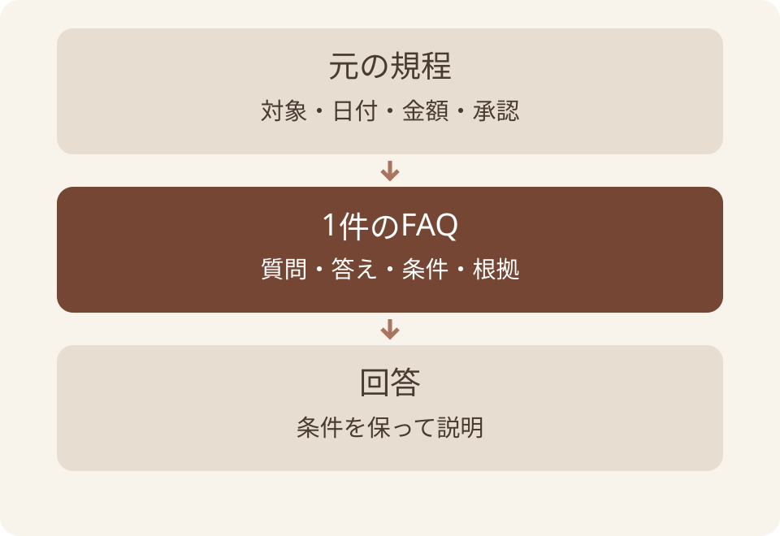
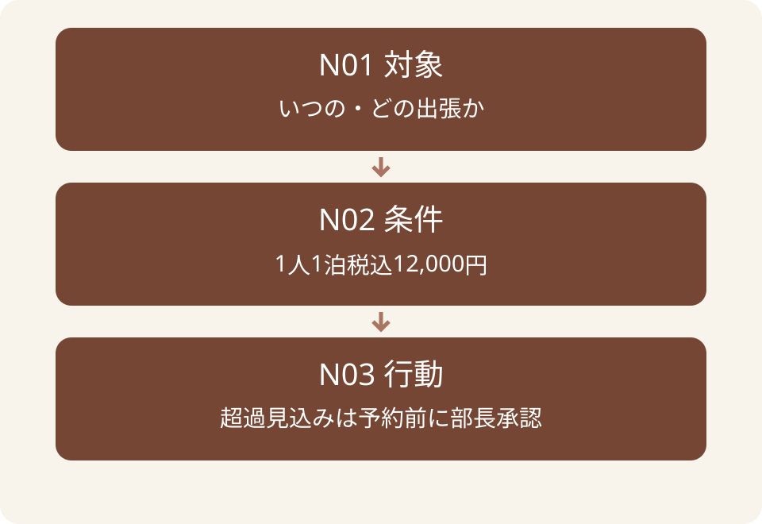
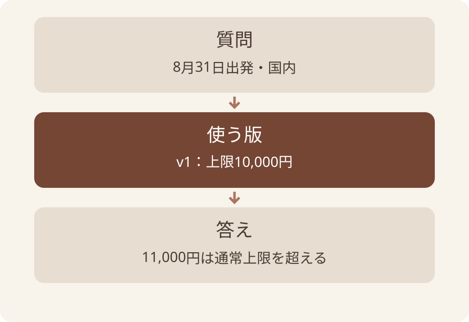

# AIにも渡しやすい文書設計 — スライド原稿

この原稿は [deck.json](deck.json) からの書き出し。修正は deck.json に行い、再出力する。

全55枚。元原稿 SHA-256: `32312a6138de0b01ba34e1431c41c08d4a9cb41f71ae74ad731ec45569ec8bb2`。

図版はリンク先の画像を参照。補足はHTML用の説明で、PPTXのスピーカーノートには含まれない。

## 01. AIにも渡しやすい文書設計

出張規程からFAQを作り、根拠と更新条件を残す

AI社内勉強会 / 2026年9月 / 架空教材で練習

### 参照・説明の補足（HTML用）

このスライドは架空の出張規程による研修向けの設計・運用例です。
https://developers.google.com/tech-writing/one/documents

## 02. この資料でできるようになること

はじめに

架空の出張規程から、使い続けられるFAQを1件作ります。

- AI向け文書設計の目的と、普通の文書との関係を説明する。
- 質問・答え・条件・根拠をそろえて書く。
- 規程が変わったとき、直す箇所と残す箇所を選ぶ。

### 参照・説明の補足（HTML用）

このスライドは架空の出張規程による研修向けの設計・運用例です。
https://developers.google.com/tech-writing/one/documents

## 03. 4章で、作成から更新までを追う

はじめに

最初にテーマを理解し、次に文書の実物を読みます。

| 章 | 答える問い |
| --- | --- |
| 1 定義 | 何を、誰が読めるようにするか |
| 2 深掘り | 条件と根拠をどう書き残すか |
| 3 応用 | 断片・旧版・誤答をどう直すか |
| 4 Tips | 他の人が確認して使い続けられるか |

### 参照・説明の補足（HTML用）

このスライドは架空の出張規程による研修向けの設計・運用例です。
https://developers.google.com/tech-writing/one/documents

## 04. AI向けドキュメント設計とは何か

01

目的、必要性、文書で行う工夫をつかみます。

### 参照・説明の補足（HTML用）

このスライドは架空の出張規程による研修向けの設計・運用例です。
https://developers.google.com/tech-writing/one/documents

## 05. AI向け文書設計は、読み違いを減らす準備

01｜AI向けドキュメント設計とは何か

人とAIが、対象・条件・根拠をたどれるように文書を組み立てることです。

- 何の質問に答える文書かを明らかにする。
- 答えが使える条件と、元の記述を一緒に残す。
- 内容を探し、確認し、更新できるつながりを作る。

### 参照・説明の補足（HTML用）

このスライドは架空の出張規程による研修向けの設計・運用例です。
https://developers.google.com/tech-writing/one/documents

## 06. なぜ、説明の前提を書き残すのか

01｜AI向けドキュメント設計とは何か

事情を知らない読み手は、「いつもの条件」を補えません。

- 担当者は「上限」と聞けば国内出張を思い浮かべるかもしれない。
- 別部署の人やAIには、海外も対象なのか分からない。
- 対象・単位・適用日を文書に書けば、同じ条件を確かめられる。

### 参照・説明の補足（HTML用）

このスライドは架空の出張規程による研修向けの設計・運用例です。
https://developers.google.com/tech-writing/one/documents

## 07. 人とAIが読むときの前提

01｜AI向けドキュメント設計とは何か

人にも必要な条件を、文書の中にはっきり書く。

| 読み手 | 文書に残したいこと |
| --- | --- |
| 事情を知る同僚 | 略語や「いつもの手順」を他の人も辿れる説明 |
| 一部だけ読むAI | 対象・適用日・根拠・不足情報が分かるまとまり |

### 参照・説明の補足（HTML用）

https://developers.google.com/tech-writing/one/documents
knowledge/ai-ready-docs/one-faq-with-evidence.md

## 08. 文書の一部だけが渡る場面を考える

01｜AI向けドキュメント設計とは何か

抜き出した部分にも、答えに必要な条件を残します。

- 元規程：国内・出発日・金額・承認。
- FAQ：1つの質問に必要な条件をまとめる。
- 回答：根拠の範囲で、次の行動を示す。



架空の出張規程を使った処理の関係

### 参照・説明の補足（HTML用）

このスライドは架空の出張規程による研修向けの設計・運用例です。
https://developers.google.com/tech-writing/one/documents

## 09. 設計するのは、本文とつながり

01｜AI向けドキュメント設計とは何か

きれいな文章にした後も、見つけ方と見直し方が必要です。

- 本文：質問に答える情報を、意味のまとまりで書く。
- つながり：目次からFAQ、FAQから原文へ進める。
- 更新：どの原文のどの版を使ったか、担当が分かるようにする。

### 参照・説明の補足（HTML用）

このスライドは架空の出張規程による研修向けの設計・運用例です。
https://developers.google.com/tech-writing/one/documents

## 10. 文書が整うと、何を確かめやすいか

01｜AI向けドキュメント設計とは何か

以下は期待する効果と、その成立条件です。

| 期待すること | 必要な条件 |
| --- | --- |
| 資料を選びやすい | 見出しと説明が内容に合う |
| 答えを確認しやすい | 原文の該当箇所へたどれる |
| 変更を追いやすい | 参照関係と適用日が残る |

### 参照・説明の補足（HTML用）

このスライドは架空の出張規程による研修向けの設計・運用例です。
https://developers.google.com/tech-writing/one/documents

## 11. そのFAQは、いつの出張に使うか

01｜AI向けドキュメント設計とは何か

答えと一緒に、対象の条件と原文を残す

- 同じ11,000円のホテルでも、出発日によって通常の上限が違う。
- 今日はFAQを1件作り、資料が変わった後の見直しまで考える。


資料を渡す場面の挿絵。検索や自動更新の実行結果ではない。

### 参照・説明の補足（HTML用）

training/cases/travel/policy-current.md
training/cases/travel/policy-previous.md
https://developers.google.com/tech-writing/one/documents

## 12. 書き方をそろえても、読む操作は必要

01｜AI向けドキュメント設計とは何か

保存した文書をAIが読めるかは、利用環境で確かめます。

- 手元のFAQを添付する、本文を渡すなどの操作を行う。
- リンク先を参照できるかは、接続と閲覧範囲を確認する。
- 整形しただけで検索・正答・自動更新が動くとは扱わない。

### 参照・説明の補足（HTML用）

このスライドは架空の出張規程による研修向けの設計・運用例です。
https://developers.google.com/tech-writing/one/documents

## 13. 1件のFAQを、根拠から作る

02

対象を決め、原文を読み、条件を残して書きます。

### 参照・説明の補足（HTML用）

このスライドは架空の出張規程による研修向けの設計・運用例です。
https://developers.google.com/tech-writing/one/documents

## 14. 旧版と新版の違い

02｜1件のFAQを、根拠から作る

以下はあおばサンプル株式会社の架空規程。

| 条件 | 旧版v1 | 新版v2 |
| --- | --- | --- |
| 対象の出発日 | 2026年1月1日〜8月31日 | 2026年9月1日以降 |
| 通常の宿泊費上限 | 1人1泊税込10,000円 | 1人1泊税込12,000円 |
| 対象 | 国内出張 | 国内出張 |
| 予約前の承認 | O03：上限超過見込みなら部長承認 | N03：上限超過見込みなら部長承認 |

### 参照・説明の補足（HTML用）

training/cases/travel/policy-current.md
training/cases/travel/policy-previous.md

## 15. 11,000円の宿を判断する

02｜1件のFAQを、根拠から作る

予約日や申請日ではなく、出発日で版を選ぶ。

| 質問 | 読む版 | 判定・次の確認 |
| --- | --- | --- |
| 8月31日出発・国内 | v1 | 10,000円を超える |
| 9月1日出発・国内 | v2 | 12,000円以内 |
| 出発日不明・国内 | まだ選べない | 出発日を確認する |

### 参照・説明の補足（HTML用）

training/cases/travel/policy-current.md
training/cases/travel/policy-previous.md

## 16. FAQにする質問を決める

02｜1件のFAQを、根拠から作る

9月10日出発の国内出張。1人1泊税込13,000円の宿を予約する前。

- 質問は「予約する前に、何が必要ですか」。
- N01で適用版、N02で上限、N03で事前承認を確かめる。
- 承認後の精算上限は、この資料からは決めない。

### 参照・説明の補足（HTML用）

training/cases/travel/policy-current.md
training/cases/travel/policy-previous.md

## 17. 条件が抜けたFAQ

02｜1件のFAQを、根拠から作る

次の下書きで、元資料にない意味が増えていないかを見る。

````text
Q. ホテル代が高いときはどうすればよいですか。
A. 承認を取れば全額精算できます。

不足しているもの：
対象の出張、金額、承認の時点、承認する人、根拠。
````

### 参照・説明の補足（HTML用）

training/cases/travel/policy-current.md
training/cases/travel/policy-previous.md

## 18. 根拠と条件を残したFAQ

02｜1件のFAQを、根拠から作る

配布例の faq/over-limit.md から原文の節へリンクします。

````text
Q. 9月10日出発の国内出張で、1人1泊税込13,000円の宿を
   予約する前に何が必要ですか。
A. 予約する前に部長の承認を受けます。
条件：規程v2対象。1人1泊税込12,000円を超える見込み。
根拠：[出張規程v2](../sources/policy-v2.md#rules)
      対象の節にあるN01・N02・N03を確認。
未確認：承認後の精算上限は記載されていません。
````

### 参照・説明の補足（HTML用）

training/cases/travel/policy-current.md
training/cases/travel/policy-previous.md

## 19. 答えを支える3つの条項

02｜1件のFAQを、根拠から作る

金額の条項だけでは、適用日と承認手順が欠けます。

- N01：9月1日以降の国内出張に適用。
- N02：通常の上限は1人1泊税込12,000円。
- N03：超過見込みなら予約前に部長承認。



架空の出張規程を使った処理の関係

### 参照・説明の補足（HTML用）

このスライドは架空の出張規程による研修向けの設計・運用例です。
https://developers.google.com/tech-writing/one/documents

## 20. 1件の答えが辿れるまとまり

02｜1件のFAQを、根拠から作る

質問・答え・条件・根拠を、まとめて読める大きさにする。

- 宿泊費の承認と、帰着後の申請期限は別の質問として整理する。
- 分けた先にも対象や出典を残し、関連FAQへリンクする。
- 細かく切るだけで、AIが正しく選べるとは決まらない。

### 参照・説明の補足（HTML用）

https://developers.google.com/tech-writing/one/documents
knowledge/ai-ready-docs/one-faq-with-evidence.md

## 21. 分ける単位を、質問で決める

02｜1件のFAQを、根拠から作る

文字数だけで区切ると、判断に必要な条件が離れます。

| 質問 | 一緒に残すもの |
| --- | --- |
| 上限を超える宿を予約したい | 対象・金額・予約前の承認 |
| 帰着後の精算はいつまで | 帰着日・期限・必要書類 |
| 海外の上限はいくら | 国内規程では未確認と示す |

### 参照・説明の補足（HTML用）

このスライドは架空の出張規程による研修向けの設計・運用例です。
https://developers.google.com/tech-writing/one/documents

## 22. 見出しと索引の例

02｜1件のFAQを、根拠から作る

ファイル名だけでなく、何を調べられるかを入口で案内する。

````text
出張の質問

・宿泊費が通常の上限を超える見込みの場合
  faq/over-limit.md：予約前の承認と対象の出張

・帰着後の精算申請
  faq/expense-deadline.md：領収書と申請期限

原文は sources/ に保存し、各FAQから参照する。
リンクを開き、rules節のN01〜N03を原文と照合する。
````

### 参照・説明の補足（HTML用）

https://github.com/GoogleCloudPlatform/open-knowledge-format/blob/ad30107c31c06aec8a7d5636e0d1058118604e6f/SPEC.md
knowledge/okf/directory-structure.md

## 23. 見出しと短い説明の役割

02｜1件のFAQを、根拠から作る

ファイルを開く前に、答えがありそうか判断する手がかりです。

- 「FAQまとめ」より「国内出張の宿泊費と予約前承認」と書く。
- 説明には対象と、答えられる質問を書く。
- 見出しを変えたら、本文がその範囲を扱うかも確かめる。

### 参照・説明の補足（HTML用）

このスライドは架空の出張規程による研修向けの設計・運用例です。
https://developers.google.com/tech-writing/one/documents

## 24. 知識と指示と手順の置き場所

02｜1件のFAQを、根拠から作る

Skillは、再利用する作業手順と関連資料をまとめたものです。

| 内容 | 置き場所の例 |
| --- | --- |
| 宿泊費の条件と根拠 | FAQや規程などの参照資料 |
| 元資料を変更しない共通ルール | 対応環境のAGENTS.mdやCLAUDE.md |
| FAQを作る繰り返しの手順 | Skillの本文と関連資料 |

### 参照・説明の補足（HTML用）

knowledge/agent-capabilities/prompts-and-project-rules.md
knowledge/agent-capabilities/writing-good-skills.md

## 25. 共通ルールのファイル

02｜1件のFAQを、根拠から作る

対応するアプリが、作業の前提や確認方法を参照する。

- AGENTS.mdは、対応するエージェントへプロジェクトの指示を伝える形式。
- Claude CodeにはCLAUDE.mdなどの仕組みがある。
- 探索範囲と読み込み方は環境ごとに確認する。保存だけで全AIが読むわけではない。

### 参照・説明の補足（HTML用）

https://agents.md/
https://code.claude.com/docs/en/memory

## 26. 共通ルールに残す内容の例

02｜1件のFAQを、根拠から作る

毎回守る範囲と、必要な資料への入口を書く。

````text
このフォルダでは架空規程からFAQの下書きを作る。
出発日で規程の版を選ぶ。分からなければ聞き返す。
規程の原本を変更しない。
FAQは drafts/ に別名で保存する。
回答には対象の条件と原文の段落を記載する。
記載がない例外や承認後の精算上限を推測しない。
````

### 参照・説明の補足（HTML用）

training/cases/travel/policy-current.md
training/cases/travel/policy-previous.md
knowledge/agent-capabilities/prompts-and-project-rules.md

## 27. 繰り返す手順をSkillへまとめる

02｜1件のFAQを、根拠から作る

Skill用手順の本文例。アプリへの導入前に動作を確かめる。

````text
用途：出張の質問を、根拠付きFAQの下書きにする。
入力：質問、出発日、国内/海外、規程の候補。
手順：対象日で版を選び、答えを支える段落を読む。
不足：出発日不明なら質問。資料になければ未確認と残す。
出力：質問、答え、条件、根拠、未確認事項。
完了条件：原文と照合し、保存したFAQを開いて確かめる。
````

### 参照・説明の補足（HTML用）

training/cases/travel/policy-current.md
training/cases/travel/policy-previous.md
knowledge/agent-capabilities/writing-good-skills.md
https://agentskills.io/specification

## 28. Skillの入口と動作の確認

02｜1件のFAQを、根拠から作る

SKILL.mdにはnameとdescriptionを持つfrontmatterを置く。

- descriptionで、どんな依頼に使う手順かを具体的に示す。
- 対象の依頼で使えるかと、正しいFAQを作れるかを分けて試す。
- 指示ファイルもSkillも、OSや接続先の権限を制限する設定とは別。

### 参照・説明の補足（HTML用）

https://agentskills.io/specification
knowledge/agent-capabilities/writing-good-skills.md

## 29. 出典と日付の意味

02｜1件のFAQを、根拠から作る

書いた日付が新しくても、過去の出張の適用版は変わらない。

| 項目 | 意味 |
| --- | --- |
| 規程の適用開始日 | どの日付の出張にルールを使うか |
| generated.at | 内容を作成・意味ある更新をした記録 |
| verified | 誰がいつ根拠や実体と照合したかの記録 |
| stale_after | この時刻以降、古い可能性があるとして再確認する |

### 参照・説明の補足（HTML用）

https://github.com/GoogleCloudPlatform/open-knowledge-format/blob/ad30107c31c06aec8a7d5636e0d1058118604e6f/SPEC.md
training/cases/travel/policy-current.md
training/cases/travel/policy-previous.md

## 30. OKFを使う場合の最小の考え方

02｜1件のFAQを、根拠から作る

OKFは、知識をファイルで扱うための書式。

- 非予約のMarkdownには、読めるYAMLと空でないtypeを付ける。
- 出典を書くsourcesの各項目には、resourceを指定する。
- 作っただけのFAQはdraftとして扱い、内容を確かめた範囲を別に記録する。

### 参照・説明の補足（HTML用）

https://github.com/GoogleCloudPlatform/open-knowledge-format/blob/ad30107c31c06aec8a7d5636e0d1058118604e6f/SPEC.md

## 31. 形式が合うことと、答えが合うこと

02｜1件のFAQを、根拠から作る

検査する対象を分けると、何が残っているか分かる。

- YAMLやリンクの検査では、書式や参照先の存在を調べる。
- 原文との照合では、金額・対象日・予約前の承認を調べる。
- どちらも通っただけで、検索や自動更新が実環境で動いたとは言えない。

### 参照・説明の補足（HTML用）

https://github.com/GoogleCloudPlatform/open-knowledge-format/blob/ad30107c31c06aec8a7d5636e0d1058118604e6f/SPEC.md
knowledge/ai-ready-docs/update-dependent-faq.md

## 32. 読み違いと更新漏れを直す

03

FAQ・渡した資料・回答を見比べ、直す場所を選びます。

### 参照・説明の補足（HTML用）

このスライドは架空の出張規程による研修向けの設計・運用例です。
https://developers.google.com/tech-writing/one/documents

## 33. 誤答が出たら、3か所を照合する

03｜読み違いと更新漏れを直す

同じ誤答でも、文書を直すだけでは解決しない場合があります。

| 確認するもの | 見つかる問題の例 |
| --- | --- |
| FAQと原文 | 承認の時点が抜けた |
| 実際に渡した資料 | 目次だけで本文が届いていない |
| AIの回答 | 資料にない精算上限を加えた |

### 参照・説明の補足（HTML用）

このスライドは架空の出張規程による研修向けの設計・運用例です。
https://developers.google.com/tech-writing/one/documents

## 34. 断片にしたときの読み違い

03｜読み違いと更新漏れを直す

次の1行だけが渡った場合、何が分からなくなるでしょうか。

````text
12,000円が上限です。

不足する条件：
国内出張か／1人1泊か／税込か／どの出発日か
超える見込みの場合、予約前に何をするか
````

### 参照・説明の補足（HTML用）

このスライドは架空の出張規程による研修向けの設計・運用例です。
https://developers.google.com/tech-writing/one/documents

## 35. 断片の中にも、必要な条件を残す

03｜読み違いと更新漏れを直す

原文と照合した条件を、短い説明に保ちます。

````text
対象：2026年9月1日以降出発の国内出張。
通常の上限：1人1泊税込12,000円。
超える見込み：予約前に部長の承認を受ける。
根拠：出張規程v2 N01・N02・N03。
未確認：承認後の精算上限。
````

### 参照・説明の補足（HTML用）

このスライドは架空の出張規程による研修向けの設計・運用例です。
https://developers.google.com/tech-writing/one/documents

## 36. 見つけた版と、使う版を分ける

03｜読み違いと更新漏れを直す

新しいファイルが見つかっても、出張の時点で適用版を選びます。

- 質問：8月31日出発、国内、11,000円。まだ予約していない。
- 適用版：8月までのv1を参照。
- 判定：10,000円を超え、予約前の承認が必要。



架空の出張規程を使った処理の関係

### 参照・説明の補足（HTML用）

このスライドは架空の出張規程による研修向けの設計・運用例です。
https://developers.google.com/tech-writing/one/documents

## 37. 規程が変わった後のFAQ

03｜読み違いと更新漏れを直す

新しい規程を保存しても、FAQの本文は自動では直らない。

| FAQ | 見直す点 |
| --- | --- |
| 上限はいくら | v1対象の過去質問に12,000円を上書きしない |
| 11,000円の宿 | 対象日で、上限内か超過かを改めて確かめる |
| 海外出張 | 国内向けの金額へ置き換えない |

### 参照・説明の補足（HTML用）

training/cases/travel/policy-current.md
training/cases/travel/policy-previous.md
knowledge/ai-ready-docs/update-dependent-faq.md

## 38. 見直しを担当する流れ

03｜読み違いと更新漏れを直す

これは研修の運用案。OKFが分担を強制するわけではない。

- 収集担当は変更した原文と取得日を残し、編集担当へ知らせる。
- 編集担当は参照するFAQを探し、変更すべき答えと条件を直す。
- 別の確認担当は原文と照合し、採用した版と確認範囲を記録する。

### 参照・説明の補足（HTML用）

knowledge/ai-ready-docs/update-dependent-faq.md

## 39. 更新するFAQを、参照先から探す

03｜読み違いと更新漏れを直す

原文の変更箇所と、そこを参照するFAQを対応させます。

- 金額が変わったなら、上限を説明するFAQを探す。
- 適用日だけ変わった場合も、質問条件と版選択を見直す。
- 参照先が書かれていないFAQは、本文を開いて影響を確認する。

### 参照・説明の補足（HTML用）

このスライドは架空の出張規程による研修向けの設計・運用例です。
https://developers.google.com/tech-writing/one/documents

## 40. 何を変え、何を残すか

03｜読み違いと更新漏れを直す

過去の条件を保ちつつ、新しい質問に答えられるようにします。

| 対象 | 更新の判断 |
| --- | --- |
| 新しい出発日向けのFAQ | 新規程の条件へ改訂する |
| 過去の出張向けのFAQ | 当時の適用版と根拠を残す |
| 共通の目次 | どの日付のFAQか分かる説明にする |

### 参照・説明の補足（HTML用）

このスライドは架空の出張規程による研修向けの設計・運用例です。
https://developers.google.com/tech-writing/one/documents

## 41. 記録が新しくても、本文は確かめる

03｜読み違いと更新漏れを直す

更新日時と適用日は、それぞれ違う問いに答えます。

- 今日編集した過去出張のFAQにも、旧版の条件が必要。
- 確認者の記録は、実際に照合した本文に対して残す。
- 金額を変更したら、以前の確認済み表示を引き継がない。

### 参照・説明の補足（HTML用）

このスライドは架空の出張規程による研修向けの設計・運用例です。
https://developers.google.com/tech-writing/one/documents

## 42. 別の業務へ置き換えるとき

03｜読み違いと更新漏れを直す

構造は使い回し、条件はその業務の原文から決めます。

| 業務の質問 | 一緒に残す条件 |
| --- | --- |
| 返品できるか | 購入日・商品区分・対象外・期限 |
| 障害時の連絡先は | 時間帯・担当範囲・当番表の版 |
| 値引きの承認者は | 金額・担当部署・適用する規則 |

### 参照・説明の補足（HTML用）

このスライドは架空の出張規程による研修向けの設計・運用例です。
https://developers.google.com/tech-writing/one/documents

## 43. 読み手と確かめるTips

04

演習で版を選び、再利用する型を持ち帰ります。

### 参照・説明の補足（HTML用）

このスライドは架空の出張規程による研修向けの設計・運用例です。
https://developers.google.com/tech-writing/one/documents

## 44. 練習：古いFAQを直す

04｜読み手と確かめるTips

予約前の質問。8月31日出発・国内・1人1泊税込11,000円の宿。

- 旧FAQに「予約前の部長承認が必要」とある。
- 担当者は今日、新版の12,000円に合わせて「承認不要」へ変えた。
- この修正は正しいか。根拠と、残すべき条件を書く。

### 参照・説明の補足（HTML用）

training/cases/travel/policy-current.md
training/cases/travel/policy-previous.md

## 45. 解答：過去の出張には旧版を使う

04｜読み手と確かめるTips

2026年8月31日の出発にはv1が適用される。

- 11,000円はv1の通常上限10,000円を超える。
- 予約前なら、O03に従って部長の承認を受ける。
- すでに予約済みの精算可否は、この資料だけでは決められない。

### 参照・説明の補足（HTML用）

training/cases/travel/policy-current.md
training/cases/travel/policy-previous.md

## 46. 別の人がFAQを読む確認

04｜読み手と確かめるTips

FAQだけを読み、対象と次の行動を説明してもらう。

- どの出発日・どの出張に使う答えかが分かるか。
- 示された原文を開き、答えを裏付ける段落に到達できるか。
- 分からないことが明示され、誰へ確認するかが分かるか。

### 参照・説明の補足（HTML用）

https://developers.google.com/tech-writing/one/documents
training/cases/travel/policy-current.md
training/cases/travel/policy-previous.md

## 47. FAQ作成を頼むテンプレート

04｜読み手と確かめるTips

［ ］を埋め、AIに渡せる元資料と一緒に使います。

````text
質問：［誰が・何を知りたいか］
対象：［日付・範囲・単位］
資料：［原文のファイルと版］
出力：質問／答え／条件／根拠／未確認事項。
資料にない条件を補わず、不明点を列挙してください。
原文は変更せず、FAQの下書きとして返してください。
````

### 参照・説明の補足（HTML用）

このスライドは架空の出張規程による研修向けの設計・運用例です。
https://developers.google.com/tech-writing/one/documents

## 48. 練習：見直す日時を過ぎたFAQ

04｜読み手と確かめるTips

stale_afterを過ぎましたが、本文と原規程はまだ同じです。

- すぐに誤りと判断できるか。
- どの情報と照合し、何を記録するか。
- 新しい見直し時点を決める前に、誰が確認するか。

### 参照・説明の補足（HTML用）

このスライドは架空の出張規程による研修向けの設計・運用例です。
https://developers.google.com/tech-writing/one/documents

## 49. 解答：期限は再確認のきっかけ

04｜読み手と確かめるTips

日付だけで、正誤を決めるものではありません。

- 現行の原規程と、FAQの対象・金額・承認条件を照合する。
- 変更がなければ、確認した範囲と日時を記録する。
- 担当と運用ルールに沿って、次の見直し時点を決める。

### 参照・説明の補足（HTML用）

このスライドは架空の出張規程による研修向けの設計・運用例です。
https://developers.google.com/tech-writing/one/documents

## 50. 最初の試行で記録すること

04｜読み手と確かめるTips

効果は、同じ質問と条件で比べます。

| 観点 | 確認するもの |
| --- | --- |
| 探す | 適用版のFAQへ到達できたか |
| 答える | 対象と必要な行動が合うか |
| 確かめる | 原文の該当箇所へ戻れたか |
| 更新する | 参照するFAQを見つけられたか |

### 参照・説明の補足（HTML用）

このスライドは架空の出張規程による研修向けの設計・運用例です。
https://developers.google.com/tech-writing/one/documents

## 51. 根拠へ戻れる文書

- 答えと一緒に、対象の条件と原文を残す。
- 共通ルール・繰り返す手順・知識の役割を分ける。
- 元資料が変わったら、参照するFAQを点検する。

次のFAQを1件、別の人が確かめられる形で残す

### 参照・説明の補足（HTML用）

このスライドは架空の出張規程による研修向けの設計・運用例です。
https://developers.google.com/tech-writing/one/documents

## 52. 付録：形式と参照資料

05

書式の詳細は、対応する仕様を確認します。

### 参照・説明の補足（HTML用）

このスライドは架空の出張規程による研修向けの設計・運用例です。
https://developers.google.com/tech-writing/one/documents

## 53. 本編で使った用語

05｜付録：形式と参照資料

まず用途を思い出してから、書式を調べます。

| 用語 | この資料での意味 |
| --- | --- |
| FAQ | よくある質問と、その答え |
| 粒度 | 1件として分ける情報の大きさ |
| 出典 | 答えの根拠となる元資料 |
| フロントマター | ファイル先頭の説明欄 |

### 参照・説明の補足（HTML用）

このスライドは架空の出張規程による研修向けの設計・運用例です。
https://developers.google.com/tech-writing/one/documents

## 54. 参照した資料

05｜付録：形式と参照資料

外部資料は2026年9月6日に確認。架空規程と演習は当方の教材。

| 資料 | 用途 |
| --- | --- |
| [Google 文書作成教材](https://developers.google.com/tech-writing/one/documents) | 読者・対象範囲・冒頭の要点の設計 |
| [OKF v0.2 仕様](https://github.com/GoogleCloudPlatform/open-knowledge-format/blob/ad30107c31c06aec8a7d5636e0d1058118604e6f/SPEC.md) | 書式、出典、作成・確認・再確認の記録 |
| [AGENTS.md](https://agents.md/) | AGENTS.mdの用途 |
| [Claude Code メモリ](https://code.claude.com/docs/en/memory) | CLAUDE.mdの扱い |
| [Agent Skills 仕様](https://agentskills.io/specification) | Agent Skillsの構造と必須項目 |

## 55. 配布資料と次のテーマ

05｜付録：形式と参照資料

ここでは文書の中身と保守を練習した。

- 新旧規程は training/cases/travel/ にある。
- 版を選ぶ補助実習は training/labs/source-packs/ にある。
- 書式を詳しく学ぶなら「OKF」、探して答える仕組みは「RAG」へ。

### 参照・説明の補足（HTML用）

training/cases/travel/README.md
training/labs/source-packs/README.md
