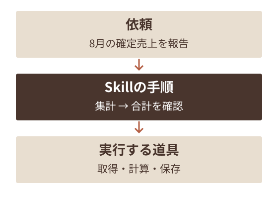
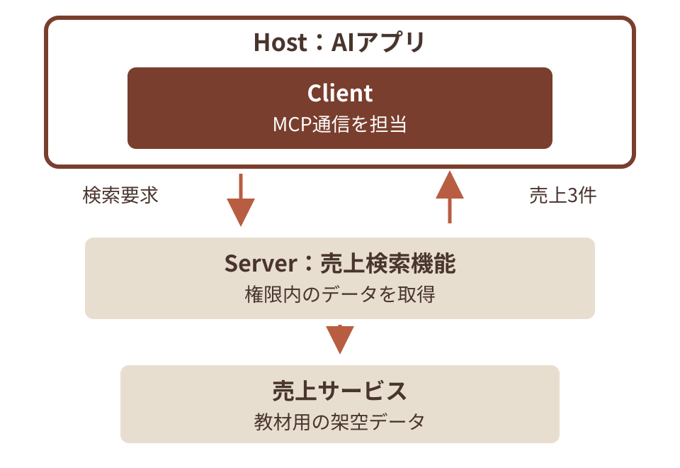
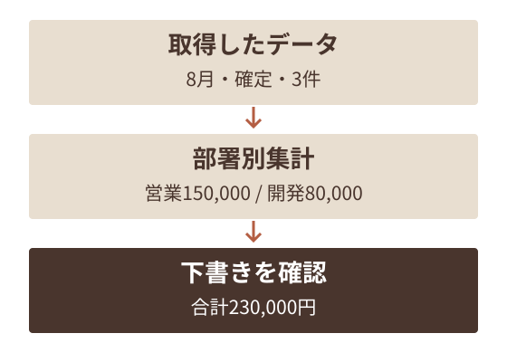

# AIに手順と道具を渡す — スライド原稿

この原稿は [deck.json](deck.json) からの書き出し。修正は deck.json に行い、再出力する。

全52枚。元原稿 SHA-256: `29ce889826dae2b51dbd4c9e2f8f0de1ecde399d77c4de19b1eeb97f8e1f88f1`。

図版はリンク先の画像を参照。補足はHTML用の説明で、PPTXのスピーカーノートには含まれない。

## 01. AIに手順と道具を渡す

プロンプト・Skill・MCP・CLIの使い分け
月次報告の例で学ぶ

社内トレーニング / 改訂版 / 2026-09-07

### 参照・説明の補足（HTML用）

架空の月次報告に基づく教材用の設計例。一般定義はAgent Skills仕様 https://agentskills.io/specification 、MCP Architecture https://modelcontextprotocol.io/docs/2026-07-28/learn/architecture 、CLIの実例 https://cli.github.com/manual/ を2026-09-07確認。特定の製品の実行結果を示すものではありません。

## 02. この資料で学ぶこと

月次報告を例に、手順と実行手段を選びます。

- 第1章：Skill・MCP・CLIの定義と違い
- 第2章：手順の作り方と、道具の使い方
- 第3章：月次報告の事例と失敗の切り分け
- 第4章：導入・共有のTipsと練習

### 参照・説明の補足（HTML用）

架空の月次報告に基づく教材用の設計例。一般定義はAgent Skills仕様 https://agentskills.io/specification 、MCP Architecture https://modelcontextprotocol.io/docs/2026-07-28/learn/architecture 、CLIの実例 https://cli.github.com/manual/ を2026-09-07確認。特定の製品の実行結果を示すものではありません。

## 03. Skill・MCP・CLIとは何か

01

何を伝え、どう実行するかを整理します

### 参照・説明の補足（HTML用）

架空の月次報告に基づく教材用の設計例。一般定義はAgent Skills仕様 https://agentskills.io/specification 、MCP Architecture https://modelcontextprotocol.io/docs/2026-07-28/learn/architecture 、CLIの実例 https://cli.github.com/manual/ を2026-09-07確認。特定の製品の実行結果を示すものではありません。

## 04. Skill・MCP・CLIとは何か

AIに仕事を頼むときの、手順・接続・操作のための仕組みです。

- Skill：再利用する指示と関連資料をまとめたフォルダ
- MCP：AIアプリと外部の機能やデータをつなぐ通信規格
- CLI：文字のコマンドでプログラムを操作する方法

### 参照・説明の補足（HTML用）

架空の月次報告に基づく教材用の設計例。一般定義はAgent Skills仕様 https://agentskills.io/specification 、MCP Architecture https://modelcontextprotocol.io/docs/2026-07-28/learn/architecture 、CLIの実例 https://cli.github.com/manual/ を2026-09-07確認。特定の製品の実行結果を示すものではありません。

## 05. 8月の売上で、部署別の報告を作って

この資料では、架空の会社と売上データを使います

### 参照・説明の補足（HTML用）

今回の例は自社の規程や導入実績ではありません。AIに渡す指示・手順・データ・道具を、この依頼に沿って区別します。

## 06. それぞれが担当すること

出典 S1 / M1 / G1

この分類は研修用の整理です。組み合わせて使えます。

| 手段 | 月次報告での役割 |
| --- | --- |
| プロンプト | 今回の対象月と完成条件を伝える |
| プロジェクトルール | 金額の単位など、共通の注意を置く |
| Skill | 再利用する手順書とひな形をまとめる |
| MCP | 売上サービスの機能へ接続する |
| CLI | コマンドで集計プログラムを動かす |

### 参照・説明の補足（HTML用）

出典（2026-09-05確認）:
S1: Agent Skills仕様 — https://agentskills.io/specification
M1: MCPアーキテクチャ — https://modelcontextprotocol.io/docs/2026-07-28/learn/architecture
G1: GitHub CLIマニュアル — https://cli.github.com/manual/

## 07. 手順と道具が受け持つ仕事

Skillで手順を読み、使える道具で実行します。

- 依頼文で対象月と完成条件を伝えます。
- Skillに集計と確認の手順を置きます。
- MCPやCLIで取得・集計を行います。



架空の月次報告を使った説明図

### 参照・説明の補足（HTML用）

架空の月次報告に基づく教材用の設計例。一般定義はAgent Skills仕様 https://agentskills.io/specification 、MCP Architecture https://modelcontextprotocol.io/docs/2026-07-28/learn/architecture 、CLIの実例 https://cli.github.com/manual/ を2026-09-07確認。特定の製品の実行結果を示すものではありません。

## 08. 同じ仕事を繰り返すときの利点

共通の手順を見直す場所が決まります。

- 毎月同じ確認事項を、手順書にまとめられます。
- 担当交代時も、入力例と期待する結果を共有できます。
- 更新した手順が使われたか、同じ例題で確かめます。

### 参照・説明の補足（HTML用）

架空の月次報告に基づく教材用の設計例。一般定義はAgent Skills仕様 https://agentskills.io/specification 、MCP Architecture https://modelcontextprotocol.io/docs/2026-07-28/learn/architecture 、CLIの実例 https://cli.github.com/manual/ を2026-09-07確認。特定の製品の実行結果を示すものではありません。

## 09. 仕組みを増やす前の判断

一度だけの短い仕事なら、依頼文だけで足りる場合があります。

| 状況 | 考えること |
| --- | --- |
| 毎回同じ説明をする | 再利用する手順をSkillへ整理 |
| 必要な売上が別サービスにある | 使える接続経路と権限を確認 |
| 手元のCSVを集計したい | 計算できる既存の道具を確認 |
| 文章を一度だけ短くしたい | 目的と完成条件を依頼文に書く |

### 参照・説明の補足（HTML用）

架空の月次報告に基づく教材用の設計例。一般定義はAgent Skills仕様 https://agentskills.io/specification 、MCP Architecture https://modelcontextprotocol.io/docs/2026-07-28/learn/architecture 、CLIの実例 https://cli.github.com/manual/ を2026-09-07確認。特定の製品の実行結果を示すものではありません。

## 10. 規格や手順だけでは保証されないこと

導入した後の動作と成果物も確かめます。

- Skillを置いても、対応アプリで見つかるとは限りません。
- MCP対応同士でも、対応機能や認証の確認が必要です。
- CLIで実行できても、計算や対象データが正しいとは限りません。

### 参照・説明の補足（HTML用）

架空の月次報告に基づく教材用の設計例。一般定義はAgent Skills仕様 https://agentskills.io/specification 、MCP Architecture https://modelcontextprotocol.io/docs/2026-07-28/learn/architecture 、CLIの実例 https://cli.github.com/manual/ を2026-09-07確認。特定の製品の実行結果を示すものではありません。

## 11. 手順を作り、道具で実行する

02

月次報告の入力・処理・完成条件を具体化します

### 参照・説明の補足（HTML用）

架空の月次報告に基づく教材用の設計例。一般定義はAgent Skills仕様 https://agentskills.io/specification 、MCP Architecture https://modelcontextprotocol.io/docs/2026-07-28/learn/architecture 、CLIの実例 https://cli.github.com/manual/ を2026-09-07確認。特定の製品の実行結果を示すものではありません。

## 12. 今回の売上データ

CSVは、表データを文字で保存する形式です。下は8月の確定売上3件です。

| 日付 | 部署 | 売上 |
| --- | --- | --- |
| 8月1日 | 営業部 | 120,000円 |
| 8月2日 | 開発部 | 80,000円 |
| 8月3日 | 営業部 | 30,000円 |

### 参照・説明の補足（HTML用）

教材用の架空データです。3行の合計は230,000円。営業部150,000円、開発部80,000円です。

## 13. できあがりの例

集計値と元データを確認できる下書きにします。

````text
8月の売上報告

営業部    150,000円
開発部     80,000円
合計      230,000円

元データ：sales-2026-08.csv
対象：確定済みの売上 3件
````

### 参照・説明の補足（HTML用）

ファイル名と報告内容は架空の例です。文章が自然でも、対象月・合計・入力件数を確かめる必要があります。

## 14. 依頼を具体的にする

AIが何を作ればよいか、完成条件をそろえます。

### 短すぎる依頼

- 売上をいい感じにまとめて
- 対象月が分からない
- 必要な集計や出力が分からない

### 具体的な依頼

- 8月の確定売上CSVを使う
- 部署別の合計を円で出す
- 合計と元ファイル名を添える

### 参照・説明の補足（HTML用）

書式や手段を増やす前に、何を求めているかを具体化します。右の依頼でも入力ファイルがなければ取得・確認が必要です。

## 15. 共通ルールの例

出典 A1 / C2

毎回同じ注意を書くなら、対応するアプリのルールにまとめます。

````text
対象月は依頼文で確認する。
未指定なら、推測して集計しない。

元のCSVは変更しない。
金額は円で表示する。
合計を確認し、入力ファイル名を残す。
````

### 参照・説明の補足（HTML用）

これは教材用のルール例です。AGENTS.mdやCLAUDE.mdなど、使うアプリが参照する形式と置き場所を確認します。

出典（2026-09-05確認）:
A1: AGENTS.md — https://agents.md/
C2: Claude Code：ルールの読込 — https://code.claude.com/docs/en/memory

## 16. ルールの読まれ方

出典 A1 / C2

ファイルを置くだけで、すべてのAIに伝わるわけではありません。

| 確認すること | 確認例 |
| --- | --- |
| 対応するファイル | AGENTS.md、CLAUDE.mdなど。アプリにより異なる |
| 読み込む範囲 | プロジェクト共通か、特定フォルダだけか |
| 読み込むタイミング | 開始時か、対象ファイルを開いたときか |
| 反映の確認 | 実際の依頼で、そのルールを参照できるか |

### 参照・説明の補足（HTML用）

Claude Codeでは親のCLAUDE.md/CLAUDE.local.mdは開始時、作業対象配下のものは必要時に読み込む仕組みがあります。会話を閉じた瞬間にプロンプトが消えるとは限りません。履歴や記憶機能も製品ごとに異なります。300行や150〜200指示を全AI共通の能力上限とは扱いません。

出典（2026-09-05確認）:
A1: AGENTS.md — https://agents.md/
C2: Claude Code：ルールの読込 — https://code.claude.com/docs/en/memory

## 17. Skillのフォルダ

出典 S1

必須はSKILL.md。関連資料やプログラムは必要に応じて加えます。

````text
monthly-sales-report/
  SKILL.md                   手順と用途
  references/
    returns.md               返品の扱い
  assets/
    report-template.csv      報告のひな形
  scripts/
    check_columns.py         CSVの列を確認
````

### 参照・説明の補足（HTML用）

このフォルダは説明用で、配布する実行用Skillではありません。スクリプトがない、手順書だけのSkillもあります。

出典（2026-09-05確認）:
S1: Agent Skills仕様 — https://agentskills.io/specification

## 18. SKILL.mdの記入例

出典 S1

冒頭に用途を書き、その下に作業手順を続けます。

````yaml
---
name: monthly-sales-report
description: 売上CSVから月次報告を作る。
  月次売上の集計を依頼されたときに使う。
---

1. 対象月と必要な列を確認する。
2. 部署別に集計し、全体合計と照合する。
3. 元データの名前を添えて下書きを保存する。
````

### 参照・説明の補足（HTML用）

これは短い説明例で、実行に必要な計算コードや例外処理までを含む完成版ではありません。nameは親フォルダ名と合わせます。descriptionは用途と使う場面の手がかりになります。

出典（2026-09-05確認）:
S1: Agent Skills仕様 — https://agentskills.io/specification

## 19. 手順書だけのSkillを試す

02｜最小の実習

Claude Codeを利用できる人向けの例。練習用プロジェクトに保存します。

````text
.claude/skills/training-sales-check/SKILL.md

---
name: training-sales-check
description: 教材の売上3件を部署別に集計する。
---
依頼文の売上を部署別に合計し、全体合計を示す。
対象月や金額が足りない場合は質問する。
入力データの変更と、外部への送信は行わない。
````

### 参照・説明の補足（HTML用）

保存先と明示呼出しはClaude Code公式Skills docs https://code.claude.com/docs/en/skills を2026-09-07確認。教材Skillの実行を実測したとの主張ではない。利用契約・アプリの導入は受講者環境に依存。

## 20. Skillを指定して、結果を照合する

02｜最小の実習

そのプロジェクトでClaude Codeを開き、次を入力します。

````text
/training-sales-check
8月の確定売上です。部署別と全体の合計を示して。
営業部 120,000円
開発部  80,000円
営業部  30,000円

確認する値：営業150,000円／開発80,000円
全体230,000円。返った結果を人が照合します。
次は月を省き、確認の質問が返るか試します。
````

### 参照・説明の補足（HTML用）

https://code.claude.com/docs/en/skills 。スラッシュ一覧に見つからなければ、保存先・name・アプリの対応を確認する。Claude Codeでの実行と実受講者試行は未確認。既存CLI例とは独立した、手順書だけの最小実習。

## 21. 必要になったところから読む

出典 S1

この読み方を「段階的開示」と呼びます。

| 段階 | 月次報告で読むもの | 読まれる情報 |
| --- | --- | --- |
| 探す | Skillの名前と用途 | 候補を選ぶための説明 |
| 使う | SKILL.mdの本文 | 集計の手順 |
| 詳しく調べる | 返品の扱いの資料 | 今回必要な参照箇所 |

### 参照・説明の補足（HTML用）

未読の参照本文はコンテキストへ入れずに済みます。参照資料は読めば内容が入ります。コードを実行するだけなら結果を返せますが、検査や修正のためにコードを読む場合はその内容も入ります。100個置いても軽いという保証ではありません。

出典（2026-09-05確認）:
S1: Agent Skills仕様 — https://agentskills.io/specification

## 22. MCPの3つの役割

AIアプリ内のClientが、Serverと通信します。

- Host：依頼を受けるAIアプリ。
- Client：Host内でMCP通信を担当。
- Server：売上を検索する機能を公開。



Serverは外部でも手元でも動く。ここでは外部接続の例。

### 参照・説明の補足（HTML用）

基準はMCP 2026-07-28版です。サーバーはローカルでも外部でも動きます。対応版・通信方法・機能・認証が合うことを確認します。MCP対応なら全ホストと全サーバーが必ず接続できる、という保証ではありません。

出典（2026-09-05確認）:
M1: MCPアーキテクチャ — https://modelcontextprotocol.io/docs/2026-07-28/learn/architecture

## 23. MCPで受け渡すもの

出典 M2 / M3

使うものを選ぶ主体は、機能ごとに異なります。

| 種類 | 月次報告での例 | 典型的な選択主体 |
| --- | --- | --- |
| Tools | 指定月の売上を検索する関数 | モデルが利用を提案 |
| Resources | 売上CSVの列の説明 | アプリが参照データを扱う |
| Prompts | 売上報告を頼むテンプレート | 利用者が選ぶ |

### 参照・説明の補足（HTML用）

すべてをモデルが自動実行するわけではありません。規格が毎回の確認ダイアログを保証するわけでもありません。利用者が拒否できる設計や確認表示が推奨され、実際の許可動作はホストと接続先の設定で確認します。

出典（2026-09-05確認）:
M2: MCPのサーバー機能 — https://modelcontextprotocol.io/docs/2026-07-28/learn/server-concepts
M3: MCP Tools仕様 — https://modelcontextprotocol.io/specification/2026-07-28/server/tools

## 24. 売上検索ツールのやり取り

出典 M2

架空の操作例です。サービスごとに名前と入力形式は異なります。

````text
入力
  対象月：2026-08
  状態：確定済み

売上検索ツールを呼ぶ

結果
  営業部 120,000円 / 開発部 80,000円
  営業部  30,000円 / 合計 3件
````

### 参照・説明の補足（HTML用）

ツールの入出力を説明する架空例です。実際のAPI名や実装済みのMCPサーバーを示していません。モデルが計算を推測する前に、取得結果の期間や件数も確かめます。

出典（2026-09-05確認）:
M2: MCPのサーバー機能 — https://modelcontextprotocol.io/docs/2026-07-28/learn/server-concepts

## 25. CLIで集計する例

出典 G1

CLIは文字で操作する方法です。下は架空プログラムの実行例です。

````text
python monthly_report.py sales-2026-08.csv

→ CSVを読み、部署別に集計する
→ report-2026-08.txt に保存する

保存後に確認すること
  営業部 150,000円 / 開発部 80,000円
  合計   230,000円
````

### 参照・説明の補足（HTML用）

monthly_report.pyは教材用の架空コマンドで、この資料に実行プログラムは付属しません。CLI一般の例として示しています。Pythonのインストールと実行許可などが必要です。gh、aws、dockerなどもすべてのOSに標準搭載されているわけではありません。

出典（2026-09-05確認）:
G1: GitHub CLIマニュアル — https://cli.github.com/manual/

## 26. 同じ入力とコードで、計算を確かめる

02｜計算をコードへ寄せる理由

CSVの合計のように手順を固定できる処理は、検査済みコードをCLIで動かすと再現・照合しやすくなります。

| 固定・記録するもの | 売上集計での例 | 確かめること |
| --- | --- | --- |
| 入力 | 同じ月の確定CSV | ファイル内容と対象行が同じか |
| コードと実行環境 | 同じ集計コードの版・設定・依存ソフト | 丸め方や通貨の扱いもそろえる |
| 期待する出力 | 営業150,000円＋開発80,000円 | 合計230,000円と照合する |
| 外部状態のある処理 | 最新売上API・現在時刻・乱数を使うCLI | 状態が変わると結果も変わる。CLIだけでは決定性を保証しない |
| 根拠 | [Anthropic：Skill authoring best practices](https://platform.claude.com/docs/en/agents-and-tools/agent-skills/best-practices) | 決定的な処理にスクリプトを使い、必要な依存を確認する |

### 参照・説明の補足（HTML用）

既存ナレッジ knowledge/agent-capabilities/choosing-skill-mcp-or-cli.md / knowledge/sources/article-tools-agent-skills-best-practices.md。公式 https://platform.claude.com/docs/en/agents-and-tools/agent-skills/best-practices のRuntime environment: Prefer scripts for deterministic operations とPackage dependenciesを2026-09-06再確認。入出力・コード版・設定・環境を固定し、非決定的要素に依存しない計算なら、同じ結果を再検査しやすくなるという設計上の説明。CLIは呼び出し方であり、処理内容が決定的であることやコードの正しさを自動保証しない。金額は既存の研修用架空CSVの例を継承。

## 27. 接続・実行に必要な準備

出典 S1 / G1 / M3

必要な道具と権限は、実行環境でも確認します。

| 確認すること | 具体例 |
| --- | --- |
| 実行環境 | 必要なコマンドやプログラムが導入済みか |
| 認証と権限 | 自分が見てよい売上だけ取得できるか |
| 対象と保存先 | 対象月・会社・出力フォルダが正しいか |
| 実行結果 | 保存したファイルを開いて合計を確かめる |

### 参照・説明の補足（HTML用）

helpはコマンドの使い方の確認に役立ちますが、間違った会社や対象月の操作までは防ぎません。終了コードや完了メッセージだけでなく、成果物と実際の状態を確認します。

出典（2026-09-05確認）:
S1: Agent Skills仕様 — https://agentskills.io/specification
G1: GitHub CLIマニュアル — https://cli.github.com/manual/
M3: MCP Tools仕様 — https://modelcontextprotocol.io/specification/2026-07-28/server/tools

## 28. 月次報告での組み合わせ

出典 S1 / M1 / G1

手順はSkillにまとめ、利用できる道具で実行します。

| 状況 | 候補 | 判断のポイント |
| --- | --- | --- |
| 同じ手順を繰り返す | Skill | 入力・例外・完成条件を共通化 |
| 売上サービスから取得する | MCP、CLIなど | 組織が使える接続方法と権限 |
| 手元のCSVを計算する | CLI＋必要ならSkill | 導入済みの道具と結果の検査 |
| 今回だけ文章を整える | プロンプト | 追加の仕組みを作る必要があるか |

### 参照・説明の補足（HTML用）

決まった優先順位はありません。組織が管理するMCPの方が認証や監査に向く場合も、既存CLIが適している場合もあります。APIはサービスがプログラム向けに用意する窓口です。

出典（2026-09-05確認）:
S1: Agent Skills仕様 — https://agentskills.io/specification
M1: MCPアーキテクチャ — https://modelcontextprotocol.io/docs/2026-07-28/learn/architecture
G1: GitHub CLIマニュアル — https://cli.github.com/manual/

## 29. 事例とトラブルシューティング

03

結果が違うとき、手順・接続・入力を切り分けます

### 参照・説明の補足（HTML用）

架空の月次報告に基づく教材用の設計例。一般定義はAgent Skills仕様 https://agentskills.io/specification 、MCP Architecture https://modelcontextprotocol.io/docs/2026-07-28/learn/architecture 、CLIの実例 https://cli.github.com/manual/ を2026-09-07確認。特定の製品の実行結果を示すものではありません。

## 30. 月次報告を仕上げる流れ

集計前後の件数と金額を照合します。

- 架空データは確定売上3件です。
- 営業部150,000円、開発部80,000円。
- 合計230,000円を下書きと照合します。



架空の月次報告を使った説明図

### 参照・説明の補足（HTML用）

架空の月次報告に基づく教材用の設計例。一般定義はAgent Skills仕様 https://agentskills.io/specification 、MCP Architecture https://modelcontextprotocol.io/docs/2026-07-28/learn/architecture 、CLIの実例 https://cli.github.com/manual/ を2026-09-07確認。特定の製品の実行結果を示すものではありません。

## 31. 合計が200,000円になった事例

教材用の失敗例です。差額だけで原因を決めつけません。

| 調べる順 | 確かめる内容 |
| --- | --- |
| 入力の件数 | 3件のうち、営業部30,000円が含まれるか |
| 対象の条件 | 8月・確定の条件で絞られているか |
| 計算の途中 | 部署別の加算に3行とも使われたか |
| 保存した結果 | 修正後の下書きを開き230,000円と照合 |

### 参照・説明の補足（HTML用）

架空の月次報告に基づく教材用の設計例。一般定義はAgent Skills仕様 https://agentskills.io/specification 、MCP Architecture https://modelcontextprotocol.io/docs/2026-07-28/learn/architecture 、CLIの実例 https://cli.github.com/manual/ を2026-09-07確認。特定の製品の実行結果を示すものではありません。

## 32. Skillが使われないとき

選択の問題と、実行の問題を分けます。

| 観測したこと | 次に確かめること |
| --- | --- |
| 候補に見当たらない | 導入先・対応形式・有効化を確認 |
| 候補にあるが選ばれない | 用途の説明と依頼が合うか確認 |
| 読まれたが処理できない | 必要なファイル・道具・権限を確認 |
| 処理はできたが誤答 | 手順と入力、期待する結果を照合 |

### 参照・説明の補足（HTML用）

架空の月次報告に基づく教材用の設計例。一般定義はAgent Skills仕様 https://agentskills.io/specification 、MCP Architecture https://modelcontextprotocol.io/docs/2026-07-28/learn/architecture 、CLIの実例 https://cli.github.com/manual/ を2026-09-07確認。特定の製品の実行結果を示すものではありません。

## 33. Skillが選ばれるか、結果が正しいか

出典 S2 / C1

説明文は選択の手がかり。実行品質は別に確かめます。

| 試す依頼・入力 | 期待する動き |
| --- | --- |
| 8月の売上報告＋必要なCSV | 対象月と合計が正しい下書きを作る |
| 文章の誤字だけ直して | 月次報告Skillを不要に使わない |
| 対象月がない売上報告の依頼 | 対象月を確認する |
| 必要な列がないCSV | 不足を知らせ、完了扱いしない |

### 参照・説明の補足（HTML用）

架空の試験例です。自動選択だけでなく、利用者がSkillを指定する製品もあります。登録場所・有効化・権限・必要なツールも成否に影響し、descriptionだけで決まりません。

出典（2026-09-05確認）:
S2: Skill作成ガイド — https://platform.claude.com/docs/en/agents-and-tools/agent-skills/best-practices
C1: Claude Code：Skills — https://code.claude.com/docs/en/skills

## 34. 接続できないとき

接続先を増やす前に、失敗した段階を確認します。

| 段階 | 確認と対応 |
| --- | --- |
| 接続先が見つからない | 設定した接続先と対応する通信方法を確認 |
| 認証が失敗する | 有効な認証と必要な閲覧範囲を確認 |
| 必要な機能がない | 対応機能と権限を調べる |
| 取得結果が空 | 対象月・確定状態・閲覧範囲を確認 |

### 参照・説明の補足（HTML用）

架空の月次報告に基づく教材用の設計例。一般定義はAgent Skills仕様 https://agentskills.io/specification 、MCP Architecture https://modelcontextprotocol.io/docs/2026-07-28/learn/architecture 、CLIの実例 https://cli.github.com/manual/ を2026-09-07確認。特定の製品の実行結果を示すものではありません。

## 35. CLIが失敗したとき

同じコマンドの再実行だけで解決しない場合があります。

| 症状 | 確認と対応 |
| --- | --- |
| コマンドが見つからない | 必要なソフトの導入と実行環境 |
| ファイルがない | 入力ファイル名と作業フォルダ |
| 必要な列がない | CSVの見出しと集計プログラムの前提 |
| 出力が古い | 保存先と更新時刻、実際の内容 |

### 参照・説明の補足（HTML用）

架空の月次報告に基づく教材用の設計例。一般定義はAgent Skills仕様 https://agentskills.io/specification 、MCP Architecture https://modelcontextprotocol.io/docs/2026-07-28/learn/architecture 、CLIの実例 https://cli.github.com/manual/ を2026-09-07確認。特定の製品の実行結果を示すものではありません。

## 36. 長い処理で確認すること

出典 M4

MCPにも進捗通知やTasks拡張があります。対応は実装ごとに違います。

| 必要なこと | 確認例 |
| --- | --- |
| 進捗が分かる | 読込中・集計中・保存中を区別できるか |
| 途中で止める | 取消が可能か。途中の出力はどうなるか |
| 再開する | 通信が切れた後、結果を取得できるか |
| 重複させない | 再実行で同じ報告や送信を増やさないか |

### 参照・説明の補足（HTML用）

MCPを短いCRUD専用、長時間処理を必ずCLIと決めません。CRUDは作成・読取・更新・削除の操作です。拡張の存在と手元の製品での利用可能性は別なので、必要な動作で比較します。

出典（2026-09-05確認）:
M4: MCP Tasks拡張 — https://modelcontextprotocol.io/extensions/tasks/overview

## 37. 手順の指示と、実際の権限

出典 C1 / G2

「外部へ送らない」と書くことと、通信を制限することは別です。

### 手順に書くこと

- 使ってよいデータの範囲
- 報告は下書きとして保存
- 確認してから共有する

### 環境で確認すること

- 接続先の閲覧・更新権限
- プログラムと外部通信先
- 実行・送信の許可設定

### 参照・説明の補足（HTML用）

allowed-toolsは許可を与える設定で、OSのサンドボックスではありません。スクリプトも必要に応じて読むことができ、段階的開示が事前検査を禁止するわけではありません。コードがないSkillでも外部ツールへ指示する可能性があります。

出典（2026-09-05確認）:
C1: Claude Code：Skills — https://code.claude.com/docs/en/skills
G2: Skillの企業利用ガイド — https://platform.claude.com/docs/en/agents-and-tools/agent-skills/enterprise

## 38. 返品を含む月へ応用する

教材用の追加条件です。返品の扱いは業務担当に確認します。

| 先に決めること | 手順へ残す内容 |
| --- | --- |
| 売上の定義 | 税込・税抜、返品を含むか |
| 対象となる日 | 売上日か返品処理日か |
| 符号と集計 | 返品を減算する規則と入力例 |
| 検証する例 | 返品なし・返品あり両方の期待値 |

### 参照・説明の補足（HTML用）

架空の月次報告に基づく教材用の設計例。一般定義はAgent Skills仕様 https://agentskills.io/specification 、MCP Architecture https://modelcontextprotocol.io/docs/2026-07-28/learn/architecture 、CLIの実例 https://cli.github.com/manual/ を2026-09-07確認。特定の製品の実行結果を示すものではありません。

## 39. 第3章の点検順序

まず、どこまで正しく進んだかを確かめます。

- 手順が読まれたか。
- 必要な接続・道具で入力を取得できたか。
- 入力の範囲と計算が正しいか。
- 保存した成果物に修正が反映されたか。

### 参照・説明の補足（HTML用）

架空の月次報告に基づく教材用の設計例。一般定義はAgent Skills仕様 https://agentskills.io/specification 、MCP Architecture https://modelcontextprotocol.io/docs/2026-07-28/learn/architecture 、CLIの実例 https://cli.github.com/manual/ を2026-09-07確認。特定の製品の実行結果を示すものではありません。

## 40. 運用のTipsと練習

04

小さく導入し、更新後も同じ仕事で確かめます

### 参照・説明の補足（HTML用）

架空の月次報告に基づく教材用の設計例。一般定義はAgent Skills仕様 https://agentskills.io/specification 、MCP Architecture https://modelcontextprotocol.io/docs/2026-07-28/learn/architecture 、CLIの実例 https://cli.github.com/manual/ を2026-09-07確認。特定の製品の実行結果を示すものではありません。

## 41. コストは同じ仕事で比べる

出典 C3 / M1

CLI→Skill→MCPという、共通の安い順はありません。

### 負荷が変わる要因

- 手順やツール定義の読み方
- 入力・出力の量と再実行
- 外部サービスの料金

### 比較で記録するもの

- 完成物の正しさ
- 処理時間と実際の料金
- 失敗後に直す手間

### 参照・説明の補足（HTML用）

MCPのtools/listは一覧取得で、全定義を常時モデルへ投入する義務ではありません。Claude Codeには必要な定義を後から取得するtool searchがあります。古い特定構成の55,000トークンを全MCPの固定費やSkill550個分に換算しません。

出典（2026-09-05確認）:
C3: Claude Code：MCP — https://code.claude.com/docs/en/mcp
M1: MCPアーキテクチャ — https://modelcontextprotocol.io/docs/2026-07-28/learn/architecture

## 42. チームで使うときの記録

出典 G2

更新した後も、同じ例題で動作を確かめられるようにします。

| 記録 | 月次報告の例 |
| --- | --- |
| 誰が管理するか | 営業企画担当と問い合わせ先 |
| どの版を使うか | 手順書の版・導入先・必要な道具 |
| 何を試したか | 8月のCSV、期待する合計、実際の結果 |
| 更新後の確認 | 同じ入力で再検査し、必要なら前の版へ戻す |

### 参照・説明の補足（HTML用）

Skillの共有や同期は登録経路・製品設定で異なります。プラグインだから必ず版固定、CLIだから必ず最新版、とは判断しません。個人の動画で紹介された利用数を、自社運用の必要数とは扱いません。

出典（2026-09-05確認）:
G2: Skillの企業利用ガイド — https://platform.claude.com/docs/en/agents-and-tools/agent-skills/enterprise

## 43. 引き継ぎに残すテンプレート

［ ］を埋め、認証情報は書きません。

````text
仕事：［月次報告など］
手順の版：［版・保存先］
対象データ：［期間・ファイル名］
使う道具：［接続先・コマンド］
期待する結果：［件数・合計など］
実際の結果：［保存先・確認した内容］
未確認と担当：［次に確認すること・担当］
````

### 参照・説明の補足（HTML用）

架空の月次報告に基づく教材用の設計例。一般定義はAgent Skills仕様 https://agentskills.io/specification 、MCP Architecture https://modelcontextprotocol.io/docs/2026-07-28/learn/architecture 、CLIの実例 https://cli.github.com/manual/ を2026-09-07確認。特定の製品の実行結果を示すものではありません。

## 44. 2分で考える：どこを整えるか

それぞれの状況で、まず必要になるものを考えてください。

| 状況 | 考えるポイント |
| --- | --- |
| 毎回、同じ返品処理を説明している | どこに再利用する手順を置くか |
| 売上サービスへ未接続 | どの接続経路と権限が使えるか |
| CSVはあるが集計方法がない | 何を使って計算するか |
| 結果は出たが合計が違う | 何を確認してから完了にするか |

### 参照・説明の補足（HTML用）

受講者に2分考えてもらいます。ツール名だけの正解探しではなく、対象の不足を言葉にする練習です。次ページで一例を示します。

## 45. 考え方の例

複数の手段を組み合わせても構いません。

| 状況 | 対応の例 |
| --- | --- |
| 同じ返品処理を繰り返す | Skillに手順と確認例をまとめる |
| 売上サービスへ未接続 | MCP・CLIの対応と権限を調べる |
| 集計方法がない | 承認された集計プログラムを用意する |
| 合計が違う | 対象月・入力行・計算結果を照合する |

### 参照・説明の補足（HTML用）

これは唯一の解答ではありません。Excelなど別の道具でも、利用環境と完成条件に合えば選択肢になります。

## 46. 最初の導入で試すこと

実データの前に、少量の教材データで流れを確認します。

- 正常な入力で、期待する合計になるか。
- 対象月や必要な列がないとき、止まって知らせるか。
- 読み取りだけの仕事で、元データを変更しないか。
- 更新した版でも同じ例題を再検査できるか。

### 参照・説明の補足（HTML用）

架空の月次報告に基づく教材用の設計例。一般定義はAgent Skills仕様 https://agentskills.io/specification 、MCP Architecture https://modelcontextprotocol.io/docs/2026-07-28/learn/architecture 、CLIの実例 https://cli.github.com/manual/ を2026-09-07確認。特定の製品の実行結果を示すものではありません。

## 47. 自分の仕事で試す準備

- 対象の仕事と、完成した状態を決める
- 繰り返す手順はSkillなどにまとめる
- 接続方法・権限・道具を確認する
- 小さな入力で実行し、成果物を確かめる

手順を伝える方法と、実行する道具を組み合わせる

### 参照・説明の補足（HTML用）

架空の月次報告に基づく教材用の設計例。一般定義はAgent Skills仕様 https://agentskills.io/specification 、MCP Architecture https://modelcontextprotocol.io/docs/2026-07-28/learn/architecture 、CLIの実例 https://cli.github.com/manual/ を2026-09-07確認。特定の製品の実行結果を示すものではありません。

## 48. 付録：仕様と参照資料

05

具体的な仕様・製品の扱いは対応する資料で確認します

### 参照・説明の補足（HTML用）

架空の月次報告に基づく教材用の設計例。一般定義はAgent Skills仕様 https://agentskills.io/specification 、MCP Architecture https://modelcontextprotocol.io/docs/2026-07-28/learn/architecture 、CLIの実例 https://cli.github.com/manual/ を2026-09-07確認。特定の製品の実行結果を示すものではありません。

## 49. 形式の要件と、短く書く目安

出典 S1 / S2

「500行」は作成上の推奨です。501行で形式違反にはなりません。

| 種類 | 例 | 意味 |
| --- | --- | --- |
| 形式の要件 | name・description | 共通形式で必須のメタデータ |
| 作成の目安 | 本文500行未満 | 必要な手順を見つけやすくする推奨 |
| 量の目安 | メタデータ約100トークン | 文章を処理する単位。量は変わる |

### 参照・説明の補足（HTML用）

本文5,000トークン未満も推奨です。トークンは文章を処理する単位で、字数そのものではありません。量は記述と言語、アプリの扱い方によります。参照を1階層にする助言は参照先を延々とたどる構造を避ける趣旨で、フォルダ階層の形式制限ではありません。

出典（2026-09-05確認）:
S1: Agent Skills仕様 — https://agentskills.io/specification
S2: Skill作成ガイド — https://platform.claude.com/docs/en/agents-and-tools/agent-skills/best-practices

## 50. 参照資料：Skillとルール

2026年9月5日に確認した一次資料。資料名から公式ページを開けます。

| 番号 | 資料 | この資料で使った内容 |
| --- | --- | --- |
| S1 | [Agent Skills仕様](https://agentskills.io/specification) | 共通形式・段階的開示 |
| S2 | [Skill作成ガイド](https://platform.claude.com/docs/en/agents-and-tools/agent-skills/best-practices) | 短い手順・評価例 |
| C1 | [Claude Code：Skills](https://code.claude.com/docs/en/skills) | 起動・設定・権限 |
| C2 | [Claude Codeのルール](https://code.claude.com/docs/en/memory) | 対応ファイルと読込範囲 |
| A1 | [AGENTS.md](https://agents.md/) | エージェント向け指示ファイル |

### 参照・説明の補足（HTML用）

架空の月次報告に基づく教材用の設計例。一般定義はAgent Skills仕様 https://agentskills.io/specification 、MCP Architecture https://modelcontextprotocol.io/docs/2026-07-28/learn/architecture 、CLIの実例 https://cli.github.com/manual/ を2026-09-07確認。特定の製品の実行結果を示すものではありません。

## 51. 参照資料：接続と運用

MCPの説明は2026-07-28版を基準にしています。

| 番号 | 資料 | この資料で使った内容 |
| --- | --- | --- |
| M1 | [MCP公式：アーキテクチャ](https://modelcontextprotocol.io/docs/2026-07-28/learn/architecture) | Host・Client・Server |
| M2 | [MCP公式：サーバー機能](https://modelcontextprotocol.io/docs/2026-07-28/learn/server-concepts) | Tools・Resources・Prompts |
| M3 | [MCP Tools仕様](https://modelcontextprotocol.io/specification/2026-07-28/server/tools) | ユーザー制御の推奨 |
| C3 | [Claude Code：MCP](https://code.claude.com/docs/en/mcp) | 定義の遅延読込 |

### 参照・説明の補足（HTML用）

補足原典：https://modelcontextprotocol.io/docs/2026-07-28/learn/architecture
企業利用ガイド：https://platform.claude.com/docs/en/agents-and-tools/agent-skills/enterprise

## 52. 参照資料：実行と共有

製品や設定の変更後には、使う経路と必要な動作を再確認します。

| 番号 | 資料 | この資料で使った内容 |
| --- | --- | --- |
| M4 | [MCP Tasks拡張](https://modelcontextprotocol.io/extensions/tasks/overview) | 長時間処理の追跡 |
| G1 | [GitHub CLIマニュアル](https://cli.github.com/manual/) | 導入・認証 |
| G2 | [Skillの企業利用ガイド](https://platform.claude.com/docs/en/agents-and-tools/agent-skills/enterprise) | 導入前の確認・版の管理 |

### 参照・説明の補足（HTML用）

架空の月次報告に基づく教材用の設計例。一般定義はAgent Skills仕様 https://agentskills.io/specification 、MCP Architecture https://modelcontextprotocol.io/docs/2026-07-28/learn/architecture 、CLIの実例 https://cli.github.com/manual/ を2026-09-07確認。特定の製品の実行結果を示すものではありません。
